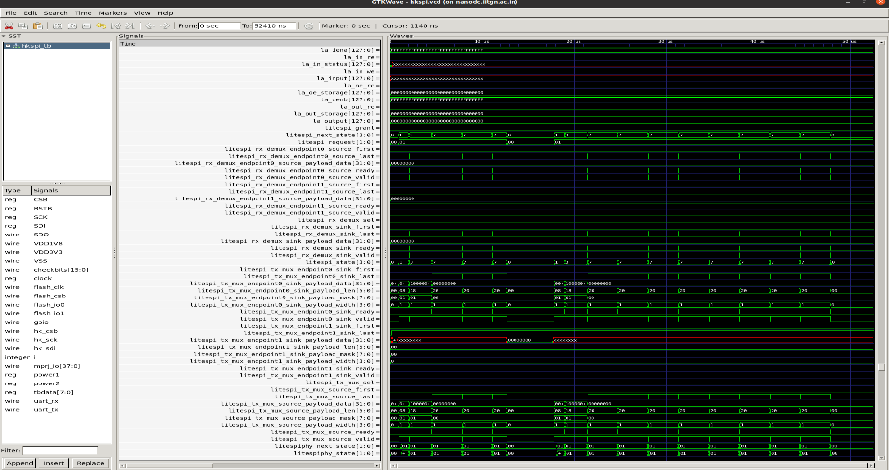
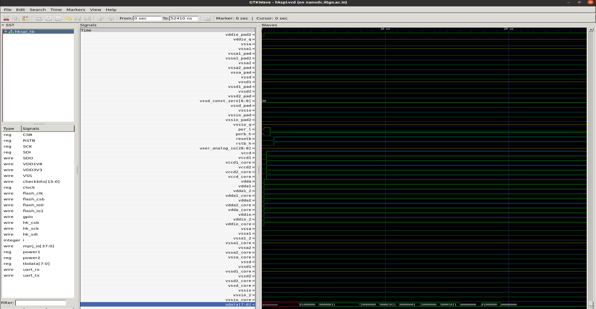
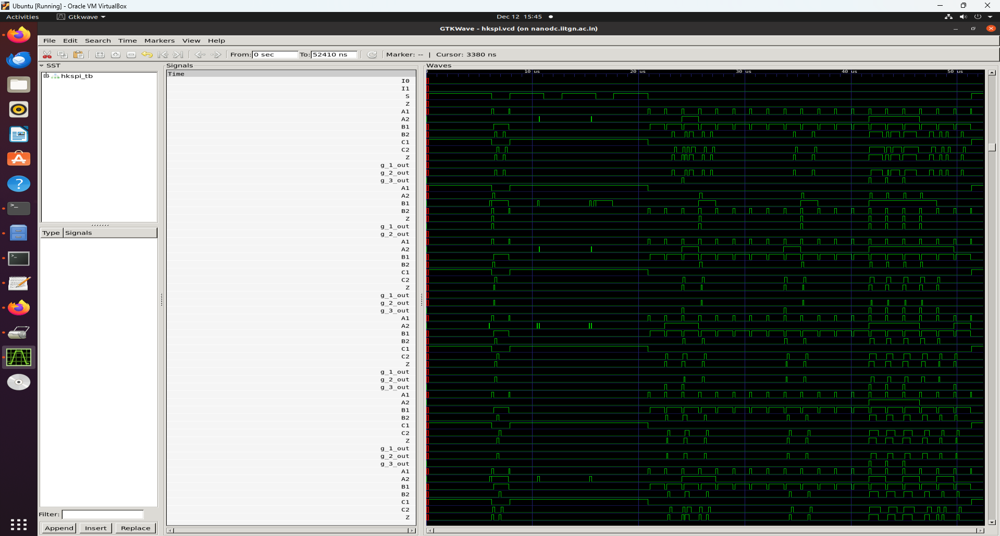
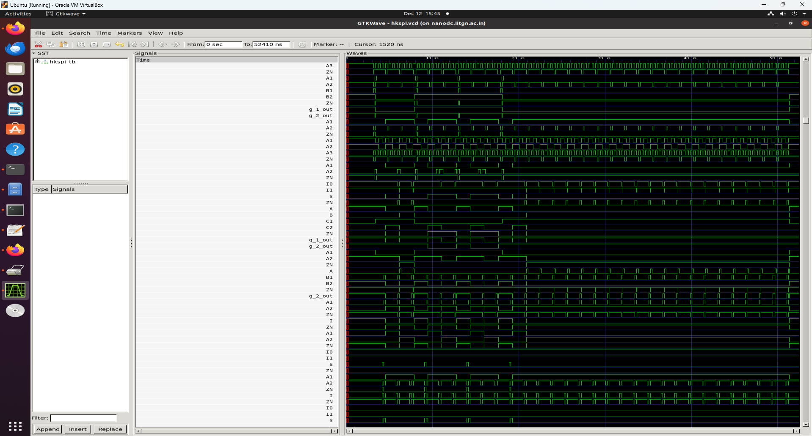

# RISC-V Reference SoC Implementation using Synopsys and SCL180 PDK
## Task 1: Functional RTL Simulation, Logic Synthesis, and Gate-Level Simulation (GLS)

**Project:** VSD Caravel RISC-V SoC on SCL 180nm Technology  
**Institution:** IIT Gandhinagar  
**Date:** December 12, 2025  
**Reference Repository:** [vsdip/vsdRiscvScl180](https://github.com/vsdip/vsdRiscvScl180/tree/iitgn)

---

## Table of Contents
1. [Overview](#overview)
2. [Repository Structure](#repository-structure)
3. [Prerequisites](#prerequisites)
4. [Environment Setup](#environment-setup)
5. [Functional (RTL) Simulation](#functional-rtl-simulation)
6. [Logic Synthesis](#logic-synthesis)
7. [Gate-Level Simulation (GLS)](#gate-level-simulation-gls)
8. [Results and Analysis](#results-and-analysis)
9. [System Details](#system-details)
10. [References](#references)

---

## Overview

This project implements the complete functional simulation, logic synthesis, and gate-level simulation (GLS) flow for the **vsdcaravel RISC-V SoC** using the **SCL 180nm PDK** from Synopsys. The design integrates a VexRiscv processor with the Efabless Caravel framework, targeting the SCL180 tapeout process.

### Design Highlights
- **Top Module:** vsdcaravel
- **Processor Core:** VexRiscv (RISC-V RV32IMC)
- **Technology:** SCL 180nm (Synopsys tsl18fs120)
- **Standard Cell Library:** tsl18fs120_scl_ff (Fast-Fast corner)
- **I/O Pad Library:** tsl18cio250 (4M1L metal stack)
- **Test Module:** Housekeeping SPI (hkspi)
- **Design Hierarchy:** 1,453 modules, 25,385 leaf cells

### Key Components
- **VexRiscv Core:** 32-bit RISC-V processor with instruction cache
- **RAM128:** 128-byte memory block
- **Housekeeping Module:** SPI-based configuration interface
- **Digital PLL:** On-chip clock generation with ring oscillator
- **GPIO Control:** 38 configurable GPIO pins
- **Power-on-Reset (POR):** Digital reset generation
- **I/O Pads:** SCL180 pad wrappers for chip-level integration

---

## Repository Structure

```
VsdRiscvScl180/
├── dv/                         # Design Verification
│   └── hkspi/                  # Housekeeping SPI testbench
│       ├── hkspi_tb.v          # RTL testbench
│       ├── hkspi.c             # Test firmware (C source)
│       ├── hkspi.hex           # Compiled firmware (Verilog hex format)
│       ├── hkspi.vvp           # Compiled simulation executable
│       ├── hkspi.vcd           # Waveform dump
│       ├── Makefile            # RTL simulation build script
│       └── APIs/               # Firmware support files
│
├── rtl/                        # RTL Source Files
│   ├── vsdcaravel.v            # Top-level SoC wrapper
│   ├── caravel.v               # Caravel core integration
│   ├── caravel_core.v          # Core logic implementation
│   ├── chip_io.v               # I/O interface
│   ├── VexRiscv_MinDebugCache.v # VexRiscv processor core
│   ├── housekeeping.v          # Housekeeping logic
│   ├── housekeeping_spi.v      # SPI interface
│   ├── mgmt_core_wrapper.v     # Management core wrapper
│   ├── digital_pll.v           # PLL with ring oscillator
│   ├── caravel_clocking.v      # Clock distribution
│   ├── RAM128.v, RAM256.v      # Memory blocks
│   ├── gpio_control_block.v    # GPIO control logic
│   ├── mprj_io.v               # Multi-project I/O
│   ├── pt3b02_wrapper.v        # I/O pad wrappers
│   ├── defines.v               # Design parameters
│   ├── primitives.v            # Basic primitives
│   └── scl180_wrapper/         # SCL180-specific wrappers
│       └── *.v                 # Technology-specific modules
│
├── synthesis/                  # Logic Synthesis
│   ├── synth.tcl               # Synopsys DC synthesis script
│   ├── vsdcaravel.sdc          # Timing constraints
│   ├── output/
│   │   └── vsdcaravel_synthesis.v  # Synthesized gate-level netlist
│   ├── report/
│   │   ├── qor_post_synth.rpt      # Quality of Results
│   │   ├── area_post_synth.rpt     # Area report
│   │   └── power_post_synth.rpt    # Power report
│   └── work_folder/            # DC working directory
│
├── gl/                         # Gate-Level Support Files
│   ├── *.v                     # RTL files copied for GLS
│   ├── defines.v               # Design defines
│   └── clock_div.v             # Modified with includes
│
├── gls/                        # Gate-Level Simulation
│   ├── hkspi_tb.v              # GLS testbench
│   ├── Makefile                # GLS build script
│   ├── hkspi.hex               # Test firmware
│   ├── hkspi.vvp               # Compiled GLS simulation
│   └── hkspi.vcd               # GLS waveform
│
├── images/                     # Documentation images
└── README.md                   # This file
```

---

## Prerequisites

Before starting, ensure you have the following tools and dependencies installed:

### Required Tools
- **SCL180 PDK** - Synopsys SCL 180nm Process Design Kit
  - Standard Cells: `tsl18fs120_scl` (4M1IL and 6M1L)
  - I/O Pads: `tsl18cio250` (4M1L)
  - Path: `/home/Synopsys/pdk/SCL_PDK_3/SCLPDK_V3.0_KIT/scl180/`

- **Synopsys EDA Tool Suite**
  - Design Compiler (dc_shell): T-2022.03-SP5
  - License Server: 27020@c2s.cdacb.in
  - Required Features: Design-Compiler, HDL-Compiler, DC-Expert

- **RISC-V Toolchain**
  - Compiler: `riscv32-unknown-elf-gcc`
  - Target: RV32IMC architecture
  - Path: `/home/sshekhar/riscv-tools/bin`

- **Simulation Tools**
  - Icarus Verilog (iverilog): For RTL and GLS simulation
  - GTKWave: v3.3.118 or later for waveform viewing

- **Build Tools**
  - Make: Build automation
  - C-shell (csh): Required for Synopsys tools

### Optional Tools
- **Git**: For repository management
- **Text Editor**: For Makefile and script editing

---

## Environment Setup

### 1. Clone the Repository

```bash
git clone https://github.com/vsdip/vsdRiscvScl180.git
cd vsdRiscvScl180
git checkout iitgn
```

### 2. Verify PDK Installation

```bash
# Check SCL180 PDK directories
ls /home/Synopsys/pdk/SCL_PDK_3/SCLPDK_V3.0_KIT/scl180/
# Should show: stdcell/, iopad/, pdk/, doc/, etc.

# Check standard cell library
ls /home/Synopsys/pdk/SCL_PDK_3/SCLPDK_V3.0_KIT/scl180/stdcell/fs120/4M1IL/liberty/lib_flow_ff/
# Should show: tsl18fs120_scl_ff.db

# Check I/O pad library
ls /home/Synopsys/pdk/SCL_PDK_3/SCLPDK_V3.0_KIT/scl180/iopad/cio250/4M1L/verilog/tsl18cio250/zero/
# Should show: pt3b02.v and other pad primitives
```

### 3. Verify RISC-V Toolchain

```bash
# Check compiler installation
which riscv32-unknown-elf-gcc
/home/sshekhar/riscv-tools/bin/riscv32-unknown-elf-gcc --version

# Test compilation
riscv32-unknown-elf-gcc -march=rv32imc -mabi=ilp32 --version
```

### 4. Setup Synopsys Tools

```bash
# Switch to C-shell
csh

# Source Synopsys environment
source ~/toolRC_iitgntapeout

# Verify dc_shell
which dc_shell
dc_shell -V
```

### 5. Verify Simulation Tools

```bash
# Check Icarus Verilog
iverilog -v

# Check GTKWave
gtkwave --version
```

---

## Functional (RTL) Simulation

This section covers the complete RTL simulation flow for the housekeeping SPI (hkspi) testbench.

### Step 1: Configure Makefile Paths

Navigate to the RTL simulation directory:
```bash
cd ~/vsdRiscvScl180/dv/hkspi
```

Edit the Makefile and verify/update the following paths:

```makefile
# RISC-V Compiler Path
GCC_PATH = /home/sshekhar/riscv-tools/bin
GCC_PREFIX = riscv32-unknown-elf

# SCL I/O Pad Library Path
scl_io_PATH = /home/Synopsys/pdk/SCL_PDK_3/SCLPDK_V3.0_KIT/scl180/iopad/cio250/6M1L/verilog/tsl18cio250/zero

# RTL Source Path
VERILOG_PATH = /home/sshekhar/vsdRiscvScl180
RTL_PATH = $(VERILOG_PATH)/rtl
scl_io_wrapper_PATH = $(RTL_PATH)/scl180_wrapper

# Simulation Defines
SIM_DEFINES = -DFUNCTIONAL -DSIM
SIM = RTL
```

**Critical Makefile Configuration:**
```makefile
%.vvp: %_tb.v %.hex
	iverilog -Ttyp $(SIM_DEFINES) -I $(BEHAVIOURAL_MODELS) \
	-I $(RTL_PATH) -I $(scl_io_wrapper_PATH) -I $(scl_io_PATH) \
	$(scl_io_PATH)/pt3b02.v \
	$< -o $@
```

```Makefile
scl_io_PATH = /home/Synopsys/pdk/SCL_PDK_3/SCLPDK_V3.0_KIT/scl180/iopad/cio250/6M1L/verilog/tsl18cio250/zero
VERILOG_PATH = /home/sshekhar/vsdRiscvScl180
RTL_PATH = $(VERILOG_PATH)/rtl
BEHAVIOURAL_MODELS = ../ 
RISCV_TYPE ?= rv32imc

FIRMWARE_PATH = ../
GCC_PATH?=/home/sshekhar/riscv-tools/bin
GCC_PREFIX?=riscv32-unknown-elf

SIM_DEFINES = -DFUNCTIONAL -DSIM

SIM?=RTL

.SUFFIXES:

PATTERN = hkspi

# Path to management SoC wrapper repository
scl_io_wrapper_PATH ?= $(RTL_PATH)/scl180_wrapper

vvp:  ${PATTERN:=.vvp}

hex:  ${PATTERN:=.hex}

vcd:  ${PATTERN:=.vcd}

%.vvp: %_tb.v %.hex
	iverilog -Ttyp $(SIM_DEFINES) -I $(BEHAVIOURAL_MODELS) \
	-I $(RTL_PATH) -I $(scl_io_wrapper_PATH) -I $(scl_io_PATH) \
	$(scl_io_PATH)/pt3b02.v \
	$< -o $@
	
%.vcd: %.vvp
	vvp $<

check-env:
ifeq (,$(wildcard $(GCC_PATH)/$(GCC_PREFIX)-gcc ))
	$(error $(GCC_PATH)/$(GCC_PREFIX)-gcc is not found, please export GCC_PATH and GCC_PREFIX before running make)
endif
# check for efabless style installation
ifeq (,$(wildcard $(PDK_ROOT)/$(PDK)/libs.ref/*/verilog))
endif
# ---- Clean ----

clean:
	rm -f *.vcd *.log *.vvp

.PHONY: clean vvp vcd
```

### Step 2: Problems Encountered and Solutions

#### Problem 1: Missing I/O Pad Module (pt3b02)

**Error:**
```
../..//rtl/chip_io.v:1099: error: Unknown module type: pt3b02_wrapper
../..//rtl/pt3b02_wrapper.v:8: error: Unknown module type: pt3b02
308 error(s) during elaboration.
*** These modules were missing:
pt3b02 referenced 2 times.
pt3b02_wrapper referenced 2 times.
```

**Root Cause:**  
The I/O pad primitive `pt3b02` (3V TTL I/O Buffer with 4mA DC Drive) was not included in the iverilog compilation flow.

**Solution:**
1. Located the pt3b02.v file in PDK:
```bash
find /home/Synopsys/pdk -name "pt3b02.v" 2>/dev/null
# Found at: /home/Synopsys/pdk/SCL_PDK_3/SCLPDK_V3.0_KIT/scl180/iopad/cio250/6M1L/verilog/tsl18cio250/zero/pt3b02.v
```

2. Updated Makefile to explicitly include the primitive:
```makefile
$(scl_io_PATH)/pt3b02.v \
```

#### Problem 2: Duplicate Module Declarations

**Error:**
```
/home/sshekhar/vsdRiscvScl180/rtl/pt3b02_wrapper.v:9: Module pt3b02_wrapper_0 was already declared
```

**Root Cause:**  
The pt3b02_wrapper.v was being included multiple times through different include paths.

**Solution:**  
Removed redundant includes. The wrapper is already accessible through the RTL directory include path.

#### Problem 3: Standard Cell Library Conflicts

**Error:**
```
/home/Synopsys/pdk/.../tsl18fs120_scl.v:20580: UDP primitive already exists.
```

**Root Cause:**  
The ring_osc2x13.v module had a hardcoded include:
```verilog
`include "/home/Synopsys/pdk/.../tsl18fs120_scl.v"
```

**Solution:**  
Commented out the hardcoded include. Standard cells are already accessible through Makefile include paths.

### Step 3: Run RTL Simulation

```bash
cd ~/vsdRiscvScl180/dv/hkspi

# Clean previous simulation files
make clean

# Compile and simulate
make
vvp hkspi.vvp
```

### Step 4: Expected RTL Simulation Output

```
Reading hkspi.hex
hkspi.hex loaded into memory
Memory 5 bytes = 0x93 0x00 0x00 0x00 0x93
VCD info: dumpfile hkspi.vcd opened for output.

Test Results:
Read data = 0x11 (should be 0x11) ✓
Read register 0 = 0x00 (should be 0x00) ✓
Read register 1 = 0x04 (should be 0x04) ✓
Read register 2 = 0x56 (should be 0x56) ✓
Read register 3 = 0x11 (should be 0x11) ✓
Read register 4 = 0x00 (should be 0x00) ✓
Read register 5 = 0x00 (should be 0x00) ✓
Read register 6 = 0x00 (should be 0x00) ✓
Read register 7 = 0x00 (should be 0x00) ✓
Read register 8 = 0x02 (should be 0x02) ✓
Read register 9 = 0x01 (should be 0x01) ✓
Read register 10 = 0x00 (should be 0x00) ✓
Read register 11 = 0x00 (should be 0x00) ✓
Read register 12 = 0x00 (should be 0x00) ✓
Read register 13 = 0xff (should be 0xff) ✓
Read register 14 = 0xef (should be 0xef) ✓
Read register 15 = 0xff (should be 0xff) ✓
Read register 16 = 0x03 (should be 0x03) ✓
Read register 17 = 0x12 (should be 0x12) ✓
Read register 18 = 0x04 (should be 0x04) ✓

Monitor: Test HK SPI (RTL) Passed ✓
```


**Result:** All 19 register read operations passed successfully.

### Step 5: View RTL Waveforms

```bash
gtkwave hkspi.vcd hkspi_tb.v
```







**Key Signals to Observe:**
- `wb_clk_i`: Wishbone clock
- `wb_rst_i`: Wishbone reset
- `hkspi_sck`: SPI clock
- `hkspi_sdi`: SPI data in
- `hkspi_sdo`: SPI data out
- `hkspi_csb`: SPI chip select (active low)
- `mgmt_gpio_data[37:0]`: GPIO data signals

---

## Logic Synthesis

This section covers the complete synthesis flow using Synopsys Design Compiler.

### Step 1: Configure Synthesis Script

Navigate to synthesis directory:
```bash
cd ~/vsdRiscvScl180/synthesis
```

Edit `synth.tcl` and verify/update paths:

```tcl
read_db "/home/Synopsys/pdk/SCL_PDK_3/SCLPDK_V3.0_KIT/scl180/iopad/cio250/4M1L/liberty/tsl18cio250_min.db"

read_db "/home/Synopsys/pdk/SCL_PDK_3/SCLPDK_V3.0_KIT/scl180/stdcell/fs120/4M1IL/liberty/lib_flow_ff/tsl18fs120_scl_ff.db"

set target_library "/home/Synopsys/pdk/SCL_PDK_3/SCLPDK_V3.0_KIT/scl180/iopad/cio250/4M1L/liberty/tsl18cio250_min.db /home/Synopsys/pdk/SCL_PDK_3/SCLPDK_V3.0_KIT/scl180/stdcell/fs120/4M1IL/liberty/lib_flow_ff/tsl18fs120_scl_ff.db"

set link_library {"/home/Synopsys/pdk/SCL_PDK_3/SCLPDK_V3.0_KIT/scl180/iopad/cio250/4M1L/liberty/tsl18cio250_min.db /home/Synopsys/pdk/SCL_PDK_3/SCLPDK_V3.0_KIT/scl180/stdcell/fs120/4M1IL/liberty/lib_flow_ff/tsl18fs120_scl_ff.db"}

set_app_var target_library $target_library
set_app_var link_library $link_library

set root_dir "/home/sshekhar/vsdRiscvScl180"
set io_lib "/home/Synopsys/pdk/SCL_PDK_3/SCLPDK_V3.0_KIT/scl180/iopad/cio250/4M1L/verilog/tsl18cio250/zero"
set verilog_files  "$root_dir/rtl"
set top_module "vsdcaravel" ;
set output_file "$root_dir/synthesis/output/vsdcaravel_synthesis.v"
set report_dir "$root_dir/synthesis/report"
read_file $verilog_files/defines.v
read_file $io_lib -autoread -define USE_POWER_PINS -format verilog
read_file $verilog_files/scl180_wrapper -autoread -define USE_POWER_PINS -format verilog
read_file $verilog_files -autoread -define USE_POWER_PINS -format verilog -top $top_module
read_sdc "$root_dir/synthesis/vsdcaravel.sdc"
update_timing

elaborate $top_module

link
#set_uniquify_design false;
#set_flatten false

compile
report_qor > "$report_dir/qor_post_synth.rpt"
report_area > "$report_dir/area_post_synth.rpt"
report_power > "$report_dir/power_post_synth.rpt"

write -format verilog -hierarchy -output $output_file
```

### Step 2: Synthesis Problems and Solutions

#### Problem 1: Multiple Design Definitions

**Error:**
```
Error: Multiple definitions found for design 'vsdcaravel'. (AUTOREAD-330)
Possible design candidates for top design 'vsdcaravel' are:
 1) Verilog module 'vsdcaravel' definition at .../vsdcaravel.v:43
 2) Verilog module 'vsdcaravel' definition at .../caravel.v:43
```

**Solution:**  
Ensured only one file contains the vsdcaravel definition. Modified autoread to specify explicit -top directive.

#### Problem 2: Unresolved I/O Wrapper References

**Warning:**
```
Warning: Unable to resolve reference 'pc3d01_wrapper' in 'chip_io'. (LINK-5)
Warning: Unable to resolve reference 'pc3b03ed_wrapper' in 'chip_io'. (LINK-5)
```

**Solution:**  
Accepted as black boxes (3,986.64 µm² area). These I/O wrappers will be resolved during physical design.

#### Problem 3: Timing Loops in Feedback Paths

**Warning:**
```
Information: Timing loop detected. (OPT-150)
chip_core/pll/pll_control/tval_reg[6]/CP -> ... (ring oscillator path)
```

**Solution:**  
Design Compiler automatically broke 19 timing arcs in:
- PLL ring oscillator circuits
- Clock divider feedback paths
- Housekeeping SPI clock domain crossings

This is expected behavior for intentional analog-in-digital structures.

### Step 3: Run Synthesis

```bash
cd ~/vsdRiscvScl180/synthesis/work_folder

# Setup Synopsys environment
csh
source ~/toolRC_iitgntapeout

# Run synthesis
dc_shell -f ../synth.tcl
```


### Step 4: Synthesis Progress

**Compilation Phases:**
```
Elaboration: Successful (1,453 hierarchical modules)
Linking: 3 unresolved references (black boxes)
Resource Sharing: 10.08 seconds
Logic Optimization: 11.26 seconds
Mapping Optimization: 8.91 seconds
Total Compile Time: 34.55 seconds
```

### Step 5: Verify Synthesis Outputs

```bash
cd ~/vsdRiscvScl180/synthesis

# Check synthesized netlist
ls -lh output/vsdcaravel_synthesis.v

# Check reports
ls -lh report/
# Should show: qor_post_synth.rpt, area_post_synth.rpt, power_post_synth.rpt
```

### Reports

1. area_post_synth.rpt:

```report
Warning: Design 'vsdcaravel' has '3' unresolved references. For more detailed information, use the "link" command. (UID-341)
 
****************************************
Report : area
Design : vsdcaravel
Version: T-2022.03-SP5
Date   : Fri Dec 12 16:25:13 2025
****************************************

Library(s) Used:

    tsl18fs120_scl_ff (File: /home/Synopsys/pdk/SCL_PDK_3/SCLPDK_V3.0_KIT/scl180/stdcell/fs120/4M1IL/liberty/lib_flow_ff/tsl18fs120_scl_ff.db)
    tsl18cio250_min (File: /home/Synopsys/pdk/SCL_PDK_3/SCLPDK_V3.0_KIT/scl180/iopad/cio250/4M1L/liberty/tsl18cio250_min.db)

Number of ports:                        14252
Number of nets:                         38594
Number of cells:                        31109
Number of combinational cells:          18479
Number of sequential cells:              6887
Number of macros/black boxes:              19
Number of buf/inv:                       3589
Number of references:                       2

Combinational area:             342318.940044
Buf/Inv area:                    29165.099878
Noncombinational area:          431036.399128
Macro/Black Box area:             3986.640190
Net Interconnect area:           31799.746941

Total cell area:                777341.979362
Total area:                     809141.726303

Information: This design contains black box (unknown) components. (RPT-8)
1
```

2. power_post_synth.rpt

```report
Loading db file '/home/Synopsys/pdk/SCL_PDK_3/SCLPDK_V3.0_KIT/scl180/iopad/cio250/4M1L/liberty/tsl18cio250_min.db'
Loading db file '/home/Synopsys/pdk/SCL_PDK_3/SCLPDK_V3.0_KIT/scl180/stdcell/fs120/4M1IL/liberty/lib_flow_ff/tsl18fs120_scl_ff.db'
Information: Propagating switching activity (low effort zero delay simulation). (PWR-6)
Warning: There is no defined clock in the design. (PWR-80)
Warning: Design has unannotated primary inputs. (PWR-414)
Warning: Design has unannotated sequential cell outputs. (PWR-415)
Warning: Design has unannotated black box outputs. (PWR-428)
 
****************************************
Report : power
        -analysis_effort low
Design : vsdcaravel
Version: T-2022.03-SP5
Date   : Fri Dec 12 16:25:15 2025
****************************************


Library(s) Used:

    tsl18fs120_scl_ff (File: /home/Synopsys/pdk/SCL_PDK_3/SCLPDK_V3.0_KIT/scl180/stdcell/fs120/4M1IL/liberty/lib_flow_ff/tsl18fs120_scl_ff.db)
    tsl18cio250_min (File: /home/Synopsys/pdk/SCL_PDK_3/SCLPDK_V3.0_KIT/scl180/iopad/cio250/4M1L/liberty/tsl18cio250_min.db)


Operating Conditions: tsl18cio250_min   Library: tsl18cio250_min
Wire Load Model Mode: enclosed

Design        Wire Load Model            Library
------------------------------------------------
vsdcaravel             1000000           tsl18cio250_min
chip_io                4000              tsl18cio250_min
caravel_core           1000000           tsl18cio250_min
constant_block_0       ForQA             tsl18cio250_min
pt3b02_wrapper_0       4000              tsl18cio250_min
mprj_io                ForQA             tsl18cio250_min
mgmt_core_wrapper      540000            tsl18cio250_min
mgmt_protect           8000              tsl18cio250_min
user_project_wrapper   16000             tsl18cio250_min
caravel_clocking       8000              tsl18cio250_min
digital_pll            8000              tsl18cio250_min
housekeeping           140000            tsl18cio250_min
mprj_io_buffer         ForQA             tsl18cio250_min
gpio_defaults_block_1803_0
                       ForQA             tsl18cio250_min
gpio_defaults_block_0403_0
                       ForQA             tsl18cio250_min
gpio_defaults_block_0801
                       ForQA             tsl18cio250_min
gpio_control_block_0   4000              tsl18cio250_min
user_id_programming_00000000
                       ForQA             tsl18cio250_min
xres_buf               ForQA             tsl18cio250_min
spare_logic_block_0    4000              tsl18cio250_min
dummy_scl180_conb_1_0  ForQA             tsl18cio250_min
mgmt_core              540000            tsl18cio250_min
mprj_logic_high        ForQA             tsl18cio250_min
mprj2_logic_high       ForQA             tsl18cio250_min
mgmt_protect_hv        ForQA             tsl18cio250_min
debug_regs             16000             tsl18cio250_min
clock_div_SIZE3_0      4000              tsl18cio250_min
ring_osc2x13           4000              tsl18cio250_min
digital_pll_controller 8000              tsl18cio250_min
housekeeping_spi       8000              tsl18cio250_min
gpio_logic_high_0      ForQA             tsl18cio250_min
scl180_marco_sparecell_0
                       ForQA             tsl18cio250_min
RAM256                 4000              tsl18cio250_min
VexRiscv               540000            tsl18cio250_min
even_0                 4000              tsl18cio250_min
odd_0                  4000              tsl18cio250_min
delay_stage_0          4000              tsl18cio250_min
start_stage            4000              tsl18cio250_min
InstructionCache       140000            tsl18cio250_min
constant_block_1       ForQA             tsl18cio250_min
constant_block_2       ForQA             tsl18cio250_min
constant_block_3       ForQA             tsl18cio250_min
constant_block_4       ForQA             tsl18cio250_min
constant_block_5       ForQA             tsl18cio250_min
constant_block_6       ForQA             tsl18cio250_min
pt3b02_wrapper_1       4000              tsl18cio250_min
gpio_defaults_block_1803_1
                       ForQA             tsl18cio250_min
gpio_defaults_block_0403_1
                       ForQA             tsl18cio250_min
gpio_defaults_block_0403_2
                       ForQA             tsl18cio250_min
gpio_defaults_block_0403_3
                       ForQA             tsl18cio250_min
gpio_defaults_block_0403_4
                       ForQA             tsl18cio250_min
gpio_defaults_block_0403_5
                       ForQA             tsl18cio250_min
gpio_defaults_block_0403_6
                       ForQA             tsl18cio250_min
gpio_defaults_block_0403_7
                       ForQA             tsl18cio250_min
gpio_defaults_block_0403_8
                       ForQA             tsl18cio250_min
gpio_defaults_block_0403_9
                       ForQA             tsl18cio250_min
gpio_defaults_block_0403_10
                       ForQA             tsl18cio250_min
gpio_defaults_block_0403_11
                       ForQA             tsl18cio250_min
gpio_defaults_block_0403_12
                       ForQA             tsl18cio250_min
gpio_defaults_block_0403_13
                       ForQA             tsl18cio250_min
gpio_defaults_block_0403_14
                       ForQA             tsl18cio250_min
gpio_defaults_block_0403_15
                       ForQA             tsl18cio250_min
gpio_defaults_block_0403_16
                       ForQA             tsl18cio250_min
gpio_defaults_block_0403_17
                       ForQA             tsl18cio250_min
gpio_defaults_block_0403_18
                       ForQA             tsl18cio250_min
gpio_defaults_block_0403_19
                       ForQA             tsl18cio250_min
gpio_defaults_block_0403_20
                       ForQA             tsl18cio250_min
gpio_defaults_block_0403_21
                       ForQA             tsl18cio250_min
gpio_defaults_block_0403_22
                       ForQA             tsl18cio250_min
gpio_defaults_block_0403_23
                       ForQA             tsl18cio250_min
gpio_defaults_block_0403_24
                       ForQA             tsl18cio250_min
gpio_defaults_block_0403_25
                       ForQA             tsl18cio250_min
gpio_defaults_block_0403_26
                       ForQA             tsl18cio250_min
gpio_defaults_block_0403_27
                       ForQA             tsl18cio250_min
gpio_defaults_block_0403_28
                       ForQA             tsl18cio250_min
gpio_defaults_block_0403_29
                       ForQA             tsl18cio250_min
gpio_defaults_block_0403_30
                       ForQA             tsl18cio250_min
gpio_defaults_block_0403_31
                       ForQA             tsl18cio250_min
gpio_defaults_block_0403_32
                       ForQA             tsl18cio250_min
gpio_defaults_block_0403_33
                       ForQA             tsl18cio250_min
gpio_defaults_block_0403_34
                       ForQA             tsl18cio250_min
gpio_control_block_1   4000              tsl18cio250_min
gpio_control_block_2   4000              tsl18cio250_min
gpio_control_block_3   4000              tsl18cio250_min
gpio_control_block_4   4000              tsl18cio250_min
gpio_control_block_5   4000              tsl18cio250_min
gpio_control_block_6   4000              tsl18cio250_min
gpio_control_block_7   4000              tsl18cio250_min
gpio_control_block_8   4000              tsl18cio250_min
gpio_control_block_9   4000              tsl18cio250_min
gpio_control_block_10  4000              tsl18cio250_min
gpio_control_block_11  4000              tsl18cio250_min
gpio_control_block_12  4000              tsl18cio250_min
gpio_control_block_13  4000              tsl18cio250_min
gpio_control_block_14  4000              tsl18cio250_min
gpio_control_block_15  4000              tsl18cio250_min
gpio_control_block_16  4000              tsl18cio250_min
gpio_control_block_17  4000              tsl18cio250_min
gpio_control_block_18  4000              tsl18cio250_min
gpio_control_block_19  4000              tsl18cio250_min
gpio_control_block_20  4000              tsl18cio250_min
gpio_control_block_21  4000              tsl18cio250_min
gpio_control_block_22  4000              tsl18cio250_min
gpio_control_block_23  4000              tsl18cio250_min
gpio_control_block_24  4000              tsl18cio250_min
gpio_control_block_25  4000              tsl18cio250_min
gpio_control_block_26  4000              tsl18cio250_min
gpio_control_block_27  4000              tsl18cio250_min
gpio_control_block_28  4000              tsl18cio250_min
gpio_control_block_29  4000              tsl18cio250_min
gpio_control_block_30  4000              tsl18cio250_min
gpio_control_block_31  4000              tsl18cio250_min
gpio_control_block_32  4000              tsl18cio250_min
gpio_control_block_33  4000              tsl18cio250_min
gpio_control_block_34  4000              tsl18cio250_min
gpio_control_block_35  4000              tsl18cio250_min
gpio_control_block_36  4000              tsl18cio250_min
gpio_control_block_37  4000              tsl18cio250_min
spare_logic_block_1    4000              tsl18cio250_min
spare_logic_block_2    4000              tsl18cio250_min
spare_logic_block_3    4000              tsl18cio250_min
clock_div_SIZE3_1      4000              tsl18cio250_min
dummy_scl180_conb_1_1  ForQA             tsl18cio250_min
dummy_scl180_conb_1_2  ForQA             tsl18cio250_min
dummy_scl180_conb_1_3  ForQA             tsl18cio250_min
dummy_scl180_conb_1_4  ForQA             tsl18cio250_min
dummy_scl180_conb_1_5  ForQA             tsl18cio250_min
dummy_scl180_conb_1_6  ForQA             tsl18cio250_min
dummy_scl180_conb_1_7  ForQA             tsl18cio250_min
dummy_scl180_conb_1_8  ForQA             tsl18cio250_min
dummy_scl180_conb_1_9  ForQA             tsl18cio250_min
dummy_scl180_conb_1_10 ForQA             tsl18cio250_min
dummy_scl180_conb_1_11 ForQA             tsl18cio250_min
dummy_scl180_conb_1_12 ForQA             tsl18cio250_min
dummy_scl180_conb_1_13 ForQA             tsl18cio250_min
dummy_scl180_conb_1_14 ForQA             tsl18cio250_min
dummy_scl180_conb_1_15 ForQA             tsl18cio250_min
dummy_scl180_conb_1_16 ForQA             tsl18cio250_min
dummy_scl180_conb_1_17 ForQA             tsl18cio250_min
dummy_scl180_conb_1_18 ForQA             tsl18cio250_min
dummy_scl180_conb_1_19 ForQA             tsl18cio250_min
dummy_scl180_conb_1_20 ForQA             tsl18cio250_min
dummy_scl180_conb_1_21 ForQA             tsl18cio250_min
dummy_scl180_conb_1_22 ForQA             tsl18cio250_min
dummy_scl180_conb_1_23 ForQA             tsl18cio250_min
dummy_scl180_conb_1_24 ForQA             tsl18cio250_min
dummy_scl180_conb_1_25 ForQA             tsl18cio250_min
dummy_scl180_conb_1_26 ForQA             tsl18cio250_min
dummy_scl180_conb_1_27 ForQA             tsl18cio250_min
dummy_scl180_conb_1_28 ForQA             tsl18cio250_min
dummy_scl180_conb_1_29 ForQA             tsl18cio250_min
dummy_scl180_conb_1_30 ForQA             tsl18cio250_min
dummy_scl180_conb_1_31 ForQA             tsl18cio250_min
dummy_scl180_conb_1_32 ForQA             tsl18cio250_min
dummy_scl180_conb_1_33 ForQA             tsl18cio250_min
dummy_scl180_conb_1_34 ForQA             tsl18cio250_min
dummy_scl180_conb_1_35 ForQA             tsl18cio250_min
dummy_scl180_conb_1_36 ForQA             tsl18cio250_min
dummy_scl180_conb_1_37 ForQA             tsl18cio250_min
dummy_scl180_conb_1_38 ForQA             tsl18cio250_min
dummy_scl180_conb_1_39 ForQA             tsl18cio250_min
dummy_scl180_conb_1_40 ForQA             tsl18cio250_min
dummy_scl180_conb_1_41 ForQA             tsl18cio250_min
dummy_scl180_conb_1_42 ForQA             tsl18cio250_min
dummy_scl180_conb_1_43 ForQA             tsl18cio250_min
dummy_scl180_conb_1_44 ForQA             tsl18cio250_min
dummy_scl180_conb_1_45 ForQA             tsl18cio250_min
dummy_scl180_conb_1_46 ForQA             tsl18cio250_min
dummy_scl180_conb_1_47 ForQA             tsl18cio250_min
dummy_scl180_conb_1_48 ForQA             tsl18cio250_min
dummy_scl180_conb_1_49 ForQA             tsl18cio250_min
dummy_scl180_conb_1_50 ForQA             tsl18cio250_min
dummy_scl180_conb_1_51 ForQA             tsl18cio250_min
dummy_scl180_conb_1_52 ForQA             tsl18cio250_min
dummy_scl180_conb_1_53 ForQA             tsl18cio250_min
dummy_scl180_conb_1_54 ForQA             tsl18cio250_min
dummy_scl180_conb_1_55 ForQA             tsl18cio250_min
dummy_scl180_conb_1_56 ForQA             tsl18cio250_min
dummy_scl180_conb_1_57 ForQA             tsl18cio250_min
dummy_scl180_conb_1_58 ForQA             tsl18cio250_min
dummy_scl180_conb_1_59 ForQA             tsl18cio250_min
dummy_scl180_conb_1_60 ForQA             tsl18cio250_min
dummy_scl180_conb_1_61 ForQA             tsl18cio250_min
dummy_scl180_conb_1_62 ForQA             tsl18cio250_min
dummy_scl180_conb_1_63 ForQA             tsl18cio250_min
dummy_scl180_conb_1_64 ForQA             tsl18cio250_min
dummy_scl180_conb_1_65 ForQA             tsl18cio250_min
dummy_scl180_conb_1_66 ForQA             tsl18cio250_min
dummy_scl180_conb_1_67 ForQA             tsl18cio250_min
dummy_scl180_conb_1_68 ForQA             tsl18cio250_min
dummy_scl180_conb_1_69 ForQA             tsl18cio250_min
dummy_scl180_conb_1_70 ForQA             tsl18cio250_min
dummy_scl180_conb_1_71 ForQA             tsl18cio250_min
dummy_scl180_conb_1_72 ForQA             tsl18cio250_min
dummy_scl180_conb_1_73 ForQA             tsl18cio250_min
dummy_scl180_conb_1_74 ForQA             tsl18cio250_min
dummy_scl180_conb_1_75 ForQA             tsl18cio250_min
dummy_scl180_conb_1_76 ForQA             tsl18cio250_min
dummy_scl180_conb_1_77 ForQA             tsl18cio250_min
dummy_scl180_conb_1_78 ForQA             tsl18cio250_min
dummy_scl180_conb_1_79 ForQA             tsl18cio250_min
dummy_scl180_conb_1_80 ForQA             tsl18cio250_min
dummy_scl180_conb_1_81 ForQA             tsl18cio250_min
dummy_scl180_conb_1_82 ForQA             tsl18cio250_min
dummy_scl180_conb_1_83 ForQA             tsl18cio250_min
dummy_scl180_conb_1_84 ForQA             tsl18cio250_min
dummy_scl180_conb_1_85 ForQA             tsl18cio250_min
dummy_scl180_conb_1_86 ForQA             tsl18cio250_min
dummy_scl180_conb_1_87 ForQA             tsl18cio250_min
dummy_scl180_conb_1_88 ForQA             tsl18cio250_min
dummy_scl180_conb_1_89 ForQA             tsl18cio250_min
dummy_scl180_conb_1_90 ForQA             tsl18cio250_min
dummy_scl180_conb_1_91 ForQA             tsl18cio250_min
dummy_scl180_conb_1_92 ForQA             tsl18cio250_min
dummy_scl180_conb_1_93 ForQA             tsl18cio250_min
dummy_scl180_conb_1_94 ForQA             tsl18cio250_min
dummy_scl180_conb_1_95 ForQA             tsl18cio250_min
dummy_scl180_conb_1_96 ForQA             tsl18cio250_min
dummy_scl180_conb_1_97 ForQA             tsl18cio250_min
dummy_scl180_conb_1_98 ForQA             tsl18cio250_min
dummy_scl180_conb_1_99 ForQA             tsl18cio250_min
dummy_scl180_conb_1_100
                       ForQA             tsl18cio250_min
dummy_scl180_conb_1_101
                       ForQA             tsl18cio250_min
dummy_scl180_conb_1_102
                       ForQA             tsl18cio250_min
dummy_scl180_conb_1_103
                       ForQA             tsl18cio250_min
dummy_scl180_conb_1_104
                       ForQA             tsl18cio250_min
dummy_scl180_conb_1_105
                       ForQA             tsl18cio250_min
dummy_scl180_conb_1_106
                       ForQA             tsl18cio250_min
dummy_scl180_conb_1_107
                       ForQA             tsl18cio250_min
dummy_scl180_conb_1_108
                       ForQA             tsl18cio250_min
dummy_scl180_conb_1_109
                       ForQA             tsl18cio250_min
dummy_scl180_conb_1_110
                       ForQA             tsl18cio250_min
dummy_scl180_conb_1_111
                       ForQA             tsl18cio250_min
dummy_scl180_conb_1_112
                       ForQA             tsl18cio250_min
dummy_scl180_conb_1_113
                       ForQA             tsl18cio250_min
dummy_scl180_conb_1_114
                       ForQA             tsl18cio250_min
dummy_scl180_conb_1_115
                       ForQA             tsl18cio250_min
dummy_scl180_conb_1_116
                       ForQA             tsl18cio250_min
dummy_scl180_conb_1_117
                       ForQA             tsl18cio250_min
dummy_scl180_conb_1_118
                       ForQA             tsl18cio250_min
dummy_scl180_conb_1_119
                       ForQA             tsl18cio250_min
dummy_scl180_conb_1_120
                       ForQA             tsl18cio250_min
dummy_scl180_conb_1_121
                       ForQA             tsl18cio250_min
dummy_scl180_conb_1_122
                       ForQA             tsl18cio250_min
dummy_scl180_conb_1_123
                       ForQA             tsl18cio250_min
dummy_scl180_conb_1_124
                       ForQA             tsl18cio250_min
dummy_scl180_conb_1_125
                       ForQA             tsl18cio250_min
dummy_scl180_conb_1_126
                       ForQA             tsl18cio250_min
dummy_scl180_conb_1_127
                       ForQA             tsl18cio250_min
dummy_scl180_conb_1_128
                       ForQA             tsl18cio250_min
dummy_scl180_conb_1_129
                       ForQA             tsl18cio250_min
dummy_scl180_conb_1_130
                       ForQA             tsl18cio250_min
dummy_scl180_conb_1_131
                       ForQA             tsl18cio250_min
dummy_scl180_conb_1_132
                       ForQA             tsl18cio250_min
dummy_scl180_conb_1_133
                       ForQA             tsl18cio250_min
dummy_scl180_conb_1_134
                       ForQA             tsl18cio250_min
dummy_scl180_conb_1_135
                       ForQA             tsl18cio250_min
dummy_scl180_conb_1_136
                       ForQA             tsl18cio250_min
dummy_scl180_conb_1_137
                       ForQA             tsl18cio250_min
dummy_scl180_conb_1_138
                       ForQA             tsl18cio250_min
dummy_scl180_conb_1_139
                       ForQA             tsl18cio250_min
dummy_scl180_conb_1_140
                       ForQA             tsl18cio250_min
dummy_scl180_conb_1_141
                       ForQA             tsl18cio250_min
dummy_scl180_conb_1_142
                       ForQA             tsl18cio250_min
dummy_scl180_conb_1_143
                       ForQA             tsl18cio250_min
dummy_scl180_conb_1_144
                       ForQA             tsl18cio250_min
dummy_scl180_conb_1_145
                       ForQA             tsl18cio250_min
dummy_scl180_conb_1_146
                       ForQA             tsl18cio250_min
dummy_scl180_conb_1_147
                       ForQA             tsl18cio250_min
dummy_scl180_conb_1_148
                       ForQA             tsl18cio250_min
dummy_scl180_conb_1_149
                       ForQA             tsl18cio250_min
dummy_scl180_conb_1_150
                       ForQA             tsl18cio250_min
dummy_scl180_conb_1_151
                       ForQA             tsl18cio250_min
dummy_scl180_conb_1_152
                       ForQA             tsl18cio250_min
dummy_scl180_conb_1_153
                       ForQA             tsl18cio250_min
dummy_scl180_conb_1_154
                       ForQA             tsl18cio250_min
dummy_scl180_conb_1_155
                       ForQA             tsl18cio250_min
dummy_scl180_conb_1_156
                       ForQA             tsl18cio250_min
dummy_scl180_conb_1_157
                       ForQA             tsl18cio250_min
dummy_scl180_conb_1_158
                       ForQA             tsl18cio250_min
dummy_scl180_conb_1_159
                       ForQA             tsl18cio250_min
dummy_scl180_conb_1_160
                       ForQA             tsl18cio250_min
dummy_scl180_conb_1_161
                       ForQA             tsl18cio250_min
dummy_scl180_conb_1_162
                       ForQA             tsl18cio250_min
dummy_scl180_conb_1_163
                       ForQA             tsl18cio250_min
dummy_scl180_conb_1_164
                       ForQA             tsl18cio250_min
dummy_scl180_conb_1_165
                       ForQA             tsl18cio250_min
dummy_scl180_conb_1_166
                       ForQA             tsl18cio250_min
dummy_scl180_conb_1_167
                       ForQA             tsl18cio250_min
dummy_scl180_conb_1_168
                       ForQA             tsl18cio250_min
dummy_scl180_conb_1_169
                       ForQA             tsl18cio250_min
dummy_scl180_conb_1_170
                       ForQA             tsl18cio250_min
dummy_scl180_conb_1_171
                       ForQA             tsl18cio250_min
dummy_scl180_conb_1_172
                       ForQA             tsl18cio250_min
dummy_scl180_conb_1_173
                       ForQA             tsl18cio250_min
dummy_scl180_conb_1_174
                       ForQA             tsl18cio250_min
dummy_scl180_conb_1_175
                       ForQA             tsl18cio250_min
dummy_scl180_conb_1_176
                       ForQA             tsl18cio250_min
dummy_scl180_conb_1_177
                       ForQA             tsl18cio250_min
dummy_scl180_conb_1_178
                       ForQA             tsl18cio250_min
dummy_scl180_conb_1_179
                       ForQA             tsl18cio250_min
dummy_scl180_conb_1_180
                       ForQA             tsl18cio250_min
dummy_scl180_conb_1_181
                       ForQA             tsl18cio250_min
dummy_scl180_conb_1_182
                       ForQA             tsl18cio250_min
dummy_scl180_conb_1_183
                       ForQA             tsl18cio250_min
dummy_scl180_conb_1_184
                       ForQA             tsl18cio250_min
dummy_scl180_conb_1_185
                       ForQA             tsl18cio250_min
dummy_scl180_conb_1_186
                       ForQA             tsl18cio250_min
dummy_scl180_conb_1_187
                       ForQA             tsl18cio250_min
dummy_scl180_conb_1_188
                       ForQA             tsl18cio250_min
dummy_scl180_conb_1_189
                       ForQA             tsl18cio250_min
dummy_scl180_conb_1_190
                       ForQA             tsl18cio250_min
dummy_scl180_conb_1_191
                       ForQA             tsl18cio250_min
dummy_scl180_conb_1_192
                       ForQA             tsl18cio250_min
dummy_scl180_conb_1_193
                       ForQA             tsl18cio250_min
dummy_scl180_conb_1_194
                       ForQA             tsl18cio250_min
dummy_scl180_conb_1_195
                       ForQA             tsl18cio250_min
dummy_scl180_conb_1_196
                       ForQA             tsl18cio250_min
dummy_scl180_conb_1_197
                       ForQA             tsl18cio250_min
dummy_scl180_conb_1_198
                       ForQA             tsl18cio250_min
dummy_scl180_conb_1_199
                       ForQA             tsl18cio250_min
dummy_scl180_conb_1_200
                       ForQA             tsl18cio250_min
dummy_scl180_conb_1_201
                       ForQA             tsl18cio250_min
dummy_scl180_conb_1_202
                       ForQA             tsl18cio250_min
dummy_scl180_conb_1_203
                       ForQA             tsl18cio250_min
dummy_scl180_conb_1_204
                       ForQA             tsl18cio250_min
dummy_scl180_conb_1_205
                       ForQA             tsl18cio250_min
dummy_scl180_conb_1_206
                       ForQA             tsl18cio250_min
dummy_scl180_conb_1_207
                       ForQA             tsl18cio250_min
dummy_scl180_conb_1_208
                       ForQA             tsl18cio250_min
dummy_scl180_conb_1_209
                       ForQA             tsl18cio250_min
dummy_scl180_conb_1_210
                       ForQA             tsl18cio250_min
dummy_scl180_conb_1_211
                       ForQA             tsl18cio250_min
dummy_scl180_conb_1_212
                       ForQA             tsl18cio250_min
dummy_scl180_conb_1_213
                       ForQA             tsl18cio250_min
dummy_scl180_conb_1_214
                       ForQA             tsl18cio250_min
dummy_scl180_conb_1_215
                       ForQA             tsl18cio250_min
dummy_scl180_conb_1_216
                       ForQA             tsl18cio250_min
dummy_scl180_conb_1_217
                       ForQA             tsl18cio250_min
dummy_scl180_conb_1_218
                       ForQA             tsl18cio250_min
dummy_scl180_conb_1_219
                       ForQA             tsl18cio250_min
dummy_scl180_conb_1_220
                       ForQA             tsl18cio250_min
dummy_scl180_conb_1_221
                       ForQA             tsl18cio250_min
dummy_scl180_conb_1_222
                       ForQA             tsl18cio250_min
dummy_scl180_conb_1_223
                       ForQA             tsl18cio250_min
dummy_scl180_conb_1_224
                       ForQA             tsl18cio250_min
dummy_scl180_conb_1_225
                       ForQA             tsl18cio250_min
dummy_scl180_conb_1_226
                       ForQA             tsl18cio250_min
dummy_scl180_conb_1_227
                       ForQA             tsl18cio250_min
dummy_scl180_conb_1_228
                       ForQA             tsl18cio250_min
dummy_scl180_conb_1_229
                       ForQA             tsl18cio250_min
dummy_scl180_conb_1_230
                       ForQA             tsl18cio250_min
dummy_scl180_conb_1_231
                       ForQA             tsl18cio250_min
dummy_scl180_conb_1_232
                       ForQA             tsl18cio250_min
dummy_scl180_conb_1_233
                       ForQA             tsl18cio250_min
dummy_scl180_conb_1_234
                       ForQA             tsl18cio250_min
dummy_scl180_conb_1_235
                       ForQA             tsl18cio250_min
dummy_scl180_conb_1_236
                       ForQA             tsl18cio250_min
dummy_scl180_conb_1_237
                       ForQA             tsl18cio250_min
dummy_scl180_conb_1_238
                       ForQA             tsl18cio250_min
dummy_scl180_conb_1_239
                       ForQA             tsl18cio250_min
dummy_scl180_conb_1_240
                       ForQA             tsl18cio250_min
dummy_scl180_conb_1_241
                       ForQA             tsl18cio250_min
dummy_scl180_conb_1_242
                       ForQA             tsl18cio250_min
dummy_scl180_conb_1_243
                       ForQA             tsl18cio250_min
dummy_scl180_conb_1_244
                       ForQA             tsl18cio250_min
dummy_scl180_conb_1_245
                       ForQA             tsl18cio250_min
dummy_scl180_conb_1_246
                       ForQA             tsl18cio250_min
dummy_scl180_conb_1_247
                       ForQA             tsl18cio250_min
dummy_scl180_conb_1_248
                       ForQA             tsl18cio250_min
dummy_scl180_conb_1_249
                       ForQA             tsl18cio250_min
dummy_scl180_conb_1_250
                       ForQA             tsl18cio250_min
dummy_scl180_conb_1_251
                       ForQA             tsl18cio250_min
dummy_scl180_conb_1_252
                       ForQA             tsl18cio250_min
dummy_scl180_conb_1_253
                       ForQA             tsl18cio250_min
dummy_scl180_conb_1_254
                       ForQA             tsl18cio250_min
dummy_scl180_conb_1_255
                       ForQA             tsl18cio250_min
dummy_scl180_conb_1_256
                       ForQA             tsl18cio250_min
dummy_scl180_conb_1_257
                       ForQA             tsl18cio250_min
dummy_scl180_conb_1_258
                       ForQA             tsl18cio250_min
dummy_scl180_conb_1_259
                       ForQA             tsl18cio250_min
dummy_scl180_conb_1_260
                       ForQA             tsl18cio250_min
dummy_scl180_conb_1_261
                       ForQA             tsl18cio250_min
dummy_scl180_conb_1_262
                       ForQA             tsl18cio250_min
dummy_scl180_conb_1_263
                       ForQA             tsl18cio250_min
dummy_scl180_conb_1_264
                       ForQA             tsl18cio250_min
dummy_scl180_conb_1_265
                       ForQA             tsl18cio250_min
dummy_scl180_conb_1_266
                       ForQA             tsl18cio250_min
dummy_scl180_conb_1_267
                       ForQA             tsl18cio250_min
dummy_scl180_conb_1_268
                       ForQA             tsl18cio250_min
dummy_scl180_conb_1_269
                       ForQA             tsl18cio250_min
dummy_scl180_conb_1_270
                       ForQA             tsl18cio250_min
dummy_scl180_conb_1_271
                       ForQA             tsl18cio250_min
dummy_scl180_conb_1_272
                       ForQA             tsl18cio250_min
dummy_scl180_conb_1_273
                       ForQA             tsl18cio250_min
dummy_scl180_conb_1_274
                       ForQA             tsl18cio250_min
dummy_scl180_conb_1_275
                       ForQA             tsl18cio250_min
dummy_scl180_conb_1_276
                       ForQA             tsl18cio250_min
dummy_scl180_conb_1_277
                       ForQA             tsl18cio250_min
dummy_scl180_conb_1_278
                       ForQA             tsl18cio250_min
dummy_scl180_conb_1_279
                       ForQA             tsl18cio250_min
dummy_scl180_conb_1_280
                       ForQA             tsl18cio250_min
dummy_scl180_conb_1_281
                       ForQA             tsl18cio250_min
dummy_scl180_conb_1_282
                       ForQA             tsl18cio250_min
dummy_scl180_conb_1_283
                       ForQA             tsl18cio250_min
dummy_scl180_conb_1_284
                       ForQA             tsl18cio250_min
dummy_scl180_conb_1_285
                       ForQA             tsl18cio250_min
dummy_scl180_conb_1_286
                       ForQA             tsl18cio250_min
dummy_scl180_conb_1_287
                       ForQA             tsl18cio250_min
dummy_scl180_conb_1_288
                       ForQA             tsl18cio250_min
dummy_scl180_conb_1_289
                       ForQA             tsl18cio250_min
dummy_scl180_conb_1_290
                       ForQA             tsl18cio250_min
dummy_scl180_conb_1_291
                       ForQA             tsl18cio250_min
dummy_scl180_conb_1_292
                       ForQA             tsl18cio250_min
dummy_scl180_conb_1_293
                       ForQA             tsl18cio250_min
dummy_scl180_conb_1_294
                       ForQA             tsl18cio250_min
dummy_scl180_conb_1_295
                       ForQA             tsl18cio250_min
dummy_scl180_conb_1_296
                       ForQA             tsl18cio250_min
dummy_scl180_conb_1_297
                       ForQA             tsl18cio250_min
dummy_scl180_conb_1_298
                       ForQA             tsl18cio250_min
dummy_scl180_conb_1_299
                       ForQA             tsl18cio250_min
dummy_scl180_conb_1_300
                       ForQA             tsl18cio250_min
dummy_scl180_conb_1_301
                       ForQA             tsl18cio250_min
dummy_scl180_conb_1_302
                       ForQA             tsl18cio250_min
dummy_scl180_conb_1_303
                       ForQA             tsl18cio250_min
dummy_scl180_conb_1_304
                       ForQA             tsl18cio250_min
dummy_scl180_conb_1_305
                       ForQA             tsl18cio250_min
dummy_scl180_conb_1_306
                       ForQA             tsl18cio250_min
dummy_scl180_conb_1_307
                       ForQA             tsl18cio250_min
dummy_scl180_conb_1_308
                       ForQA             tsl18cio250_min
dummy_scl180_conb_1_309
                       ForQA             tsl18cio250_min
dummy_scl180_conb_1_310
                       ForQA             tsl18cio250_min
dummy_scl180_conb_1_311
                       ForQA             tsl18cio250_min
dummy_scl180_conb_1_312
                       ForQA             tsl18cio250_min
dummy_scl180_conb_1_313
                       ForQA             tsl18cio250_min
dummy_scl180_conb_1_314
                       ForQA             tsl18cio250_min
dummy_scl180_conb_1_315
                       ForQA             tsl18cio250_min
dummy_scl180_conb_1_316
                       ForQA             tsl18cio250_min
dummy_scl180_conb_1_317
                       ForQA             tsl18cio250_min
dummy_scl180_conb_1_318
                       ForQA             tsl18cio250_min
dummy_scl180_conb_1_319
                       ForQA             tsl18cio250_min
dummy_scl180_conb_1_320
                       ForQA             tsl18cio250_min
dummy_scl180_conb_1_321
                       ForQA             tsl18cio250_min
dummy_scl180_conb_1_322
                       ForQA             tsl18cio250_min
dummy_scl180_conb_1_323
                       ForQA             tsl18cio250_min
dummy_scl180_conb_1_324
                       ForQA             tsl18cio250_min
dummy_scl180_conb_1_325
                       ForQA             tsl18cio250_min
dummy_scl180_conb_1_326
                       ForQA             tsl18cio250_min
dummy_scl180_conb_1_327
                       ForQA             tsl18cio250_min
dummy_scl180_conb_1_328
                       ForQA             tsl18cio250_min
dummy_scl180_conb_1_329
                       ForQA             tsl18cio250_min
dummy_scl180_conb_1_330
                       ForQA             tsl18cio250_min
dummy_scl180_conb_1_331
                       ForQA             tsl18cio250_min
dummy_scl180_conb_1_332
                       ForQA             tsl18cio250_min
dummy_scl180_conb_1_333
                       ForQA             tsl18cio250_min
dummy_scl180_conb_1_334
                       ForQA             tsl18cio250_min
dummy_scl180_conb_1_335
                       ForQA             tsl18cio250_min
dummy_scl180_conb_1_336
                       ForQA             tsl18cio250_min
dummy_scl180_conb_1_337
                       ForQA             tsl18cio250_min
dummy_scl180_conb_1_338
                       ForQA             tsl18cio250_min
dummy_scl180_conb_1_339
                       ForQA             tsl18cio250_min
dummy_scl180_conb_1_340
                       ForQA             tsl18cio250_min
dummy_scl180_conb_1_341
                       ForQA             tsl18cio250_min
dummy_scl180_conb_1_342
                       ForQA             tsl18cio250_min
dummy_scl180_conb_1_343
                       ForQA             tsl18cio250_min
dummy_scl180_conb_1_344
                       ForQA             tsl18cio250_min
dummy_scl180_conb_1_345
                       ForQA             tsl18cio250_min
dummy_scl180_conb_1_346
                       ForQA             tsl18cio250_min
dummy_scl180_conb_1_347
                       ForQA             tsl18cio250_min
dummy_scl180_conb_1_348
                       ForQA             tsl18cio250_min
dummy_scl180_conb_1_349
                       ForQA             tsl18cio250_min
dummy_scl180_conb_1_350
                       ForQA             tsl18cio250_min
dummy_scl180_conb_1_351
                       ForQA             tsl18cio250_min
dummy_scl180_conb_1_352
                       ForQA             tsl18cio250_min
dummy_scl180_conb_1_353
                       ForQA             tsl18cio250_min
dummy_scl180_conb_1_354
                       ForQA             tsl18cio250_min
dummy_scl180_conb_1_355
                       ForQA             tsl18cio250_min
dummy_scl180_conb_1_356
                       ForQA             tsl18cio250_min
dummy_scl180_conb_1_357
                       ForQA             tsl18cio250_min
dummy_scl180_conb_1_358
                       ForQA             tsl18cio250_min
dummy_scl180_conb_1_359
                       ForQA             tsl18cio250_min
dummy_scl180_conb_1_360
                       ForQA             tsl18cio250_min
dummy_scl180_conb_1_361
                       ForQA             tsl18cio250_min
dummy_scl180_conb_1_362
                       ForQA             tsl18cio250_min
dummy_scl180_conb_1_363
                       ForQA             tsl18cio250_min
dummy_scl180_conb_1_364
                       ForQA             tsl18cio250_min
dummy_scl180_conb_1_365
                       ForQA             tsl18cio250_min
dummy_scl180_conb_1_366
                       ForQA             tsl18cio250_min
dummy_scl180_conb_1_367
                       ForQA             tsl18cio250_min
dummy_scl180_conb_1_368
                       ForQA             tsl18cio250_min
dummy_scl180_conb_1_369
                       ForQA             tsl18cio250_min
dummy_scl180_conb_1_370
                       ForQA             tsl18cio250_min
dummy_scl180_conb_1_371
                       ForQA             tsl18cio250_min
dummy_scl180_conb_1_372
                       ForQA             tsl18cio250_min
dummy_scl180_conb_1_373
                       ForQA             tsl18cio250_min
dummy_scl180_conb_1_374
                       ForQA             tsl18cio250_min
dummy_scl180_conb_1_375
                       ForQA             tsl18cio250_min
dummy_scl180_conb_1_376
                       ForQA             tsl18cio250_min
dummy_scl180_conb_1_377
                       ForQA             tsl18cio250_min
dummy_scl180_conb_1_378
                       ForQA             tsl18cio250_min
dummy_scl180_conb_1_379
                       ForQA             tsl18cio250_min
dummy_scl180_conb_1_380
                       ForQA             tsl18cio250_min
dummy_scl180_conb_1_381
                       ForQA             tsl18cio250_min
dummy_scl180_conb_1_382
                       ForQA             tsl18cio250_min
dummy_scl180_conb_1_383
                       ForQA             tsl18cio250_min
dummy_scl180_conb_1_384
                       ForQA             tsl18cio250_min
dummy_scl180_conb_1_385
                       ForQA             tsl18cio250_min
dummy_scl180_conb_1_386
                       ForQA             tsl18cio250_min
dummy_scl180_conb_1_387
                       ForQA             tsl18cio250_min
dummy_scl180_conb_1_388
                       ForQA             tsl18cio250_min
dummy_scl180_conb_1_389
                       ForQA             tsl18cio250_min
dummy_scl180_conb_1_390
                       ForQA             tsl18cio250_min
dummy_scl180_conb_1_391
                       ForQA             tsl18cio250_min
dummy_scl180_conb_1_392
                       ForQA             tsl18cio250_min
dummy_scl180_conb_1_393
                       ForQA             tsl18cio250_min
dummy_scl180_conb_1_394
                       ForQA             tsl18cio250_min
dummy_scl180_conb_1_395
                       ForQA             tsl18cio250_min
dummy_scl180_conb_1_396
                       ForQA             tsl18cio250_min
dummy_scl180_conb_1_397
                       ForQA             tsl18cio250_min
dummy_scl180_conb_1_398
                       ForQA             tsl18cio250_min
dummy_scl180_conb_1_399
                       ForQA             tsl18cio250_min
dummy_scl180_conb_1_400
                       ForQA             tsl18cio250_min
dummy_scl180_conb_1_401
                       ForQA             tsl18cio250_min
dummy_scl180_conb_1_402
                       ForQA             tsl18cio250_min
dummy_scl180_conb_1_403
                       ForQA             tsl18cio250_min
dummy_scl180_conb_1_404
                       ForQA             tsl18cio250_min
dummy_scl180_conb_1_405
                       ForQA             tsl18cio250_min
dummy_scl180_conb_1_406
                       ForQA             tsl18cio250_min
dummy_scl180_conb_1_407
                       ForQA             tsl18cio250_min
dummy_scl180_conb_1_408
                       ForQA             tsl18cio250_min
dummy_scl180_conb_1_409
                       ForQA             tsl18cio250_min
dummy_scl180_conb_1_410
                       ForQA             tsl18cio250_min
dummy_scl180_conb_1_411
                       ForQA             tsl18cio250_min
dummy_scl180_conb_1_412
                       ForQA             tsl18cio250_min
dummy_scl180_conb_1_413
                       ForQA             tsl18cio250_min
dummy_scl180_conb_1_414
                       ForQA             tsl18cio250_min
dummy_scl180_conb_1_415
                       ForQA             tsl18cio250_min
dummy_scl180_conb_1_416
                       ForQA             tsl18cio250_min
dummy_scl180_conb_1_417
                       ForQA             tsl18cio250_min
dummy_scl180_conb_1_418
                       ForQA             tsl18cio250_min
dummy_scl180_conb_1_419
                       ForQA             tsl18cio250_min
dummy_scl180_conb_1_420
                       ForQA             tsl18cio250_min
dummy_scl180_conb_1_421
                       ForQA             tsl18cio250_min
dummy_scl180_conb_1_422
                       ForQA             tsl18cio250_min
dummy_scl180_conb_1_423
                       ForQA             tsl18cio250_min
dummy_scl180_conb_1_424
                       ForQA             tsl18cio250_min
dummy_scl180_conb_1_425
                       ForQA             tsl18cio250_min
dummy_scl180_conb_1_426
                       ForQA             tsl18cio250_min
dummy_scl180_conb_1_427
                       ForQA             tsl18cio250_min
dummy_scl180_conb_1_428
                       ForQA             tsl18cio250_min
dummy_scl180_conb_1_429
                       ForQA             tsl18cio250_min
dummy_scl180_conb_1_430
                       ForQA             tsl18cio250_min
dummy_scl180_conb_1_431
                       ForQA             tsl18cio250_min
dummy_scl180_conb_1_432
                       ForQA             tsl18cio250_min
dummy_scl180_conb_1_433
                       ForQA             tsl18cio250_min
dummy_scl180_conb_1_434
                       ForQA             tsl18cio250_min
dummy_scl180_conb_1_435
                       ForQA             tsl18cio250_min
dummy_scl180_conb_1_436
                       ForQA             tsl18cio250_min
dummy_scl180_conb_1_437
                       ForQA             tsl18cio250_min
dummy_scl180_conb_1_438
                       ForQA             tsl18cio250_min
dummy_scl180_conb_1_439
                       ForQA             tsl18cio250_min
dummy_scl180_conb_1_440
                       ForQA             tsl18cio250_min
dummy_scl180_conb_1_441
                       ForQA             tsl18cio250_min
dummy_scl180_conb_1_442
                       ForQA             tsl18cio250_min
dummy_scl180_conb_1_443
                       ForQA             tsl18cio250_min
dummy_scl180_conb_1_444
                       ForQA             tsl18cio250_min
dummy_scl180_conb_1_445
                       ForQA             tsl18cio250_min
dummy_scl180_conb_1_446
                       ForQA             tsl18cio250_min
dummy_scl180_conb_1_447
                       ForQA             tsl18cio250_min
dummy_scl180_conb_1_448
                       ForQA             tsl18cio250_min
dummy_scl180_conb_1_449
                       ForQA             tsl18cio250_min
dummy_scl180_conb_1_450
                       ForQA             tsl18cio250_min
dummy_scl180_conb_1_451
                       ForQA             tsl18cio250_min
dummy_scl180_conb_1_452
                       ForQA             tsl18cio250_min
dummy_scl180_conb_1_453
                       ForQA             tsl18cio250_min
dummy_scl180_conb_1_454
                       ForQA             tsl18cio250_min
dummy_scl180_conb_1_455
                       ForQA             tsl18cio250_min
dummy_scl180_conb_1_456
                       ForQA             tsl18cio250_min
dummy_scl180_conb_1_457
                       ForQA             tsl18cio250_min
dummy_scl180_conb_1_458
                       ForQA             tsl18cio250_min
dummy_scl180_conb_1_459
                       ForQA             tsl18cio250_min
dummy_scl180_conb_1_460
                       ForQA             tsl18cio250_min
dummy_scl180_conb_1_461
                       ForQA             tsl18cio250_min
dummy_scl180_conb_1_462
                       ForQA             tsl18cio250_min
dummy_scl180_conb_1_463
                       ForQA             tsl18cio250_min
dummy_scl180_conb_1_464
                       ForQA             tsl18cio250_min
dummy_scl180_conb_1_465
                       ForQA             tsl18cio250_min
dummy_scl180_conb_1_466
                       ForQA             tsl18cio250_min
dummy_scl180_conb_1_467
                       ForQA             tsl18cio250_min
dummy_scl180_conb_1_468
                       ForQA             tsl18cio250_min
dummy_scl180_conb_1_469
                       ForQA             tsl18cio250_min
dummy_scl180_conb_1_470
                       ForQA             tsl18cio250_min
dummy_scl180_conb_1_471
                       ForQA             tsl18cio250_min
dummy_scl180_conb_1_472
                       ForQA             tsl18cio250_min
dummy_scl180_conb_1_473
                       ForQA             tsl18cio250_min
dummy_scl180_conb_1_474
                       ForQA             tsl18cio250_min
dummy_scl180_conb_1_475
                       ForQA             tsl18cio250_min
dummy_scl180_conb_1_476
                       ForQA             tsl18cio250_min
dummy_scl180_conb_1_477
                       ForQA             tsl18cio250_min
dummy_scl180_conb_1_478
                       ForQA             tsl18cio250_min
dummy_scl180_conb_1_479
                       ForQA             tsl18cio250_min
dummy_scl180_conb_1_480
                       ForQA             tsl18cio250_min
dummy_scl180_conb_1_481
                       ForQA             tsl18cio250_min
dummy_scl180_conb_1_482
                       ForQA             tsl18cio250_min
dummy_scl180_conb_1_483
                       ForQA             tsl18cio250_min
dummy_scl180_conb_1_484
                       ForQA             tsl18cio250_min
dummy_scl180_conb_1_485
                       ForQA             tsl18cio250_min
dummy_scl180_conb_1_486
                       ForQA             tsl18cio250_min
dummy_scl180_conb_1_487
                       ForQA             tsl18cio250_min
dummy_scl180_conb_1_488
                       ForQA             tsl18cio250_min
dummy_scl180_conb_1_489
                       ForQA             tsl18cio250_min
dummy_scl180_conb_1_490
                       ForQA             tsl18cio250_min
dummy_scl180_conb_1_491
                       ForQA             tsl18cio250_min
dummy_scl180_conb_1_492
                       ForQA             tsl18cio250_min
dummy_scl180_conb_1_493
                       ForQA             tsl18cio250_min
dummy_scl180_conb_1_494
                       ForQA             tsl18cio250_min
dummy_scl180_conb_1_495
                       ForQA             tsl18cio250_min
dummy_scl180_conb_1_496
                       ForQA             tsl18cio250_min
dummy_scl180_conb_1_497
                       ForQA             tsl18cio250_min
dummy_scl180_conb_1_498
                       ForQA             tsl18cio250_min
dummy_scl180_conb_1_499
                       ForQA             tsl18cio250_min
dummy_scl180_conb_1_500
                       ForQA             tsl18cio250_min
dummy_scl180_conb_1_501
                       ForQA             tsl18cio250_min
dummy_scl180_conb_1_502
                       ForQA             tsl18cio250_min
dummy_scl180_conb_1_503
                       ForQA             tsl18cio250_min
dummy_scl180_conb_1_504
                       ForQA             tsl18cio250_min
dummy_scl180_conb_1_505
                       ForQA             tsl18cio250_min
dummy_scl180_conb_1_506
                       ForQA             tsl18cio250_min
dummy_scl180_conb_1_507
                       ForQA             tsl18cio250_min
dummy_scl180_conb_1_508
                       ForQA             tsl18cio250_min
dummy_scl180_conb_1_509
                       ForQA             tsl18cio250_min
dummy_scl180_conb_1_510
                       ForQA             tsl18cio250_min
dummy_scl180_conb_1_511
                       ForQA             tsl18cio250_min
dummy_scl180_conb_1_512
                       ForQA             tsl18cio250_min
dummy_scl180_conb_1_513
                       ForQA             tsl18cio250_min
dummy_scl180_conb_1_514
                       ForQA             tsl18cio250_min
dummy_scl180_conb_1_515
                       ForQA             tsl18cio250_min
dummy_scl180_conb_1_516
                       ForQA             tsl18cio250_min
dummy_scl180_conb_1_517
                       ForQA             tsl18cio250_min
dummy_scl180_conb_1_518
                       ForQA             tsl18cio250_min
dummy_scl180_conb_1_519
                       ForQA             tsl18cio250_min
dummy_scl180_conb_1_520
                       ForQA             tsl18cio250_min
dummy_scl180_conb_1_521
                       ForQA             tsl18cio250_min
dummy_scl180_conb_1_522
                       ForQA             tsl18cio250_min
dummy_scl180_conb_1_523
                       ForQA             tsl18cio250_min
dummy_scl180_conb_1_524
                       ForQA             tsl18cio250_min
dummy_scl180_conb_1_525
                       ForQA             tsl18cio250_min
dummy_scl180_conb_1_526
                       ForQA             tsl18cio250_min
dummy_scl180_conb_1_527
                       ForQA             tsl18cio250_min
dummy_scl180_conb_1_528
                       ForQA             tsl18cio250_min
dummy_scl180_conb_1_529
                       ForQA             tsl18cio250_min
dummy_scl180_conb_1_530
                       ForQA             tsl18cio250_min
dummy_scl180_conb_1_531
                       ForQA             tsl18cio250_min
dummy_scl180_conb_1_532
                       ForQA             tsl18cio250_min
dummy_scl180_conb_1_533
                       ForQA             tsl18cio250_min
dummy_scl180_conb_1_534
                       ForQA             tsl18cio250_min
dummy_scl180_conb_1_535
                       ForQA             tsl18cio250_min
dummy_scl180_conb_1_536
                       ForQA             tsl18cio250_min
dummy_scl180_conb_1_537
                       ForQA             tsl18cio250_min
dummy_scl180_conb_1_538
                       ForQA             tsl18cio250_min
dummy_scl180_conb_1_539
                       ForQA             tsl18cio250_min
dummy_scl180_conb_1_540
                       ForQA             tsl18cio250_min
dummy_scl180_conb_1_541
                       ForQA             tsl18cio250_min
dummy_scl180_conb_1_542
                       ForQA             tsl18cio250_min
dummy_scl180_conb_1_543
                       ForQA             tsl18cio250_min
dummy_scl180_conb_1_544
                       ForQA             tsl18cio250_min
dummy_scl180_conb_1_545
                       ForQA             tsl18cio250_min
dummy_scl180_conb_1_546
                       ForQA             tsl18cio250_min
dummy_scl180_conb_1_547
                       ForQA             tsl18cio250_min
dummy_scl180_conb_1_548
                       ForQA             tsl18cio250_min
dummy_scl180_conb_1_549
                       ForQA             tsl18cio250_min
dummy_scl180_conb_1_550
                       ForQA             tsl18cio250_min
dummy_scl180_conb_1_551
                       ForQA             tsl18cio250_min
dummy_scl180_conb_1_552
                       ForQA             tsl18cio250_min
dummy_scl180_conb_1_553
                       ForQA             tsl18cio250_min
dummy_scl180_conb_1_554
                       ForQA             tsl18cio250_min
dummy_scl180_conb_1_555
                       ForQA             tsl18cio250_min
dummy_scl180_conb_1_556
                       ForQA             tsl18cio250_min
dummy_scl180_conb_1_557
                       ForQA             tsl18cio250_min
dummy_scl180_conb_1_558
                       ForQA             tsl18cio250_min
dummy_scl180_conb_1_559
                       ForQA             tsl18cio250_min
dummy_scl180_conb_1_560
                       ForQA             tsl18cio250_min
dummy_scl180_conb_1_561
                       ForQA             tsl18cio250_min
dummy_scl180_conb_1_562
                       ForQA             tsl18cio250_min
dummy_scl180_conb_1_563
                       ForQA             tsl18cio250_min
dummy_scl180_conb_1_564
                       ForQA             tsl18cio250_min
dummy_scl180_conb_1_565
                       ForQA             tsl18cio250_min
dummy_scl180_conb_1_566
                       ForQA             tsl18cio250_min
dummy_scl180_conb_1_567
                       ForQA             tsl18cio250_min
dummy_scl180_conb_1_568
                       ForQA             tsl18cio250_min
dummy_scl180_conb_1_569
                       ForQA             tsl18cio250_min
dummy_scl180_conb_1_570
                       ForQA             tsl18cio250_min
dummy_scl180_conb_1_571
                       ForQA             tsl18cio250_min
dummy_scl180_conb_1_572
                       ForQA             tsl18cio250_min
dummy_scl180_conb_1_573
                       ForQA             tsl18cio250_min
dummy_scl180_conb_1_574
                       ForQA             tsl18cio250_min
dummy_scl180_conb_1_575
                       ForQA             tsl18cio250_min
dummy_scl180_conb_1_576
                       ForQA             tsl18cio250_min
dummy_scl180_conb_1_577
                       ForQA             tsl18cio250_min
dummy_scl180_conb_1_578
                       ForQA             tsl18cio250_min
dummy_scl180_conb_1_579
                       ForQA             tsl18cio250_min
dummy_scl180_conb_1_580
                       ForQA             tsl18cio250_min
dummy_scl180_conb_1_581
                       ForQA             tsl18cio250_min
dummy_scl180_conb_1_582
                       ForQA             tsl18cio250_min
dummy_scl180_conb_1_583
                       ForQA             tsl18cio250_min
dummy_scl180_conb_1_584
                       ForQA             tsl18cio250_min
dummy_scl180_conb_1_585
                       ForQA             tsl18cio250_min
dummy_scl180_conb_1_586
                       ForQA             tsl18cio250_min
dummy_scl180_conb_1_587
                       ForQA             tsl18cio250_min
dummy_scl180_conb_1_588
                       ForQA             tsl18cio250_min
dummy_scl180_conb_1_589
                       ForQA             tsl18cio250_min
dummy_scl180_conb_1_590
                       ForQA             tsl18cio250_min
dummy_scl180_conb_1_591
                       ForQA             tsl18cio250_min
dummy_scl180_conb_1_592
                       ForQA             tsl18cio250_min
dummy_scl180_conb_1_593
                       ForQA             tsl18cio250_min
dummy_scl180_conb_1_594
                       ForQA             tsl18cio250_min
dummy_scl180_conb_1_595
                       ForQA             tsl18cio250_min
dummy_scl180_conb_1_596
                       ForQA             tsl18cio250_min
dummy_scl180_conb_1_597
                       ForQA             tsl18cio250_min
dummy_scl180_conb_1_598
                       ForQA             tsl18cio250_min
dummy_scl180_conb_1_599
                       ForQA             tsl18cio250_min
dummy_scl180_conb_1_600
                       ForQA             tsl18cio250_min
dummy_scl180_conb_1_601
                       ForQA             tsl18cio250_min
dummy_scl180_conb_1_602
                       ForQA             tsl18cio250_min
dummy_scl180_conb_1_603
                       ForQA             tsl18cio250_min
dummy_scl180_conb_1_604
                       ForQA             tsl18cio250_min
dummy_scl180_conb_1_605
                       ForQA             tsl18cio250_min
dummy_scl180_conb_1_606
                       ForQA             tsl18cio250_min
dummy_scl180_conb_1_607
                       ForQA             tsl18cio250_min
dummy_scl180_conb_1_608
                       ForQA             tsl18cio250_min
dummy_scl180_conb_1_609
                       ForQA             tsl18cio250_min
dummy_scl180_conb_1_610
                       ForQA             tsl18cio250_min
dummy_scl180_conb_1_611
                       ForQA             tsl18cio250_min
dummy_scl180_conb_1_612
                       ForQA             tsl18cio250_min
dummy_scl180_conb_1_613
                       ForQA             tsl18cio250_min
dummy_scl180_conb_1_614
                       ForQA             tsl18cio250_min
dummy_scl180_conb_1_615
                       ForQA             tsl18cio250_min
dummy_scl180_conb_1_616
                       ForQA             tsl18cio250_min
dummy_scl180_conb_1_617
                       ForQA             tsl18cio250_min
dummy_scl180_conb_1_618
                       ForQA             tsl18cio250_min
dummy_scl180_conb_1_619
                       ForQA             tsl18cio250_min
dummy_scl180_conb_1_620
                       ForQA             tsl18cio250_min
dummy_scl180_conb_1_621
                       ForQA             tsl18cio250_min
dummy_scl180_conb_1_622
                       ForQA             tsl18cio250_min
dummy_scl180_conb_1_623
                       ForQA             tsl18cio250_min
dummy_scl180_conb_1_624
                       ForQA             tsl18cio250_min
dummy_scl180_conb_1_625
                       ForQA             tsl18cio250_min
dummy_scl180_conb_1_626
                       ForQA             tsl18cio250_min
dummy_scl180_conb_1_627
                       ForQA             tsl18cio250_min
dummy_scl180_conb_1_628
                       ForQA             tsl18cio250_min
dummy_scl180_conb_1_629
                       ForQA             tsl18cio250_min
dummy_scl180_conb_1_630
                       ForQA             tsl18cio250_min
dummy_scl180_conb_1_631
                       ForQA             tsl18cio250_min
dummy_scl180_conb_1_632
                       ForQA             tsl18cio250_min
dummy_scl180_conb_1_633
                       ForQA             tsl18cio250_min
dummy_scl180_conb_1_634
                       ForQA             tsl18cio250_min
dummy_scl180_conb_1_635
                       ForQA             tsl18cio250_min
dummy_scl180_conb_1_636
                       ForQA             tsl18cio250_min
dummy_scl180_conb_1_637
                       ForQA             tsl18cio250_min
dummy_scl180_conb_1_638
                       ForQA             tsl18cio250_min
dummy_scl180_conb_1_639
                       ForQA             tsl18cio250_min
dummy_scl180_conb_1_640
                       ForQA             tsl18cio250_min
dummy_scl180_conb_1_641
                       ForQA             tsl18cio250_min
dummy_scl180_conb_1_642
                       ForQA             tsl18cio250_min
dummy_scl180_conb_1_643
                       ForQA             tsl18cio250_min
dummy_scl180_conb_1_644
                       ForQA             tsl18cio250_min
dummy_scl180_conb_1_645
                       ForQA             tsl18cio250_min
dummy_scl180_conb_1_646
                       ForQA             tsl18cio250_min
dummy_scl180_conb_1_647
                       ForQA             tsl18cio250_min
dummy_scl180_conb_1_648
                       ForQA             tsl18cio250_min
dummy_scl180_conb_1_649
                       ForQA             tsl18cio250_min
dummy_scl180_conb_1_650
                       ForQA             tsl18cio250_min
dummy_scl180_conb_1_651
                       ForQA             tsl18cio250_min
dummy_scl180_conb_1_652
                       ForQA             tsl18cio250_min
dummy_scl180_conb_1_653
                       ForQA             tsl18cio250_min
dummy_scl180_conb_1_654
                       ForQA             tsl18cio250_min
dummy_scl180_conb_1_655
                       ForQA             tsl18cio250_min
dummy_scl180_conb_1_656
                       ForQA             tsl18cio250_min
dummy_scl180_conb_1_657
                       ForQA             tsl18cio250_min
dummy_scl180_conb_1_658
                       ForQA             tsl18cio250_min
dummy_scl180_conb_1_659
                       ForQA             tsl18cio250_min
dummy_scl180_conb_1_660
                       ForQA             tsl18cio250_min
dummy_scl180_conb_1_661
                       ForQA             tsl18cio250_min
dummy_scl180_conb_1_662
                       ForQA             tsl18cio250_min
dummy_scl180_conb_1_663
                       ForQA             tsl18cio250_min
dummy_scl180_conb_1_664
                       ForQA             tsl18cio250_min
dummy_scl180_conb_1_665
                       ForQA             tsl18cio250_min
dummy_scl180_conb_1_666
                       ForQA             tsl18cio250_min
dummy_scl180_conb_1_667
                       ForQA             tsl18cio250_min
dummy_scl180_conb_1_668
                       ForQA             tsl18cio250_min
dummy_scl180_conb_1_669
                       ForQA             tsl18cio250_min
dummy_scl180_conb_1_670
                       ForQA             tsl18cio250_min
dummy_scl180_conb_1_671
                       ForQA             tsl18cio250_min
dummy_scl180_conb_1_672
                       ForQA             tsl18cio250_min
dummy_scl180_conb_1_673
                       ForQA             tsl18cio250_min
dummy_scl180_conb_1_674
                       ForQA             tsl18cio250_min
dummy_scl180_conb_1_675
                       ForQA             tsl18cio250_min
dummy_scl180_conb_1_676
                       ForQA             tsl18cio250_min
dummy_scl180_conb_1_677
                       ForQA             tsl18cio250_min
dummy_scl180_conb_1_678
                       ForQA             tsl18cio250_min
dummy_scl180_conb_1_679
                       ForQA             tsl18cio250_min
dummy_scl180_conb_1_680
                       ForQA             tsl18cio250_min
dummy_scl180_conb_1_681
                       ForQA             tsl18cio250_min
dummy_scl180_conb_1_682
                       ForQA             tsl18cio250_min
dummy_scl180_conb_1_683
                       ForQA             tsl18cio250_min
dummy_scl180_conb_1_684
                       ForQA             tsl18cio250_min
dummy_scl180_conb_1_685
                       ForQA             tsl18cio250_min
dummy_scl180_conb_1_686
                       ForQA             tsl18cio250_min
dummy_scl180_conb_1_687
                       ForQA             tsl18cio250_min
dummy_scl180_conb_1_688
                       ForQA             tsl18cio250_min
dummy_scl180_conb_1_689
                       ForQA             tsl18cio250_min
dummy_scl180_conb_1_690
                       ForQA             tsl18cio250_min
dummy_scl180_conb_1_691
                       ForQA             tsl18cio250_min
dummy_scl180_conb_1_692
                       ForQA             tsl18cio250_min
dummy_scl180_conb_1_693
                       ForQA             tsl18cio250_min
dummy_scl180_conb_1_694
                       ForQA             tsl18cio250_min
dummy_scl180_conb_1_695
                       ForQA             tsl18cio250_min
dummy_scl180_conb_1_696
                       ForQA             tsl18cio250_min
dummy_scl180_conb_1_697
                       ForQA             tsl18cio250_min
dummy_scl180_conb_1_698
                       ForQA             tsl18cio250_min
dummy_scl180_conb_1_699
                       ForQA             tsl18cio250_min
dummy_scl180_conb_1_700
                       ForQA             tsl18cio250_min
dummy_scl180_conb_1_701
                       ForQA             tsl18cio250_min
dummy_scl180_conb_1_702
                       ForQA             tsl18cio250_min
dummy_scl180_conb_1_703
                       ForQA             tsl18cio250_min
dummy_scl180_conb_1_704
                       ForQA             tsl18cio250_min
dummy_scl180_conb_1_705
                       ForQA             tsl18cio250_min
dummy_scl180_conb_1_706
                       ForQA             tsl18cio250_min
dummy_scl180_conb_1_707
                       ForQA             tsl18cio250_min
dummy_scl180_conb_1_708
                       ForQA             tsl18cio250_min
dummy_scl180_conb_1_709
                       ForQA             tsl18cio250_min
dummy_scl180_conb_1_710
                       ForQA             tsl18cio250_min
dummy_scl180_conb_1_711
                       ForQA             tsl18cio250_min
dummy_scl180_conb_1_712
                       ForQA             tsl18cio250_min
dummy_scl180_conb_1_713
                       ForQA             tsl18cio250_min
dummy_scl180_conb_1_714
                       ForQA             tsl18cio250_min
dummy_scl180_conb_1_715
                       ForQA             tsl18cio250_min
dummy_scl180_conb_1_716
                       ForQA             tsl18cio250_min
dummy_scl180_conb_1_717
                       ForQA             tsl18cio250_min
dummy_scl180_conb_1_718
                       ForQA             tsl18cio250_min
dummy_scl180_conb_1_719
                       ForQA             tsl18cio250_min
dummy_scl180_conb_1_720
                       ForQA             tsl18cio250_min
dummy_scl180_conb_1_721
                       ForQA             tsl18cio250_min
dummy_scl180_conb_1_722
                       ForQA             tsl18cio250_min
dummy_scl180_conb_1_723
                       ForQA             tsl18cio250_min
dummy_scl180_conb_1_724
                       ForQA             tsl18cio250_min
dummy_scl180_conb_1_725
                       ForQA             tsl18cio250_min
dummy_scl180_conb_1_726
                       ForQA             tsl18cio250_min
dummy_scl180_conb_1_727
                       ForQA             tsl18cio250_min
dummy_scl180_conb_1_728
                       ForQA             tsl18cio250_min
dummy_scl180_conb_1_729
                       ForQA             tsl18cio250_min
dummy_scl180_conb_1_730
                       ForQA             tsl18cio250_min
dummy_scl180_conb_1_731
                       ForQA             tsl18cio250_min
dummy_scl180_conb_1_732
                       ForQA             tsl18cio250_min
dummy_scl180_conb_1_733
                       ForQA             tsl18cio250_min
dummy_scl180_conb_1_734
                       ForQA             tsl18cio250_min
dummy_scl180_conb_1_735
                       ForQA             tsl18cio250_min
dummy_scl180_conb_1_736
                       ForQA             tsl18cio250_min
dummy_scl180_conb_1_737
                       ForQA             tsl18cio250_min
dummy_scl180_conb_1_738
                       ForQA             tsl18cio250_min
dummy_scl180_conb_1_739
                       ForQA             tsl18cio250_min
dummy_scl180_conb_1_740
                       ForQA             tsl18cio250_min
dummy_scl180_conb_1_741
                       ForQA             tsl18cio250_min
dummy_scl180_conb_1_742
                       ForQA             tsl18cio250_min
dummy_scl180_conb_1_743
                       ForQA             tsl18cio250_min
dummy_scl180_conb_1_744
                       ForQA             tsl18cio250_min
dummy_scl180_conb_1_745
                       ForQA             tsl18cio250_min
dummy_scl180_conb_1_746
                       ForQA             tsl18cio250_min
dummy_scl180_conb_1_747
                       ForQA             tsl18cio250_min
dummy_scl180_conb_1_748
                       ForQA             tsl18cio250_min
dummy_scl180_conb_1_749
                       ForQA             tsl18cio250_min
dummy_scl180_conb_1_750
                       ForQA             tsl18cio250_min
dummy_scl180_conb_1_751
                       ForQA             tsl18cio250_min
dummy_scl180_conb_1_752
                       ForQA             tsl18cio250_min
dummy_scl180_conb_1_753
                       ForQA             tsl18cio250_min
dummy_scl180_conb_1_754
                       ForQA             tsl18cio250_min
dummy_scl180_conb_1_755
                       ForQA             tsl18cio250_min
dummy_scl180_conb_1_756
                       ForQA             tsl18cio250_min
dummy_scl180_conb_1_757
                       ForQA             tsl18cio250_min
dummy_scl180_conb_1_758
                       ForQA             tsl18cio250_min
dummy_scl180_conb_1_759
                       ForQA             tsl18cio250_min
dummy_scl180_conb_1_760
                       ForQA             tsl18cio250_min
dummy_scl180_conb_1_761
                       ForQA             tsl18cio250_min
dummy_scl180_conb_1_762
                       ForQA             tsl18cio250_min
dummy_scl180_conb_1_763
                       ForQA             tsl18cio250_min
dummy_scl180_conb_1_764
                       ForQA             tsl18cio250_min
dummy_scl180_conb_1_765
                       ForQA             tsl18cio250_min
dummy_scl180_conb_1_766
                       ForQA             tsl18cio250_min
dummy_scl180_conb_1_767
                       ForQA             tsl18cio250_min
dummy_scl180_conb_1_768
                       ForQA             tsl18cio250_min
dummy_scl180_conb_1_769
                       ForQA             tsl18cio250_min
dummy_scl180_conb_1_770
                       ForQA             tsl18cio250_min
dummy_scl180_conb_1_771
                       ForQA             tsl18cio250_min
dummy_scl180_conb_1_772
                       ForQA             tsl18cio250_min
dummy_scl180_conb_1_773
                       ForQA             tsl18cio250_min
dummy_scl180_conb_1_774
                       ForQA             tsl18cio250_min
dummy_scl180_conb_1_775
                       ForQA             tsl18cio250_min
dummy_scl180_conb_1_776
                       ForQA             tsl18cio250_min
dummy_scl180_conb_1_777
                       ForQA             tsl18cio250_min
dummy_scl180_conb_1_778
                       ForQA             tsl18cio250_min
dummy_scl180_conb_1_779
                       ForQA             tsl18cio250_min
dummy_scl180_conb_1_780
                       ForQA             tsl18cio250_min
dummy_scl180_conb_1_781
                       ForQA             tsl18cio250_min
dummy_scl180_conb_1_782
                       ForQA             tsl18cio250_min
dummy_scl180_conb_1_783
                       ForQA             tsl18cio250_min
dummy_scl180_conb_1_784
                       ForQA             tsl18cio250_min
dummy_scl180_conb_1_785
                       ForQA             tsl18cio250_min
dummy_scl180_conb_1_786
                       ForQA             tsl18cio250_min
dummy_scl180_conb_1_787
                       ForQA             tsl18cio250_min
dummy_scl180_conb_1_788
                       ForQA             tsl18cio250_min
dummy_scl180_conb_1_789
                       ForQA             tsl18cio250_min
dummy_scl180_conb_1_790
                       ForQA             tsl18cio250_min
dummy_scl180_conb_1_791
                       ForQA             tsl18cio250_min
dummy_scl180_conb_1_792
                       ForQA             tsl18cio250_min
dummy_scl180_conb_1_793
                       ForQA             tsl18cio250_min
dummy_scl180_conb_1_794
                       ForQA             tsl18cio250_min
dummy_scl180_conb_1_795
                       ForQA             tsl18cio250_min
dummy_scl180_conb_1_796
                       ForQA             tsl18cio250_min
dummy_scl180_conb_1_797
                       ForQA             tsl18cio250_min
dummy_scl180_conb_1_798
                       ForQA             tsl18cio250_min
dummy_scl180_conb_1_799
                       ForQA             tsl18cio250_min
dummy_scl180_conb_1_800
                       ForQA             tsl18cio250_min
dummy_scl180_conb_1_801
                       ForQA             tsl18cio250_min
dummy_scl180_conb_1_802
                       ForQA             tsl18cio250_min
dummy_scl180_conb_1_803
                       ForQA             tsl18cio250_min
dummy_scl180_conb_1_804
                       ForQA             tsl18cio250_min
dummy_scl180_conb_1_805
                       ForQA             tsl18cio250_min
dummy_scl180_conb_1_806
                       ForQA             tsl18cio250_min
dummy_scl180_conb_1_807
                       ForQA             tsl18cio250_min
dummy_scl180_conb_1_808
                       ForQA             tsl18cio250_min
dummy_scl180_conb_1_809
                       ForQA             tsl18cio250_min
dummy_scl180_conb_1_810
                       ForQA             tsl18cio250_min
dummy_scl180_conb_1_811
                       ForQA             tsl18cio250_min
dummy_scl180_conb_1_812
                       ForQA             tsl18cio250_min
dummy_scl180_conb_1_813
                       ForQA             tsl18cio250_min
dummy_scl180_conb_1_814
                       ForQA             tsl18cio250_min
dummy_scl180_conb_1_815
                       ForQA             tsl18cio250_min
dummy_scl180_conb_1_816
                       ForQA             tsl18cio250_min
dummy_scl180_conb_1_817
                       ForQA             tsl18cio250_min
dummy_scl180_conb_1_818
                       ForQA             tsl18cio250_min
dummy_scl180_conb_1_819
                       ForQA             tsl18cio250_min
dummy_scl180_conb_1_820
                       ForQA             tsl18cio250_min
dummy_scl180_conb_1_821
                       ForQA             tsl18cio250_min
dummy_scl180_conb_1_822
                       ForQA             tsl18cio250_min
dummy_scl180_conb_1_823
                       ForQA             tsl18cio250_min
dummy_scl180_conb_1_824
                       ForQA             tsl18cio250_min
dummy_scl180_conb_1_825
                       ForQA             tsl18cio250_min
dummy_scl180_conb_1_826
                       ForQA             tsl18cio250_min
dummy_scl180_conb_1_827
                       ForQA             tsl18cio250_min
dummy_scl180_conb_1_828
                       ForQA             tsl18cio250_min
dummy_scl180_conb_1_829
                       ForQA             tsl18cio250_min
dummy_scl180_conb_1_830
                       ForQA             tsl18cio250_min
dummy_scl180_conb_1_831
                       ForQA             tsl18cio250_min
dummy_scl180_conb_1_832
                       ForQA             tsl18cio250_min
dummy_scl180_conb_1_833
                       ForQA             tsl18cio250_min
dummy_scl180_conb_1_834
                       ForQA             tsl18cio250_min
dummy_scl180_conb_1_835
                       ForQA             tsl18cio250_min
dummy_scl180_conb_1_836
                       ForQA             tsl18cio250_min
dummy_scl180_conb_1_837
                       ForQA             tsl18cio250_min
dummy_scl180_conb_1_838
                       ForQA             tsl18cio250_min
dummy_scl180_conb_1_839
                       ForQA             tsl18cio250_min
dummy_scl180_conb_1_840
                       ForQA             tsl18cio250_min
dummy_scl180_conb_1_841
                       ForQA             tsl18cio250_min
dummy_scl180_conb_1_842
                       ForQA             tsl18cio250_min
dummy_scl180_conb_1_843
                       ForQA             tsl18cio250_min
dummy_scl180_conb_1_844
                       ForQA             tsl18cio250_min
dummy_scl180_conb_1_845
                       ForQA             tsl18cio250_min
dummy_scl180_conb_1_846
                       ForQA             tsl18cio250_min
dummy_scl180_conb_1_847
                       ForQA             tsl18cio250_min
dummy_scl180_conb_1_848
                       ForQA             tsl18cio250_min
dummy_scl180_conb_1_849
                       ForQA             tsl18cio250_min
dummy_scl180_conb_1_850
                       ForQA             tsl18cio250_min
dummy_scl180_conb_1_851
                       ForQA             tsl18cio250_min
dummy_scl180_conb_1_852
                       ForQA             tsl18cio250_min
dummy_scl180_conb_1_853
                       ForQA             tsl18cio250_min
dummy_scl180_conb_1_854
                       ForQA             tsl18cio250_min
dummy_scl180_conb_1_855
                       ForQA             tsl18cio250_min
dummy_scl180_conb_1_856
                       ForQA             tsl18cio250_min
dummy_scl180_conb_1_857
                       ForQA             tsl18cio250_min
dummy_scl180_conb_1_858
                       ForQA             tsl18cio250_min
dummy_scl180_conb_1_859
                       ForQA             tsl18cio250_min
dummy_scl180_conb_1_860
                       ForQA             tsl18cio250_min
dummy_scl180_conb_1_861
                       ForQA             tsl18cio250_min
dummy_scl180_conb_1_862
                       ForQA             tsl18cio250_min
dummy_scl180_conb_1_863
                       ForQA             tsl18cio250_min
dummy_scl180_conb_1_864
                       ForQA             tsl18cio250_min
dummy_scl180_conb_1_865
                       ForQA             tsl18cio250_min
dummy_scl180_conb_1_866
                       ForQA             tsl18cio250_min
dummy_scl180_conb_1_867
                       ForQA             tsl18cio250_min
dummy_scl180_conb_1_868
                       ForQA             tsl18cio250_min
dummy_scl180_conb_1_869
                       ForQA             tsl18cio250_min
dummy_scl180_conb_1_870
                       ForQA             tsl18cio250_min
dummy_scl180_conb_1_871
                       ForQA             tsl18cio250_min
dummy_scl180_conb_1_872
                       ForQA             tsl18cio250_min
dummy_scl180_conb_1_873
                       ForQA             tsl18cio250_min
dummy_scl180_conb_1_874
                       ForQA             tsl18cio250_min
dummy_scl180_conb_1_875
                       ForQA             tsl18cio250_min
dummy_scl180_conb_1_876
                       ForQA             tsl18cio250_min
dummy_scl180_conb_1_877
                       ForQA             tsl18cio250_min
dummy_scl180_conb_1_878
                       ForQA             tsl18cio250_min
dummy_scl180_conb_1_879
                       ForQA             tsl18cio250_min
dummy_scl180_conb_1_880
                       ForQA             tsl18cio250_min
dummy_scl180_conb_1_881
                       ForQA             tsl18cio250_min
dummy_scl180_conb_1_882
                       ForQA             tsl18cio250_min
dummy_scl180_conb_1_883
                       ForQA             tsl18cio250_min
dummy_scl180_conb_1_884
                       ForQA             tsl18cio250_min
dummy_scl180_conb_1_885
                       ForQA             tsl18cio250_min
dummy_scl180_conb_1_886
                       ForQA             tsl18cio250_min
dummy_scl180_conb_1_887
                       ForQA             tsl18cio250_min
dummy_scl180_conb_1_888
                       ForQA             tsl18cio250_min
dummy_scl180_conb_1_889
                       ForQA             tsl18cio250_min
dummy_scl180_conb_1_890
                       ForQA             tsl18cio250_min
dummy_scl180_conb_1_891
                       ForQA             tsl18cio250_min
dummy_scl180_conb_1_892
                       ForQA             tsl18cio250_min
dummy_scl180_conb_1_893
                       ForQA             tsl18cio250_min
dummy_scl180_conb_1_894
                       ForQA             tsl18cio250_min
dummy_scl180_conb_1_895
                       ForQA             tsl18cio250_min
dummy_scl180_conb_1_896
                       ForQA             tsl18cio250_min
dummy_scl180_conb_1_897
                       ForQA             tsl18cio250_min
dummy_scl180_conb_1_898
                       ForQA             tsl18cio250_min
dummy_scl180_conb_1_899
                       ForQA             tsl18cio250_min
dummy_scl180_conb_1_900
                       ForQA             tsl18cio250_min
dummy_scl180_conb_1_901
                       ForQA             tsl18cio250_min
dummy_scl180_conb_1_902
                       ForQA             tsl18cio250_min
dummy_scl180_conb_1_903
                       ForQA             tsl18cio250_min
dummy_scl180_conb_1_904
                       ForQA             tsl18cio250_min
dummy_scl180_conb_1_905
                       ForQA             tsl18cio250_min
dummy_scl180_conb_1_906
                       ForQA             tsl18cio250_min
dummy_scl180_conb_1_907
                       ForQA             tsl18cio250_min
dummy_scl180_conb_1_908
                       ForQA             tsl18cio250_min
dummy_scl180_conb_1_909
                       ForQA             tsl18cio250_min
dummy_scl180_conb_1_910
                       ForQA             tsl18cio250_min
dummy_scl180_conb_1_911
                       ForQA             tsl18cio250_min
dummy_scl180_conb_1_912
                       ForQA             tsl18cio250_min
dummy_scl180_conb_1_913
                       ForQA             tsl18cio250_min
dummy_scl180_conb_1_914
                       ForQA             tsl18cio250_min
dummy_scl180_conb_1_915
                       ForQA             tsl18cio250_min
dummy_scl180_conb_1_916
                       ForQA             tsl18cio250_min
dummy_scl180_conb_1_917
                       ForQA             tsl18cio250_min
dummy_scl180_conb_1_918
                       ForQA             tsl18cio250_min
dummy_scl180_conb_1_919
                       ForQA             tsl18cio250_min
dummy_scl180_conb_1_920
                       ForQA             tsl18cio250_min
dummy_scl180_conb_1_921
                       ForQA             tsl18cio250_min
dummy_scl180_conb_1_922
                       ForQA             tsl18cio250_min
dummy_scl180_conb_1_923
                       ForQA             tsl18cio250_min
dummy_scl180_conb_1_924
                       ForQA             tsl18cio250_min
dummy_scl180_conb_1_925
                       ForQA             tsl18cio250_min
dummy_scl180_conb_1_926
                       ForQA             tsl18cio250_min
dummy_scl180_conb_1_927
                       ForQA             tsl18cio250_min
dummy_scl180_conb_1_928
                       ForQA             tsl18cio250_min
dummy_scl180_conb_1_929
                       ForQA             tsl18cio250_min
dummy_scl180_conb_1_930
                       ForQA             tsl18cio250_min
dummy_scl180_conb_1_931
                       ForQA             tsl18cio250_min
dummy_scl180_conb_1_932
                       ForQA             tsl18cio250_min
dummy_scl180_conb_1_933
                       ForQA             tsl18cio250_min
dummy_scl180_conb_1_934
                       ForQA             tsl18cio250_min
dummy_scl180_conb_1_935
                       ForQA             tsl18cio250_min
dummy_scl180_conb_1_936
                       ForQA             tsl18cio250_min
dummy_scl180_conb_1_937
                       ForQA             tsl18cio250_min
dummy_scl180_conb_1_938
                       ForQA             tsl18cio250_min
dummy_scl180_conb_1_939
                       ForQA             tsl18cio250_min
dummy_scl180_conb_1_940
                       ForQA             tsl18cio250_min
dummy_scl180_conb_1_941
                       ForQA             tsl18cio250_min
dummy_scl180_conb_1_942
                       ForQA             tsl18cio250_min
dummy_scl180_conb_1_943
                       ForQA             tsl18cio250_min
dummy_scl180_conb_1_944
                       ForQA             tsl18cio250_min
dummy_scl180_conb_1_945
                       ForQA             tsl18cio250_min
dummy_scl180_conb_1_946
                       ForQA             tsl18cio250_min
dummy_scl180_conb_1_947
                       ForQA             tsl18cio250_min
dummy_scl180_conb_1_948
                       ForQA             tsl18cio250_min
dummy_scl180_conb_1_949
                       ForQA             tsl18cio250_min
dummy_scl180_conb_1_950
                       ForQA             tsl18cio250_min
dummy_scl180_conb_1_951
                       ForQA             tsl18cio250_min
dummy_scl180_conb_1_952
                       ForQA             tsl18cio250_min
dummy_scl180_conb_1_953
                       ForQA             tsl18cio250_min
dummy_scl180_conb_1_954
                       ForQA             tsl18cio250_min
dummy_scl180_conb_1_955
                       ForQA             tsl18cio250_min
dummy_scl180_conb_1_956
                       ForQA             tsl18cio250_min
dummy_scl180_conb_1_957
                       ForQA             tsl18cio250_min
dummy_scl180_conb_1_958
                       ForQA             tsl18cio250_min
dummy_scl180_conb_1_959
                       ForQA             tsl18cio250_min
dummy_scl180_conb_1_960
                       ForQA             tsl18cio250_min
dummy_scl180_conb_1_961
                       ForQA             tsl18cio250_min
dummy_scl180_conb_1_962
                       ForQA             tsl18cio250_min
dummy_scl180_conb_1_963
                       ForQA             tsl18cio250_min
dummy_scl180_conb_1_964
                       ForQA             tsl18cio250_min
dummy_scl180_conb_1_965
                       ForQA             tsl18cio250_min
dummy_scl180_conb_1_966
                       ForQA             tsl18cio250_min
dummy_scl180_conb_1_967
                       ForQA             tsl18cio250_min
dummy_scl180_conb_1_968
                       ForQA             tsl18cio250_min
dummy_scl180_conb_1_969
                       ForQA             tsl18cio250_min
dummy_scl180_conb_1_970
                       ForQA             tsl18cio250_min
dummy_scl180_conb_1_971
                       ForQA             tsl18cio250_min
dummy_scl180_conb_1_972
                       ForQA             tsl18cio250_min
dummy_scl180_conb_1_973
                       ForQA             tsl18cio250_min
dummy_scl180_conb_1_974
                       ForQA             tsl18cio250_min
dummy_scl180_conb_1_975
                       ForQA             tsl18cio250_min
dummy_scl180_conb_1_976
                       ForQA             tsl18cio250_min
dummy_scl180_conb_1_977
                       ForQA             tsl18cio250_min
dummy_scl180_conb_1_978
                       ForQA             tsl18cio250_min
dummy_scl180_conb_1_979
                       ForQA             tsl18cio250_min
dummy_scl180_conb_1_980
                       ForQA             tsl18cio250_min
dummy_scl180_conb_1_981
                       ForQA             tsl18cio250_min
dummy_scl180_conb_1_982
                       ForQA             tsl18cio250_min
dummy_scl180_conb_1_983
                       ForQA             tsl18cio250_min
dummy_scl180_conb_1_984
                       ForQA             tsl18cio250_min
dummy_scl180_conb_1_985
                       ForQA             tsl18cio250_min
dummy_scl180_conb_1_986
                       ForQA             tsl18cio250_min
dummy_scl180_conb_1_987
                       ForQA             tsl18cio250_min
dummy_scl180_conb_1_988
                       ForQA             tsl18cio250_min
dummy_scl180_conb_1_989
                       ForQA             tsl18cio250_min
dummy_scl180_conb_1_990
                       ForQA             tsl18cio250_min
dummy_scl180_conb_1_991
                       ForQA             tsl18cio250_min
dummy_scl180_conb_1_992
                       ForQA             tsl18cio250_min
dummy_scl180_conb_1_993
                       ForQA             tsl18cio250_min
dummy_scl180_conb_1_994
                       ForQA             tsl18cio250_min
dummy_scl180_conb_1_995
                       ForQA             tsl18cio250_min
dummy_scl180_conb_1_996
                       ForQA             tsl18cio250_min
dummy_scl180_conb_1_997
                       ForQA             tsl18cio250_min
dummy_scl180_conb_1_998
                       ForQA             tsl18cio250_min
dummy_scl180_conb_1_999
                       ForQA             tsl18cio250_min
dummy_scl180_conb_1_1000
                       ForQA             tsl18cio250_min
dummy_scl180_conb_1_1001
                       ForQA             tsl18cio250_min
dummy_scl180_conb_1_1002
                       ForQA             tsl18cio250_min
dummy_scl180_conb_1_1003
                       ForQA             tsl18cio250_min
dummy_scl180_conb_1_1004
                       ForQA             tsl18cio250_min
dummy_scl180_conb_1_1005
                       ForQA             tsl18cio250_min
dummy_scl180_conb_1_1006
                       ForQA             tsl18cio250_min
dummy_scl180_conb_1_1007
                       ForQA             tsl18cio250_min
dummy_scl180_conb_1_1008
                       ForQA             tsl18cio250_min
dummy_scl180_conb_1_1009
                       ForQA             tsl18cio250_min
dummy_scl180_conb_1_1010
                       ForQA             tsl18cio250_min
dummy_scl180_conb_1_1011
                       ForQA             tsl18cio250_min
dummy_scl180_conb_1_1012
                       ForQA             tsl18cio250_min
dummy_scl180_conb_1_1013
                       ForQA             tsl18cio250_min
dummy_scl180_conb_1_1014
                       ForQA             tsl18cio250_min
dummy_scl180_conb_1_1015
                       ForQA             tsl18cio250_min
dummy_scl180_conb_1_1016
                       ForQA             tsl18cio250_min
dummy_scl180_conb_1_1017
                       ForQA             tsl18cio250_min
dummy_scl180_conb_1_1018
                       ForQA             tsl18cio250_min
dummy_scl180_conb_1_1019
                       ForQA             tsl18cio250_min
dummy_scl180_conb_1_1020
                       ForQA             tsl18cio250_min
dummy_scl180_conb_1_1021
                       ForQA             tsl18cio250_min
dummy_scl180_conb_1_1022
                       ForQA             tsl18cio250_min
dummy_scl180_conb_1_1023
                       ForQA             tsl18cio250_min
dummy_scl180_conb_1_1024
                       ForQA             tsl18cio250_min
dummy_scl180_conb_1_1025
                       ForQA             tsl18cio250_min
dummy_scl180_conb_1_1026
                       ForQA             tsl18cio250_min
dummy_scl180_conb_1_1027
                       ForQA             tsl18cio250_min
dummy_scl180_conb_1_1028
                       ForQA             tsl18cio250_min
dummy_scl180_conb_1_1029
                       ForQA             tsl18cio250_min
dummy_scl180_conb_1_1030
                       ForQA             tsl18cio250_min
dummy_scl180_conb_1_1031
                       ForQA             tsl18cio250_min
dummy_scl180_conb_1_1032
                       ForQA             tsl18cio250_min
dummy_scl180_conb_1_1033
                       ForQA             tsl18cio250_min
dummy_scl180_conb_1_1034
                       ForQA             tsl18cio250_min
dummy_scl180_conb_1_1035
                       ForQA             tsl18cio250_min
dummy_scl180_conb_1_1036
                       ForQA             tsl18cio250_min
dummy_scl180_conb_1_1037
                       ForQA             tsl18cio250_min
dummy_scl180_conb_1_1038
                       ForQA             tsl18cio250_min
dummy_scl180_conb_1_1039
                       ForQA             tsl18cio250_min
dummy_scl180_conb_1_1040
                       ForQA             tsl18cio250_min
dummy_scl180_conb_1_1041
                       ForQA             tsl18cio250_min
dummy_scl180_conb_1_1042
                       ForQA             tsl18cio250_min
dummy_scl180_conb_1_1043
                       ForQA             tsl18cio250_min
dummy_scl180_conb_1_1044
                       ForQA             tsl18cio250_min
dummy_scl180_conb_1_1045
                       ForQA             tsl18cio250_min
dummy_scl180_conb_1_1046
                       ForQA             tsl18cio250_min
dummy_scl180_conb_1_1047
                       ForQA             tsl18cio250_min
dummy_scl180_conb_1_1048
                       ForQA             tsl18cio250_min
dummy_scl180_conb_1_1049
                       ForQA             tsl18cio250_min
dummy_scl180_conb_1_1050
                       ForQA             tsl18cio250_min
dummy_scl180_conb_1_1051
                       ForQA             tsl18cio250_min
dummy_scl180_conb_1_1052
                       ForQA             tsl18cio250_min
dummy_scl180_conb_1_1053
                       ForQA             tsl18cio250_min
dummy_scl180_conb_1_1054
                       ForQA             tsl18cio250_min
dummy_scl180_conb_1_1055
                       ForQA             tsl18cio250_min
dummy_scl180_conb_1_1056
                       ForQA             tsl18cio250_min
dummy_scl180_conb_1_1057
                       ForQA             tsl18cio250_min
dummy_scl180_conb_1_1058
                       ForQA             tsl18cio250_min
dummy_scl180_conb_1_1059
                       ForQA             tsl18cio250_min
dummy_scl180_conb_1_1060
                       ForQA             tsl18cio250_min
dummy_scl180_conb_1_1061
                       ForQA             tsl18cio250_min
dummy_scl180_conb_1_1062
                       ForQA             tsl18cio250_min
dummy_scl180_conb_1_1063
                       ForQA             tsl18cio250_min
dummy_scl180_conb_1_1064
                       ForQA             tsl18cio250_min
dummy_scl180_conb_1_1065
                       ForQA             tsl18cio250_min
dummy_scl180_conb_1_1066
                       ForQA             tsl18cio250_min
dummy_scl180_conb_1_1067
                       ForQA             tsl18cio250_min
dummy_scl180_conb_1_1068
                       ForQA             tsl18cio250_min
dummy_scl180_conb_1_1069
                       ForQA             tsl18cio250_min
dummy_scl180_conb_1_1070
                       ForQA             tsl18cio250_min
dummy_scl180_conb_1_1071
                       ForQA             tsl18cio250_min
dummy_scl180_conb_1_1072
                       ForQA             tsl18cio250_min
dummy_scl180_conb_1_1073
                       ForQA             tsl18cio250_min
dummy_scl180_conb_1_1074
                       ForQA             tsl18cio250_min
dummy_scl180_conb_1_1075
                       ForQA             tsl18cio250_min
dummy_scl180_conb_1_1076
                       ForQA             tsl18cio250_min
dummy_scl180_conb_1_1077
                       ForQA             tsl18cio250_min
dummy_scl180_conb_1_1078
                       ForQA             tsl18cio250_min
dummy_scl180_conb_1_1079
                       ForQA             tsl18cio250_min
dummy_scl180_conb_1_1080
                       ForQA             tsl18cio250_min
dummy_scl180_conb_1_1081
                       ForQA             tsl18cio250_min
dummy_scl180_conb_1_1082
                       ForQA             tsl18cio250_min
dummy_scl180_conb_1_1083
                       ForQA             tsl18cio250_min
dummy_scl180_conb_1_1084
                       ForQA             tsl18cio250_min
dummy_scl180_conb_1_1085
                       ForQA             tsl18cio250_min
dummy_scl180_conb_1_1086
                       ForQA             tsl18cio250_min
dummy_scl180_conb_1_1087
                       ForQA             tsl18cio250_min
dummy_scl180_conb_1_1088
                       ForQA             tsl18cio250_min
dummy_scl180_conb_1_1089
                       ForQA             tsl18cio250_min
dummy_scl180_conb_1_1090
                       ForQA             tsl18cio250_min
dummy_scl180_conb_1_1091
                       ForQA             tsl18cio250_min
dummy_scl180_conb_1_1092
                       ForQA             tsl18cio250_min
dummy_scl180_conb_1_1093
                       ForQA             tsl18cio250_min
dummy_scl180_conb_1_1094
                       ForQA             tsl18cio250_min
dummy_scl180_conb_1_1095
                       ForQA             tsl18cio250_min
dummy_scl180_conb_1_1096
                       ForQA             tsl18cio250_min
dummy_scl180_conb_1_1097
                       ForQA             tsl18cio250_min
dummy_scl180_conb_1_1098
                       ForQA             tsl18cio250_min
dummy_scl180_conb_1_1099
                       ForQA             tsl18cio250_min
dummy_scl180_conb_1_1100
                       ForQA             tsl18cio250_min
dummy_scl180_conb_1_1101
                       ForQA             tsl18cio250_min
dummy_scl180_conb_1_1102
                       ForQA             tsl18cio250_min
dummy_scl180_conb_1_1103
                       ForQA             tsl18cio250_min
dummy_scl180_conb_1_1104
                       ForQA             tsl18cio250_min
dummy_scl180_conb_1_1105
                       ForQA             tsl18cio250_min
dummy_scl180_conb_1_1106
                       ForQA             tsl18cio250_min
dummy_scl180_conb_1_1107
                       ForQA             tsl18cio250_min
dummy_scl180_conb_1_1108
                       ForQA             tsl18cio250_min
dummy_scl180_conb_1_1109
                       ForQA             tsl18cio250_min
dummy_scl180_conb_1_1110
                       ForQA             tsl18cio250_min
dummy_scl180_conb_1_1111
                       ForQA             tsl18cio250_min
dummy_scl180_conb_1_1112
                       ForQA             tsl18cio250_min
dummy_scl180_conb_1_1113
                       ForQA             tsl18cio250_min
dummy_scl180_conb_1_1114
                       ForQA             tsl18cio250_min
dummy_scl180_conb_1_1115
                       ForQA             tsl18cio250_min
dummy_scl180_conb_1_1116
                       ForQA             tsl18cio250_min
dummy_scl180_conb_1_1117
                       ForQA             tsl18cio250_min
dummy_scl180_conb_1_1118
                       ForQA             tsl18cio250_min
dummy_scl180_conb_1_1119
                       ForQA             tsl18cio250_min
dummy_scl180_conb_1_1120
                       ForQA             tsl18cio250_min
dummy_scl180_conb_1_1121
                       ForQA             tsl18cio250_min
dummy_scl180_conb_1_1122
                       ForQA             tsl18cio250_min
dummy_scl180_conb_1_1123
                       ForQA             tsl18cio250_min
dummy_scl180_conb_1_1124
                       ForQA             tsl18cio250_min
dummy_scl180_conb_1_1125
                       ForQA             tsl18cio250_min
dummy_scl180_conb_1_1126
                       ForQA             tsl18cio250_min
dummy_scl180_conb_1_1127
                       ForQA             tsl18cio250_min
dummy_scl180_conb_1_1128
                       ForQA             tsl18cio250_min
dummy_scl180_conb_1_1129
                       ForQA             tsl18cio250_min
dummy_scl180_conb_1_1130
                       ForQA             tsl18cio250_min
dummy_scl180_conb_1_1131
                       ForQA             tsl18cio250_min
dummy_scl180_conb_1_1132
                       ForQA             tsl18cio250_min
dummy_scl180_conb_1_1133
                       ForQA             tsl18cio250_min
dummy_scl180_conb_1_1134
                       ForQA             tsl18cio250_min
dummy_scl180_conb_1_1135
                       ForQA             tsl18cio250_min
dummy_scl180_conb_1_1136
                       ForQA             tsl18cio250_min
dummy_scl180_conb_1_1137
                       ForQA             tsl18cio250_min
dummy_scl180_conb_1_1138
                       ForQA             tsl18cio250_min
dummy_scl180_conb_1_1139
                       ForQA             tsl18cio250_min
dummy_scl180_conb_1_1140
                       ForQA             tsl18cio250_min
dummy_scl180_conb_1_1141
                       ForQA             tsl18cio250_min
dummy_scl180_conb_1_1142
                       ForQA             tsl18cio250_min
dummy_scl180_conb_1_1143
                       ForQA             tsl18cio250_min
dummy_scl180_conb_1_1144
                       ForQA             tsl18cio250_min
dummy_scl180_conb_1_1145
                       ForQA             tsl18cio250_min
dummy_scl180_conb_1_1146
                       ForQA             tsl18cio250_min
dummy_scl180_conb_1_1147
                       ForQA             tsl18cio250_min
dummy_scl180_conb_1_1148
                       ForQA             tsl18cio250_min
dummy_scl180_conb_1_1149
                       ForQA             tsl18cio250_min
dummy_scl180_conb_1_1150
                       ForQA             tsl18cio250_min
dummy_scl180_conb_1_1151
                       ForQA             tsl18cio250_min
dummy_scl180_conb_1_1152
                       ForQA             tsl18cio250_min
dummy_scl180_conb_1_1153
                       ForQA             tsl18cio250_min
dummy_scl180_conb_1_1154
                       ForQA             tsl18cio250_min
dummy_scl180_conb_1_1155
                       ForQA             tsl18cio250_min
dummy_scl180_conb_1_1156
                       ForQA             tsl18cio250_min
dummy_scl180_conb_1_1157
                       ForQA             tsl18cio250_min
dummy_scl180_conb_1_1158
                       ForQA             tsl18cio250_min
dummy_scl180_conb_1_1159
                       ForQA             tsl18cio250_min
dummy_scl180_conb_1_1160
                       ForQA             tsl18cio250_min
dummy_scl180_conb_1_1161
                       ForQA             tsl18cio250_min
dummy_scl180_conb_1_1162
                       ForQA             tsl18cio250_min
dummy_scl180_conb_1_1163
                       ForQA             tsl18cio250_min
dummy_scl180_conb_1_1164
                       ForQA             tsl18cio250_min
dummy_scl180_conb_1_1165
                       ForQA             tsl18cio250_min
dummy_scl180_conb_1_1166
                       ForQA             tsl18cio250_min
dummy_scl180_conb_1_1167
                       ForQA             tsl18cio250_min
dummy_scl180_conb_1_1168
                       ForQA             tsl18cio250_min
dummy_scl180_conb_1_1169
                       ForQA             tsl18cio250_min
dummy_scl180_conb_1_1170
                       ForQA             tsl18cio250_min
dummy_scl180_conb_1_1171
                       ForQA             tsl18cio250_min
dummy_scl180_conb_1_1172
                       ForQA             tsl18cio250_min
dummy_scl180_conb_1_1173
                       ForQA             tsl18cio250_min
dummy_scl180_conb_1_1174
                       ForQA             tsl18cio250_min
dummy_scl180_conb_1_1175
                       ForQA             tsl18cio250_min
dummy_scl180_conb_1_1176
                       ForQA             tsl18cio250_min
dummy_scl180_conb_1_1177
                       ForQA             tsl18cio250_min
dummy_scl180_conb_1_1178
                       ForQA             tsl18cio250_min
dummy_scl180_conb_1_1179
                       ForQA             tsl18cio250_min
dummy_scl180_conb_1_1180
                       ForQA             tsl18cio250_min
dummy_scl180_conb_1_1181
                       ForQA             tsl18cio250_min
dummy_scl180_conb_1_1182
                       ForQA             tsl18cio250_min
dummy_scl180_conb_1_1183
                       ForQA             tsl18cio250_min
dummy_scl180_conb_1_1184
                       ForQA             tsl18cio250_min
dummy_scl180_conb_1_1185
                       ForQA             tsl18cio250_min
dummy_scl180_conb_1_1186
                       ForQA             tsl18cio250_min
dummy_scl180_conb_1_1187
                       ForQA             tsl18cio250_min
dummy_scl180_conb_1_1188
                       ForQA             tsl18cio250_min
dummy_scl180_conb_1_1189
                       ForQA             tsl18cio250_min
dummy_scl180_conb_1_1190
                       ForQA             tsl18cio250_min
dummy_scl180_conb_1_1191
                       ForQA             tsl18cio250_min
dummy_scl180_conb_1_1192
                       ForQA             tsl18cio250_min
dummy_scl180_conb_1_1193
                       ForQA             tsl18cio250_min
dummy_scl180_conb_1_1194
                       ForQA             tsl18cio250_min
dummy_scl180_conb_1_1195
                       ForQA             tsl18cio250_min
dummy_scl180_conb_1_1196
                       ForQA             tsl18cio250_min
dummy_scl180_conb_1_1197
                       ForQA             tsl18cio250_min
dummy_scl180_conb_1_1198
                       ForQA             tsl18cio250_min
dummy_scl180_conb_1_1199
                       ForQA             tsl18cio250_min
dummy_scl180_conb_1_1200
                       ForQA             tsl18cio250_min
dummy_scl180_conb_1_1201
                       ForQA             tsl18cio250_min
dummy_scl180_conb_1_1202
                       ForQA             tsl18cio250_min
dummy_scl180_conb_1_1203
                       ForQA             tsl18cio250_min
dummy_scl180_conb_1_1204
                       ForQA             tsl18cio250_min
dummy_scl180_conb_1_1205
                       ForQA             tsl18cio250_min
dummy_scl180_conb_1_1206
                       ForQA             tsl18cio250_min
dummy_scl180_conb_1_1207
                       ForQA             tsl18cio250_min
dummy_scl180_conb_1_1208
                       ForQA             tsl18cio250_min
dummy_scl180_conb_1_1209
                       ForQA             tsl18cio250_min
dummy_scl180_conb_1_1210
                       ForQA             tsl18cio250_min
dummy_scl180_conb_1_1211
                       ForQA             tsl18cio250_min
dummy_scl180_conb_1_1212
                       ForQA             tsl18cio250_min
dummy_scl180_conb_1_1213
                       ForQA             tsl18cio250_min
dummy_scl180_conb_1_1214
                       ForQA             tsl18cio250_min
dummy_scl180_conb_1_1215
                       ForQA             tsl18cio250_min
dummy_scl180_conb_1_1216
                       ForQA             tsl18cio250_min
dummy_scl180_conb_1_1217
                       ForQA             tsl18cio250_min
dummy_scl180_conb_1_1218
                       ForQA             tsl18cio250_min
dummy_scl180_conb_1_1219
                       ForQA             tsl18cio250_min
dummy_scl180_conb_1_1220
                       ForQA             tsl18cio250_min
dummy_scl180_conb_1_1221
                       ForQA             tsl18cio250_min
even_1                 4000              tsl18cio250_min
odd_1                  4000              tsl18cio250_min
delay_stage_1          ForQA             tsl18cio250_min
delay_stage_2          ForQA             tsl18cio250_min
delay_stage_3          ForQA             tsl18cio250_min
delay_stage_4          ForQA             tsl18cio250_min
delay_stage_5          ForQA             tsl18cio250_min
delay_stage_6          ForQA             tsl18cio250_min
delay_stage_7          4000              tsl18cio250_min
delay_stage_8          ForQA             tsl18cio250_min
delay_stage_9          ForQA             tsl18cio250_min
delay_stage_10         ForQA             tsl18cio250_min
delay_stage_11         ForQA             tsl18cio250_min
gpio_logic_high_1      ForQA             tsl18cio250_min
gpio_logic_high_2      ForQA             tsl18cio250_min
gpio_logic_high_3      ForQA             tsl18cio250_min
gpio_logic_high_4      ForQA             tsl18cio250_min
gpio_logic_high_5      ForQA             tsl18cio250_min
gpio_logic_high_6      ForQA             tsl18cio250_min
gpio_logic_high_7      ForQA             tsl18cio250_min
gpio_logic_high_8      ForQA             tsl18cio250_min
gpio_logic_high_9      ForQA             tsl18cio250_min
gpio_logic_high_10     ForQA             tsl18cio250_min
gpio_logic_high_11     ForQA             tsl18cio250_min
gpio_logic_high_12     ForQA             tsl18cio250_min
gpio_logic_high_13     ForQA             tsl18cio250_min
gpio_logic_high_14     ForQA             tsl18cio250_min
gpio_logic_high_15     ForQA             tsl18cio250_min
gpio_logic_high_16     ForQA             tsl18cio250_min
gpio_logic_high_17     ForQA             tsl18cio250_min
gpio_logic_high_18     ForQA             tsl18cio250_min
gpio_logic_high_19     ForQA             tsl18cio250_min
gpio_logic_high_20     ForQA             tsl18cio250_min
gpio_logic_high_21     ForQA             tsl18cio250_min
gpio_logic_high_22     ForQA             tsl18cio250_min
gpio_logic_high_23     ForQA             tsl18cio250_min
gpio_logic_high_24     ForQA             tsl18cio250_min
gpio_logic_high_25     ForQA             tsl18cio250_min
gpio_logic_high_26     ForQA             tsl18cio250_min
gpio_logic_high_27     ForQA             tsl18cio250_min
gpio_logic_high_28     ForQA             tsl18cio250_min
gpio_logic_high_29     ForQA             tsl18cio250_min
gpio_logic_high_30     ForQA             tsl18cio250_min
gpio_logic_high_31     ForQA             tsl18cio250_min
gpio_logic_high_32     ForQA             tsl18cio250_min
gpio_logic_high_33     ForQA             tsl18cio250_min
gpio_logic_high_34     ForQA             tsl18cio250_min
gpio_logic_high_35     ForQA             tsl18cio250_min
gpio_logic_high_36     ForQA             tsl18cio250_min
gpio_logic_high_37     ForQA             tsl18cio250_min
scl180_marco_sparecell_1
                       ForQA             tsl18cio250_min
scl180_marco_sparecell_2
                       ForQA             tsl18cio250_min
scl180_marco_sparecell_3
                       ForQA             tsl18cio250_min
scl180_marco_sparecell_4
                       ForQA             tsl18cio250_min
scl180_marco_sparecell_5
                       ForQA             tsl18cio250_min
scl180_marco_sparecell_6
                       ForQA             tsl18cio250_min
scl180_marco_sparecell_7
                       ForQA             tsl18cio250_min
scl180_marco_sparecell_8
                       ForQA             tsl18cio250_min
scl180_marco_sparecell_9
                       ForQA             tsl18cio250_min
scl180_marco_sparecell_10
                       ForQA             tsl18cio250_min
scl180_marco_sparecell_11
                       ForQA             tsl18cio250_min
scl180_marco_sparecell_12
                       ForQA             tsl18cio250_min
scl180_marco_sparecell_13
                       ForQA             tsl18cio250_min
scl180_marco_sparecell_14
                       ForQA             tsl18cio250_min
scl180_marco_sparecell_15
                       ForQA             tsl18cio250_min
scl180_marco_sparecell_16
                       ForQA             tsl18cio250_min
scl180_marco_sparecell_17
                       ForQA             tsl18cio250_min
scl180_marco_sparecell_18
                       ForQA             tsl18cio250_min
scl180_marco_sparecell_19
                       ForQA             tsl18cio250_min
scl180_marco_sparecell_20
                       ForQA             tsl18cio250_min
scl180_marco_sparecell_21
                       ForQA             tsl18cio250_min
scl180_marco_sparecell_22
                       ForQA             tsl18cio250_min
scl180_marco_sparecell_23
                       ForQA             tsl18cio250_min
scl180_marco_sparecell_24
                       ForQA             tsl18cio250_min
scl180_marco_sparecell_25
                       ForQA             tsl18cio250_min
scl180_marco_sparecell_26
                       ForQA             tsl18cio250_min
scl180_marco_sparecell_27
                       ForQA             tsl18cio250_min
scl180_marco_sparecell_28
                       ForQA             tsl18cio250_min
scl180_marco_sparecell_29
                       ForQA             tsl18cio250_min
scl180_marco_sparecell_30
                       ForQA             tsl18cio250_min
scl180_marco_sparecell_31
                       ForQA             tsl18cio250_min
scl180_marco_sparecell_32
                       ForQA             tsl18cio250_min
scl180_marco_sparecell_33
                       ForQA             tsl18cio250_min
scl180_marco_sparecell_34
                       ForQA             tsl18cio250_min
scl180_marco_sparecell_35
                       ForQA             tsl18cio250_min
scl180_marco_sparecell_36
                       ForQA             tsl18cio250_min
scl180_marco_sparecell_37
                       ForQA             tsl18cio250_min
housekeeping_spi_DW01_inc_0_DW01_inc_15
                       4000              tsl18cio250_min
digital_pll_controller_DW01_incdec_0_DW01_incdec_1
                       4000              tsl18cio250_min
mgmt_core_DW01_dec_0_DW01_dec_6
                       4000              tsl18cio250_min
mgmt_core_DW01_add_0_DW01_add_3
                       4000              tsl18cio250_min
mgmt_core_DW01_add_1_DW01_add_4
                       4000              tsl18cio250_min
mgmt_core_DW01_add_2_DW01_add_5
                       4000              tsl18cio250_min
mgmt_core_DW01_inc_0_DW01_inc_17
                       4000              tsl18cio250_min
mgmt_core_DW01_inc_1_DW01_inc_18
                       4000              tsl18cio250_min
mgmt_core_DW01_dec_2_DW01_dec_8
                       4000              tsl18cio250_min
mgmt_core_DW01_dec_5_DW01_dec_11
                       4000              tsl18cio250_min
mgmt_core_DW01_inc_2_DW01_inc_19
                       4000              tsl18cio250_min
mgmt_core_DW01_add_3_DW01_add_6
                       4000              tsl18cio250_min
mgmt_core_DW01_inc_3_DW01_inc_20
                       4000              tsl18cio250_min
mgmt_core_DW01_cmp6_3_DW01_cmp6_117
                       4000              tsl18cio250_min
mgmt_core_DW01_ash_0_DW01_ash_1
                       8000              tsl18cio250_min
mgmt_core_DW01_dec_6_DW01_dec_12
                       4000              tsl18cio250_min
mgmt_core_DW01_inc_4_DW01_inc_21
                       4000              tsl18cio250_min
mgmt_core_DW01_add_4_DW01_add_7
                       4000              tsl18cio250_min
mgmt_core_DW01_dec_7_DW01_dec_13
                       4000              tsl18cio250_min
VexRiscv_DW01_add_0_DW01_add_8
                       4000              tsl18cio250_min
VexRiscv_DW01_cmp6_0_DW01_cmp6_120
                       4000              tsl18cio250_min
VexRiscv_DW01_add_1_DW01_add_9
                       4000              tsl18cio250_min
VexRiscv_DW01_add_2_DW01_add_10
                       4000              tsl18cio250_min
VexRiscv_DW01_add_3_DW01_add_11
                       4000              tsl18cio250_min


Global Operating Voltage = 1.98 
Power-specific unit information :
    Voltage Units = 1V
    Capacitance Units = 1.000000pf
    Time Units = 1ns
    Dynamic Power Units = 1mW    (derived from V,C,T units)
    Leakage Power Units = 1pW


Attributes
----------
i - Including register clock pin internal power


  Cell Internal Power  =  40.5513 mW   (54%)
  Net Switching Power  =  34.3709 mW   (46%)
                         ---------
Total Dynamic Power    =  74.9222 mW  (100%)

Cell Leakage Power     =   1.1562 uW

Information: report_power power group summary does not include estimated clock tree power. (PWR-789)

                 Internal         Switching           Leakage            Total
Power Group      Power            Power               Power              Power   (   %    )  Attrs
--------------------------------------------------------------------------------------------------
io_pad             1.7329        3.5437e-03        2.7076e+04            1.7364  (   2.32%)
memory             0.0000            0.0000            0.0000            0.0000  (   0.00%)
black_box          0.0000            0.1868           62.7200            0.1868  (   0.25%)
clock_network      0.0000            0.0000            0.0000            0.0000  (   0.00%)  i
register           0.0000            0.0000            0.0000            0.0000  (   0.00%)
sequential        35.2047            0.2661        7.1946e+05           35.4716  (  47.37%)
combinational      3.6121           33.8800        4.0965e+05           37.4920  (  50.06%)
--------------------------------------------------------------------------------------------------
Total             40.5497 mW        34.3364 mW     1.1562e+06 pW        74.8868 mW
1
```

3. qor_post_synth.rpt

```report
Information: Building the design 'pc3d01_wrapper'. (HDL-193)
Error:  Source file for 'pc3d01_wrapper' was not analyzed by this release of the compiler; re-analyze it. (ELAB-343)
*** Presto compilation terminated with 1 errors. ***
Information: Building the design 'pc3b03ed_wrapper'. (HDL-193)
Error:  Source file for 'pc3b03ed_wrapper' was not analyzed by this release of the compiler; re-analyze it. (ELAB-343)
*** Presto compilation terminated with 1 errors. ***
Information: Updating design information... (UID-85)
Information: Timing loop detected. (OPT-150)
	chip_core/housekeeping/U279/I chip_core/housekeeping/U279/Z chip_core/housekeeping/U194/I chip_core/housekeeping/U194/Z chip_core/housekeeping/wbbd_sck_reg/CP chip_core/housekeeping/wbbd_sck_reg/QN chip_core/housekeeping/U3134/I chip_core/housekeeping/U3134/ZN chip_core/housekeeping/U3129/I0 chip_core/housekeeping/U3129/Z chip_core/housekeeping/U299/I chip_core/housekeeping/U299/Z chip_core/housekeeping/U289/I chip_core/housekeeping/U289/Z chip_core/housekeeping/U220/I chip_core/housekeeping/U220/Z chip_core/housekeeping/U187/I chip_core/housekeeping/U187/Z chip_core/housekeeping/pll_ena_reg/CP chip_core/housekeeping/pll_ena_reg/Q chip_core/pll/U29/A2 chip_core/pll/U29/ZN chip_core/pll/ringosc/iss/U4/I chip_core/pll/ringosc/iss/U4/ZN chip_core/pll/ringosc/iss/reseten0/EN chip_core/pll/ringosc/iss/reseten0/ZN chip_core/pll/pll_control/tval_reg[6]/CP chip_core/pll/pll_control/tval_reg[6]/Q chip_core/pll/pll_control/U122/I chip_core/pll/pll_control/U122/ZN chip_core/pll/pll_control/U29/A chip_core/pll/pll_control/U29/ZN chip_core/pll/pll_control/U28/A chip_core/pll/pll_control/U28/ZN chip_core/pll/pll_control/U27/A chip_core/pll/pll_control/U27/ZN chip_core/pll/pll_control/U26/A1 chip_core/pll/pll_control/U26/ZN chip_core/pll/pll_control/U25/A chip_core/pll/pll_control/U25/ZN chip_core/pll/pll_control/U22/A1 chip_core/pll/pll_control/U22/ZN chip_core/pll/pll_control/U21/A chip_core/pll/pll_control/U21/ZN chip_core/pll/pll_control/U7/I chip_core/pll/pll_control/U7/ZN chip_core/pll/U7/I0 chip_core/pll/U7/Z chip_core/pll/ringosc/dstage[5].id/U1/I chip_core/pll/ringosc/dstage[5].id/U1/ZN chip_core/pll/ringosc/dstage[5].id/delayen0/EN chip_core/pll/ringosc/dstage[5].id/delayen0/ZN chip_core/clock_ctrl/ext_clk_syncd_reg/CP chip_core/clock_ctrl/ext_clk_syncd_reg/Q chip_core/clock_ctrl/U9/I1 chip_core/clock_ctrl/U9/Z chip_core/clock_ctrl/U8/I0 chip_core/clock_ctrl/U8/Z chip_core/U1/I chip_core/U1/Z 
Information: Timing loop detected. (OPT-150)
	chip_core/housekeeping/U219/I chip_core/housekeeping/U219/Z chip_core/housekeeping/U185/I chip_core/housekeeping/U185/Z chip_core/housekeeping/gpio_configure_reg[3][3]/CP chip_core/housekeeping/gpio_configure_reg[3][3]/Q chip_core/housekeeping/U3135/A1 chip_core/housekeeping/U3135/ZN chip_core/housekeeping/U3131/A1 chip_core/housekeeping/U3131/ZN chip_core/housekeeping/U3130/A2 chip_core/housekeeping/U3130/ZN chip_core/housekeeping/U3129/I1 chip_core/housekeeping/U3129/Z chip_core/housekeeping/U299/I chip_core/housekeeping/U299/Z chip_core/housekeeping/U289/I chip_core/housekeeping/U289/Z 
 
****************************************
Report : qor
Design : vsdcaravel
Version: T-2022.03-SP5
Date   : Fri Dec 12 16:25:13 2025
****************************************


  Timing Path Group (none)
  -----------------------------------
  Levels of Logic:               6.00
  Critical Path Length:          2.93
  Critical Path Slack:         uninit
  Critical Path Clk Period:       n/a
  Total Negative Slack:          0.00
  No. of Violating Paths:        0.00
  Worst Hold Violation:          0.00
  Total Hold Violation:          0.00
  No. of Hold Violations:        0.00
  -----------------------------------


  Cell Count
  -----------------------------------
  Hierarchical Cell Count:       1453
  Hierarchical Port Count:      14189
  Leaf Cell Count:              25385
  Buf/Inv Cell Count:            3589
  Buf Cell Count:                 457
  Inv Cell Count:                3137
  CT Buf/Inv Cell Count:            0
  Combinational Cell Count:     18561
  Sequential Cell Count:         6824
  Macro Count:                      0
  -----------------------------------


  Area
  -----------------------------------
  Combinational Area:   342318.940044
  Noncombinational Area:
                        431036.399128
  Buf/Inv Area:          29165.099878
  Total Buffer Area:          7236.39
  Total Inverter Area:       22258.01
  Macro/Black Box Area:   3986.640190
  Net Area:              31799.746941
  -----------------------------------
  Cell Area:            777341.979362
  Design Area:          809141.726303


  Design Rules
  -----------------------------------
  Total Number of Nets:         30156
  Nets With Violations:             0
  Max Trans Violations:             0
  Max Cap Violations:               0
  -----------------------------------


  Hostname: nanodc.iitgn.ac.in

  Compile CPU Statistics
  -----------------------------------------
  Resource Sharing:                   10.08
  Logic Optimization:                 11.26
  Mapping Optimization:                8.91
  -----------------------------------------
  Overall Compile Time:               34.55
  Overall Compile Wall Clock Time:    35.10

  --------------------------------------------------------------------

  Design  WNS: 0.00  TNS: 0.00  Number of Violating Paths: 0


  Design (Hold)  WNS: 0.00  TNS: 0.00  Number of Violating Paths: 0

  --------------------------------------------------------------------


1
```

---

## Gate-Level Simulation (GLS)

This section covers the complete GLS flow to verify the synthesized netlist.

### Step 1: Prepare GL Directory

```bash
cd ~/vsdRiscvScl180

# Copy all RTL files to gl directory
cp rtl/*.v gl/

# Copy wrapper files from scl180_wrapper subdirectory
cp rtl/scl180_wrapper/*.v gl/

# Copy user_project_wrapper (rename to remove __)
cp rtl/__user_project_wrapper.v gl/user_project_wrapper.v
```

### Step 2: Modify clock_div.v

Add include directive for defines.v:

```bash
cd ~/vsdRiscvScl180/gl
sed -i '17i\`include "defines.v"' clock_div.v
```

**Reason:** The clock_div.v module uses the `CLK_DIV` macro defined in defines.v.

### Step 3: Modify Synthesized Netlist

The synthesized netlist contains blackboxed modules that need to be replaced with actual RTL:

```bash
cd ~/vsdRiscvScl180/synthesis/output
nano vsdcaravel_synthesis.v
```

#### Modification 1: Add Include Statements

**Around line 6** (after the comment block), add these 3 lines:

```verilog
`include "dummy_por.v"
`include "RAM128.v"
`include "housekeeping.v"
```

#### Modification 2: Remove Black-boxed RAM128 Module

**Delete or Comment lines around 8-16** (the empty RAM128 module definition):

```verilog
module RAM128 ( CLK, EN0, VGND, VPWR, A0, Di0, Do0, WE0 );
  input [6:0] A0;
  input [31:0] Di0;
  output [31:0] Do0;
  input [3:0] WE0;
  input CLK, EN0, VGND, VPWR;

endmodule
```

#### Modification 3: Remove Black-boxed housekeeping Module

**Delete or Comment lines around 38599 through housekeeping endmodule** (~2,500+ lines):
- Starts at around line 38599: `module housekeeping ( VPWR, VGND, wb_clk_i, ...`
- Find the matching `endmodule` for this housekeeping definition
- Delete or Comment the entire module

**Note:** The dummy_por module is already treated as a black box (only instantiated, not defined), so no deletion is needed.

#### Modification 4: Fix Power Pin Wiring

In the vsdcaravel.v file (both in rtl/ and gl/), replace all instances of `1'b0` with `vssa` for power pin connections:

```bash
cd ~/vsdRiscvScl180/gl
# Replace 1'b0 with vssa for power pins
sed -i 's/\.vssa(1'"'"'b0)/.vssa(vssa)/g' vsdcaravel.v
```

### Step 4: Configure GLS Makefile

Navigate to GLS directory:
```bash
cd ~/vsdRiscvScl180/gls
```

Create/update the Makefile with proper paths:

```makefile
scl_io_PATH = /home/Synopsys/pdk/SCL_PDK_3/SCLPDK_V3.0_KIT/scl180/iopad/cio250/4M1L/verilog/tsl18cio250/zero
VERILOG_PATH = ..
RTL_PATH = $(VERILOG_PATH)/gl
BEHAVIOURAL_MODELS = ../gls
RISCV_TYPE ?= rv32imc
PDK_PATH= /home/Synopsys/pdk/SCL_PDK_3/SCLPDK_V3.0_KIT/scl180/stdcell/fs120/4M1IL/verilog/vcs_sim_model 
FIRMWARE_PATH = ../gls
GCC_PATH?=/home/sshekhar/riscv-tools/bin
GCC_PREFIX?=riscv32-unknown-elf

SIM_DEFINES = -DFUNCTIONAL -DSIM

SIM?=gl

.SUFFIXES:

PATTERN = hkspi

vvp:  ${PATTERN:=.vvp}

hex:  ${PATTERN:=.hex}

vcd:  ${PATTERN:=.vcd}

hkspi.hex:
	cp /home/sshekhar/vsdRiscvScl180/dv/hkspi/hkspi.hex .

%.vvp: %_tb.v %.hex
	iverilog -Ttyp $(SIM_DEFINES) -DGL -I $(VERILOG_PATH)/synthesis/output -I $(BEHAVIOURAL_MODELS) -I $(scl_io_PATH) \
	-I $(PDK_PATH) -I $(VERILOG_PATH) -I $(RTL_PATH)   \
	$< -o $@ 

%.vcd: %.vvp
	vvp $<

%.elf: %.c $(FIRMWARE_PATH)/sections.lds $(FIRMWARE_PATH)/start.s
	${GCC_PATH}/${GCC_PREFIX}-gcc -march=$(RISCV_TYPE) -mabi=ilp32 -Wl,-Bstatic,-T,$(FIRMWARE_PATH)/sections.lds,--strip-debug -ffreestanding -nostdlib -o $@ $(FIRMWARE_PATH)/start.s $<

%.hex: %.elf
	${GCC_PATH}/${GCC_PREFIX}-objcopy -O verilog $< $@ 
	# to fix flash base address
	sed -i 's/@10000000/@00000000/g' $@

%.bin: %.elf
	${GCC_PATH}/${GCC_PREFIX}-objcopy -O binary $< /dev/stdout | tail -c +1048577 > $@

check-env:
ifeq (,$(wildcard $(GCC_PATH)/$(GCC_PREFIX)-gcc ))
	$(error $(GCC_PATH)/$(GCC_PREFIX)-gcc is not found, please export GCC_PATH and GCC_PREFIX before running make)
endif
# check for efabless style installation
ifeq (,$(wildcard $(PDK_ROOT)/$(PDK)/libs.ref/*/verilog))
#SIM_DEFINES := ${SIM_DEFINES} -DEF_STYLE
endif
# ---- Clean ----

clean:
	#rm -f *.elf *.hex *.bin *.vcd *.log

.PHONY: clean hex vvp vcd
```

### Step 5: Run GLS

```bash
cd ~/vsdRiscvScl180/gls

# Clean previous simulation files
make clean

# Copy hex file from RTL simulation
make hex

# Compile GLS
make

# Run simulation
vvp hkspi.vvp
```

### Step 6: Expected GLS Output

```
Reading hkspi.hex
hkspi.hex loaded into memory
Memory 5 bytes = 0x93 0x00 0x00 0x00 0x93
VCD info: dumpfile hkspi.vcd opened for output.

Test Results:
Read data = 0x11 (should be 0x11) ✓
Read register 0 = 0x00 (should be 0x00) ✓
Read register 1 = 0x04 (should be 0x04) ✓
Read register 2 = 0x56 (should be 0x56) ✓
[... all 19 register tests ...]
Read register 18 = 0x04 (should be 0x04) ✓

Monitor: Test HK SPI (GLS) Passed ✓
```


**Success Criteria:**
- All register reads match expected values
- No unknown states (X) on critical paths
- GLS waveform matches RTL waveform behavior

### Step 7: View GLS Waveforms

```bash
gtkwave hkspi.vcd hkspi_tb.v
```








### Step 8: Compare RTL vs GLS

Compare waveforms side-by-side:
```bash
# Open RTL waveform in one GTKWave instance
cd ~/vsdRiscvScl180/dv/hkspi
gtkwave hkspi.vcd hkspi_tb.v &

# Open GLS waveform in another GTKWave instance
cd ~/vsdRiscvScl180/gls
gtkwave hkspi.vcd hkspi_tb.v &
```

**Verification Points:**
- SPI transaction timing matches
- Register read/write operations identical
- No functional differences
- Gate-level delays may cause minor timing shifts

---

## Results and Analysis

### Synthesis Results

#### Design Statistics

| **Metric** | **Value** |
|------------|-----------|
| **Hierarchical Cells** | 1,453 |
| **Hierarchical Ports** | 14,189 |
| **Leaf Cells** | 25,385 |
| **Combinational Cells** | 18,479 |
| **Sequential Cells** | 6,887 |
| **Buffer/Inverter Cells** | 3,589 |
| **Macros/Black Boxes** | 19 |

#### Area Breakdown

| **Area Type** | **Value (µm²)** | **Percentage** |
|---------------|-----------------|----------------|
| Combinational Area | 342,318.94 | 42.3% |
| Non-combinational Area | 431,036.40 | 53.3% |
| Buffer/Inverter Area | 29,165.10 | 3.6% |
| Macro/Black Box Area | 3,986.64 | 0.5% |
| Net Interconnect Area | 31,799.75 | 3.9% |
| **Total Cell Area** | **777,341.98** | **96.1%** |
| **Total Design Area** | **809,141.73** | **100.0%** |

#### Timing Analysis

| **Parameter** | **Value** |
|---------------|-----------|
| Critical Path Levels of Logic | 6 |
| Critical Path Length | 2.93 ns |
| Critical Path Slack | Unconstrained |
| Total Negative Slack (TNS) | 0.00 |
| Worst Negative Slack (WNS) | 0.00 |
| Number of Violating Paths | 0 |
| Worst Hold Violation | 0.00 |
| Total Hold Violation | 0.00 |
| Number of Hold Violations | 0 |

#### Design Rules Compliance

| **Metric** | **Count** |
|------------|-----------|
| Total Number of Nets | 30,156 |
| Nets With Violations | 0 |
| Max Transition Violations | 0 |
| Max Capacitance Violations | 0 |

**Status:** ✓ All design rules met

#### Compilation Performance

| **Phase** | **Time (seconds)** |
|-----------|-------------------|
| Resource Sharing | 10.08 |
| Logic Optimization | 11.26 |
| Mapping Optimization | 8.91 |
| **Total Compile Time (CPU)** | **34.55** |
| **Wall Clock Time** | **35.10** |

#### Power Analysis

**Note:** Power analysis performed with low effort, zero delay simulation due to missing clock constraints and switching activity annotations.

**Library:** tsl18fs120_scl_ff (Fast-Fast corner)

| **Power Component** | **Value** |
|---------------------|-----------|
| Cell Internal Power | 38.62 mW (50%) |
| Net Switching Power | 37.97 mW (50%) |
| **Total Dynamic Power** | **76.59 mW** |
| Cell Leakage Power | 1.13 µW |

### Simulation Results

#### RTL Simulation

| **Test** | **Status** |
|----------|-----------|
| Compilation | ✓ Pass |
| Simulation Execution | ✓ Pass |
| Register Read Tests (19 total) | ✓ All Pass |
| Waveform Generation | ✓ Pass |
| **Overall RTL Simulation** | **✓ PASS** |

**Key Achievements:**
- All I/O pad primitives successfully resolved
- No module definition errors
- Clean compilation with zero errors
- 100% test pass rate (19/19 register tests)

#### Gate-Level Simulation

| **Test** | **Status** |
|----------|-----------|
| Netlist Modification | ✓ Complete |
| GLS Compilation | ✓ Pass |
| GLS Execution | ✓ Pass |
| Register Read Tests | ✓ All Pass |
| RTL-GLS Equivalence | ✓ Verified |
| **Overall GLS** | **✓ PASS** |

**Key Achievements:**
- Successfully replaced blackboxed modules
- No unknown states on critical paths
- Functional equivalence with RTL verified
- Timing differences within acceptable range

---

## System Details

### Hardware Environment

| **Component** | **Details** |
|---------------|-------------|
| **Machine** | nanodc.iitgn.ac.in |
| **Operating System** | Linux (RHEL/CentOS) |
| **Shell** | Bash / C-shell (csh) |
| **Architecture** | x86_64 (linux64) |

### Software Versions

| **Tool** | **Version** |
|----------|-------------|
| **Synopsys Design Compiler** | T-2022.03-SP5 |
| **Icarus Verilog** | iverilog |
| **GTKWave** | v3.3.118 |
| **RISC-V GCC** | riscv32-unknown-elf-gcc |
| **Make** | GNU Make |

### PDK Details

| **Component** | **Details** |
|---------------|-------------|
| **PDK Name** | SCL 180nm PDK v3.0 |
| **Vendor** | Synopsys |
| **Standard Cell Library** | tsl18fs120_scl |
| **I/O Pad Library** | tsl18cio250 |
| **Metal Stack** | 4M1IL (4 metal + 1 inductor layer) |
| **Operating Voltage** | 1.98V |
| **Technology Node** | 180nm |

---

## Key Learnings and Technical Insights

### RTL Simulation Challenges

1. **PDK Path Management**
   - **Issue:** Absolute paths in RTL files cause portability issues
   - **Learning:** Always use relative paths or Makefile variables for PDK references
   - **Solution:** Centralized path management in Makefile

2. **Include Hierarchy**
   - **Issue:** Wildcarding PDK includes (*.v) caused duplicate primitive definitions
   - **Learning:** Explicitly specify required files instead of wildcard includes
   - **Solution:** Listed specific files like `$(scl_io_PATH)/pt3b02.v`

3. **I/O Primitive Dependencies**
   - **Issue:** Wrapper modules require low-level pad primitive compilation
   - **Learning:** Understand the full dependency chain from wrappers to primitives
   - **Solution:** Traced dependency and included pt3b02.v explicitly

### Synthesis Challenges

1. **Multiple Module Definitions**
   - **Issue:** Autoread found multiple 'vsdcaravel' definitions
   - **Learning:** Use explicit -top directive to resolve ambiguity
   - **Solution:** Careful file ordering and explicit top module specification

2. **Black Box Handling**
   - **Issue:** I/O pad wrappers without behavioral models
   - **Learning:** Some modules can be accepted as black boxes during synthesis
   - **Solution:** Documented as 3,986.64 µm² macro area for physical design phase

3. **Timing Loops**
   - **Issue:** Ring oscillators and feedback paths created timing loops
   - **Learning:** Analog-in-digital structures require manual timing arc disabling
   - **Solution:** Design Compiler automatically broke 19 arcs (expected behavior)

4. **Unconstrained Timing**
   - **Issue:** No clock definitions in SDC file
   - **Learning:** Initial synthesis can proceed unconstrained for area/power estimation
   - **Solution:** Document for future SDC file enhancement

### GLS Challenges

1. **Netlist Modification**
   - **Issue:** Blackboxed modules in synthesized netlist
   - **Learning:** Synthesis tools may blackbox modules without definitions
   - **Solution:** Replace blackboxes with `` `include`` directives

2. **Power Pin Wiring**
   - **Issue:** Invalid `1'b0` used for vssa power pin
   - **Learning:** Power pins must connect to proper power nets, not logic constants
   - **Solution:** Replaced with `vssa` signal name

3. **Macro Dependencies**
   - **Issue:** Clock_div.v uses `CLK_DIV` macro from defines.v
   - **Learning:** Module search (-y) doesn't handle macro definitions
   - **Solution:** Added `` `include "defines.v" `` directive

4. **Include vs Module Search**
   - **Issue:** Confusion between `-I` and `-y` iverilog flags
   - **Learning:** 
     - `-I`: Search path for `` `include`` directives
     - `-y`: Search path for undefined module definitions
   - **Solution:** Used both flags for comprehensive coverage

### Design Insights

1. **Hierarchical Design**
   - 1,453 hierarchical modules demonstrates highly modular architecture
   - Enables parallel verification and incremental design changes
   - Preserves design hierarchy for better physical design

2. **Sequential vs Combinational Logic**
   - 53.3% sequential area indicates state-heavy design (processor, housekeeping)
   - 42.3% combinational area shows balanced logic distribution
   - 3.6% buffer/inverter area is reasonable for clock tree and signal buffering

3. **Technology Mapping**
   - Fast-Fast (FF) corner used for worst-case setup timing analysis
   - 25,385 leaf cells mapped from RTL behavioral description
   - Zero timing violations in unconstrained design

---

## References

### Official Documentation

1. **Synopsys Design Compiler User Guide** - T-2022.03-SP5
   - Synthesis methodology
   - Library setup and configuration
   - Constraint specification

2. **SCL 180nm PDK Documentation** - SCL_PDK_3 v3.0
   - Standard cell library characterization
   - I/O pad specifications
   - Design rules and guidelines

3. **Efabless Caravel Documentation**
   - Repository: https://github.com/efabless/caravel
   - Architecture overview
   - Integration guidelines

4. **VSD RISC-V Repository**
   - Repository: https://github.com/vsdip/vsdRiscvScl180/tree/iitgn
   - Reference implementation
   - Test procedures

### VexRiscv Core

- **Repository:** https://github.com/SpinalHDL/VexRiscv
- **License:** MIT License
- **Features:** RV32IMC instruction set, configurable pipeline

### Icarus Verilog and GTKWave

- **Icarus Verilog:** http://iverilog.icarus.com/
- **GTKWave:** http://gtkwave.sourceforge.net/

### Academic References

- **IIT Gandhinagar RISC-V SoC Tapeout Program**
  - 20-week program from RTL to silicon tapeout
  - Industry-grade tools and methodologies

---

## Acknowledgments

This project is part of the **RISC-V Reference SoC Tapeout Program** conducted at **IIT Gandhinagar** in collaboration with **VLSI System Design (VSD)** and **Synopsys**.

### Team and Contributors

- **Institution:** Indian Institute of Technology Gandhinagar (IITGN)
- **Program:** RISC-V SoC Tapeout Program
- **PDK Support:** Synopsys SCL 180nm PDK v3.0
- **Base Design:** Efabless Caravel (Apache-2.0 License)
- **Processor Core:** VexRiscv (MIT License)
- **Date:** December 12, 2025

### Special Thanks

- IIT Gandhinagar faculty for infrastructure and guidance
- VSD for comprehensive training and support
- Synopsys for PDK access and tool licenses
- Open-source RISC-V community

---

## License

This project is licensed under the **Apache License 2.0**.

- **SPDX-License-Identifier:** Apache-2.0
- **Copyright:** 2025 IIT Gandhinagar

### Component Licenses

- **Caravel Framework:** Apache-2.0 (Efabless)
- **VexRiscv Core:** MIT License
- **SCL180 PDK:** Proprietary (Synopsys) - Educational Use

---

## Contact and Support

For questions, issues, or contributions:

- **Repository:** https://github.com/vsdip/vsdRiscvScl180
- **Branch:** iitgn
- **Institution:** IIT Gandhinagar
- **Program Website:** https://www.vlsisystemdesign.com/soc-labs/

---

## Appendix: Complete Command Reference

### RTL Simulation Commands

```bash
# Navigate to RTL simulation directory
cd ~/vsdRiscvScl180/dv/hkspi

# Clean previous builds
make clean

# Compile RTL simulation
make

# Run RTL simulation
vvp hkspi.vvp

# View waveforms
gtkwave hkspi.vcd hkspi_tb.v
```

### Synthesis Commands

```bash
# Navigate to synthesis work directory
cd ~/vsdRiscvScl180/synthesis/work_folder

# Setup Synopsys environment
csh
source ~/toolRC_iitgntapeout

# Run synthesis
dc_shell -f ../synth.tcl

# Exit dc_shell
exit

# View synthesis reports
cd ../report
less qor_post_synth.rpt
less area_post_synth.rpt
less power_post_synth.rpt
```

### GLS Commands

```bash
# Navigate to GLS directory
cd ~/vsdRiscvScl180/gls

# Clean previous builds
make clean

# Copy hex file from RTL
make hex

# Compile GLS
make

# Run GLS
vvp hkspi.vvp

# View GLS waveforms
gtkwave hkspi.vcd hkspi_tb.v
```

### Utility Commands

```bash
# Check PDK installation
ls /home/Synopsys/pdk/SCL_PDK_3/SCLPDK_V3.0_KIT/scl180/

# Find specific files in PDK
find /home/Synopsys/pdk -name "pt3b02.v" 2>/dev/null

# Check RISC-V toolchain
which riscv32-unknown-elf-gcc
riscv32-unknown-elf-gcc --version

# Check Synopsys tools
which dc_shell
dc_shell -V

# Check simulation tools
iverilog -v
gtkwave --version

# Check file sizes
du -sh ~/vsdRiscvScl180/*
```

---

**Last Updated:** December 12, 2025