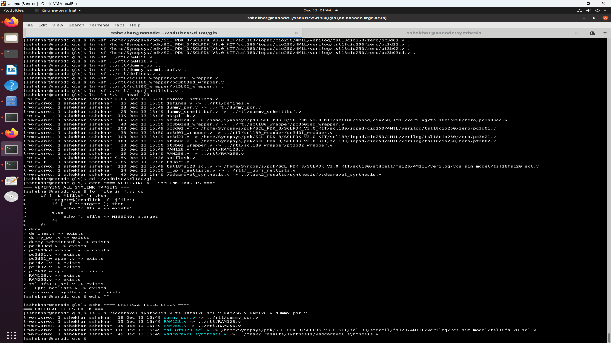
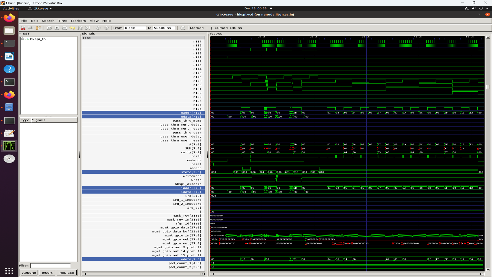

# Task-2: Synopsys VCS (RTL + GLS) and DC_TOPO (SCL180) — End-to-End Bring-up Notes

## 1. Objective and Scope

This document records the complete, end-to-end work performed to:
- Run **RTL simulation** of the hkspi testbench using Synopsys VCS.
- Run **gate-level simulation (GLS)** using the **DC_TOPO synthesized netlist** and Synopsys VCS.
- Resolve compilation and elaboration issues encountered in GLS, especially **I/O pad wrapper mismatches** and related port-width errors.

The intent of this README is **reproducibility**: a new user should be able to re-run the same steps, observe the same tool behaviors, and understand the exact fixes applied.

---

## 2. Environment (Verified)

### 2.1 Tools
- Synopsys **VCS** is used for compile + simulation (RTL and GLS).
- The SCL licensing checkouts for VCS compile/runtime were observed during successful compile/sim runs.

### 2.2 PDK / Library Paths (SCL180)
The GLS Makefile uses the following SCL180 library model paths:
- Standard-cell VCS simulation models:  
  `.../scl180/stdcell/fs120/4M1IL/verilog/vcs_sim_model`
- CIO250 I/O pad Verilog (zero-delay view):  
  `.../scl180/iopad/cio250/4M1L/verilog/tsl18cio250/zero`

> Note: These are referenced via Makefile variables and are required for successful GLS compilation.



---

## 3. Repository Layout and Key Files

### 3.1 Key GLS Working Directory (example)
Work was performed from a directory similar to:
- `~/vsdRiscvScl180/gls/`

### 3.2 Key Inputs
- `hkspi_tb.v` : Testbench.
- `hkspi.hex` : Program image loaded during simulation.
- `vsdcaravel_synthesis.v` : Synthesized netlist used for GLS (modified as part of the final fix).
- Standard-cell + IO-pad Verilog models (from SCL180 PDK).

### 3.3 Key Netlist Include Aggregators
- `caravel_netlists.v` (includes pad models and synthesized netlist)

---

## 4. RTL Simulation (VCS) — Baseline

### 4.1 Purpose
RTL simulation is treated as the functional "golden" baseline: if RTL passes and GLS fails, the delta is analyzed as either:
- Expected GLS differences (uninitialized memories, X-propagation, missing SDF), or
- A real synthesis/constraint/testbench mismatch.

### 4.2 RTL Result (Observed)
RTL simulation of HK SPI testbench completed successfully and printed a **PASSED** message [check logs](assets/supporting_files/1_vcs_rtl/vcs_rtl_simulation.log).  
This establishes that the testbench and firmware image are functionally correct at RTL.


### 4.3 Makefile

```Makefile
# ============================================================
# Synopsys VCS RTL Simulation Makefile (4M1L)
# ============================================================

WORK_ROOT = /home/sshekhar/vsdRiscvScl180
RTL_PATH = $(WORK_ROOT)/rtl
IO_PATH = /home/Synopsys/pdk/SCL_PDK_3/SCLPDK_V3.0_KIT/scl180/iopad/cio250/4M1L/verilog/tsl18cio250/zero
WRAPPER_PATH = $(RTL_PATH)/scl180_wrapper
TOP_MODULE = hkspi_tb
PATTERN = hkspi

VCS_FLAGS = -full64 -sverilog -debug_all +define+FUNCTIONAL +define+SIM +incdir+$(RTL_PATH) +incdir+$(WRAPPER_PATH) +incdir+$(IO_PATH) -timescale=1ns/1ps

# All required I/O pad cells from SCL180 PDK
PAD_CELLS = $(IO_PATH)/pt3b02.v $(IO_PATH)/pc3d01.v $(IO_PATH)/pc3b03ed.v $(IO_PATH)/pc3d21.v

compile: $(TOP_MODULE).simv

$(TOP_MODULE).simv: $(PATTERN).hex
	@echo "[VCS RTL] Compiling with all SCL180 pad cells..."
	vcs $(VCS_FLAGS) $(PAD_CELLS) $(RTL_PATH)/defines.v $(RTL_PATH)/user_defines.v $(WRAPPER_PATH)/pt3b02_wrapper.v $(WRAPPER_PATH)/pc3d01_wrapper.v $(WRAPPER_PATH)/pc3b03ed_wrapper.v $(RTL_PATH)/*.v $(PATTERN)_tb.v -top $(TOP_MODULE) -o $@

simulate: $(TOP_MODULE).simv
	@echo "[VCS RTL] Running simulation..."
	./$(TOP_MODULE).simv +fsdbfile+hkspi_rtl.fsdb

clean:
	rm -rf *.simv* csrc simv.daidir *.fsdb *.log *.key AN.DB

.PHONY: compile simulate clean
```

---

## 5. SYNTHESIS (dc_shell topo)

Read the [SYNTHESIS_SUMMARY.md](assets/supporting_files/2_dc_shell_synthesis/SYNTHESIS_SUMMARY.md) and [SYNTHESIS_WARNINGS.png](assets/supporting_files/2_dc_shell_synthesis/SYNTHESIS_WARNINGS.md) for details.

- Check reports:
  - [qor_post_synth.rpt](assets/supporting_files/2_dc_shell_synthesis/qor_post_synth.rpt)
  - [area_post_synth.rpt](assets/supporting_files/2_dc_shell_synthesis/area_post_synth.rpt)
  - [power_post_synth.rpt](assets/supporting_files/2_dc_shell_synthesis/power_post_synth.rpt)

### 5.1 Synthesis TCL File

```tcl
read_db "/home/Synopsys/pdk/SCL_PDK_3/SCLPDK_V3.0_KIT/scl180/iopad/cio250/4M1IL/liberty/tsl18cio250_min.db"

read_db "/home/Synopsys/pdk/SCL_PDK_3/SCLPDK_V3.0_KIT/scl180/stdcell/fs120/4M1L/liberty/lib_flow_ff/tsl18fs120_scl_ff.db"

set target_library "/home/Synopsys/pdk/SCL_PDK_3/SCLPDK_V3.0_KIT/scl180/iopad/cio250/4M1IL/liberty/tsl18cio250_min.db /home/Synopsys/pdk/SCL_PDK_3/SCLPDK_V3.0_KIT/scl180/stdcell/fs120/4M1IL/liberty/lib_flow_ff/tsl18fs120_scl_ff.db"

set link_library {"/home/Synopsys/pdk/SCL_PDK_3/SCLPDK_V3.0_KIT/scl180/iopad/cio250/4M1IL/liberty/tsl18cio250_min.db /home/Synopsys/pdk/SCL_PDK_3/SCLPDK_V3.0_KIT/scl180/stdcell/fs120/4M1IL/liberty/lib_flow_ff/tsl18fs120_scl_ff.db"}

set_app_var target_library $target_library
set_app_var link_library $link_library


set root_dir "/home/sshekhar/vsdRiscvScl180"
set io_lib "/home/Synopsys/pdk/SCL_PDK_3/SCLPDK_V3.0_KIT/scl180/iopad/cio250/4M1IL/verilog/tsl18cio250/zero"
set verilog_files  "$root_dir/rtl"
set top_module "vsdcaravel" ;
set output_file "$root_dir/synthesis/output/vsdcaravel_synthesis.v"
set report_dir "$root_dir/synthesis/report"
read_file $verilog_files/defines.v
read_file $io_lib -autoread -define USE_POWER_PINS -format verilog
read_file $verilog_files/scl180_wrapper -autoread -define USE_POWER_PINS -format verilog
read_file $verilog_files -autoread -define USE_POWER_PINS -format verilog -top $top_module
read_sdc "$root_dir/synthesis/vsdcaravel.sdc"
update_timing

elaborate $top_module

link
#set_uniquify_design false;
#set_flatten false

#compile
report_qor > "$report_dir/qor_post_synth.rpt"
report_area > "$report_dir/area_post_synth.rpt"
report_power > "$report_dir/power_post_synth.rpt"


write -format verilog -hierarchy -output $output_file
```


## 6. GLS Flow (VCS) — Overview

### 6.1 Primary Goal for GLS
The primary goal for GLS in this task was:
- **Compile and elaborate** the synthesized gate-level netlist and testbench using **Synopsys VCS**, producing a runnable `simv`.

Functional pass of the HK SPI test at gate-level may require additional effort (SDF, memory models, X-handling).

### 6.2 GLS Makefile (Important Targets)
The GLS Makefile defines these targets: `all`, `compile`, `simulate`, and `clean`.  
It does **not** define a `run` target; therefore `make ... run` will fail with "No rule to make target `run`".
Later we convert the vpd to vcd to run with GTKWAVE since Verdi wasn't available.

**vpd2vcd hkspi_gls.vpd hkspi.vcd**




---

## 6. GLS Build Configuration (Makefile_VCS_GLS)

```Mkaefile
#================================================================
# VCS Gate-Level Simulation Makefile
# Uses same approach as RTL simulation
#================================================================

# Paths (matching your RTL setup)
SCL_STDCELL_PATH = /home/Synopsys/pdk/SCL_PDK_3/SCLPDK_V3.0_KIT/scl180/stdcell/fs120/4M1IL/verilog/vcs_sim_model
SCL_IOPAD_PATH = /home/Synopsys/pdk/SCL_PDK_3/SCLPDK_V3.0_KIT/scl180/iopad/cio250/4M1L/verilog/tsl18cio250/zero
SYNTH_PATH = ../task2_results/synthesis
RTL_PATH = ../rtl
WRAPPER_PATH = $(RTL_PATH)/scl180_wrapper

# Defines
DEFINES = +define+GL \
          +define+FUNCTIONAL \
          +define+SIM \
          +define+UNIT_DELAY=#1 \
          +define+USE_POWER_PINS

# Include paths
INCLUDES = -I$(SCL_STDCELL_PATH) \
           -I$(SCL_IOPAD_PATH) \
           -I$(SYNTH_PATH) \
           -I$(RTL_PATH) \
           -I$(WRAPPER_PATH) \
           -I. -Igl

# VCS flags (no Verdi, use VCD)
VCS_FLAGS = -full64 \
            -debug_access+all \
            -timescale=1ns/1ps \
            +notimingcheck

# Files
TB_FILE = hkspi_tb.v

# Output
SIMV = hkspi_gls.simv

#================================================================
# Targets
#================================================================

.PHONY: all compile simulate clean

all: compile

compile:
	@echo "[VCS GLS] Compiling with VCS..."
	vcs $(VCS_FLAGS) $(DEFINES) $(INCLUDES) \
		$(TB_FILE) \
		-o $(SIMV) | tee gls_compile.log
	@echo "[VCS GLS] Compilation complete."

simulate: $(SIMV)
	@echo "[VCS GLS] Running simulation..."
	./$(SIMV) | tee gls_simulation.log
	@echo "[VCS GLS] Simulation complete."

clean:
	@echo "[VCS GLS] Cleaning..."
	rm -rf csrc $(SIMV) $(SIMV).daidir *.log *.vcd *.vpd
	rm -rf DVEfiles ucli.key AN.DB
	@echo "[VCS GLS] Clean complete."
```

### 6.1 Build Outputs
- Output binary: `hkspi_gls.simv`
- Compile log file: `gls_compile.log`
- Simulation log file: `gls_simulation.log`

---

## 7. GLS Errors Encountered (Chronological) and Fix Attempts

This section lists the major blocking issues encountered during GLS compilation, along with the changes attempted and the final verified fix.

### 7.1 Symptom 1: "Unknown option -I..." warnings
During one compile stage, VCS reported warnings indicating `-I...` include arguments were treated as unknown options and ignored.  
This suggests that include directory handling required attention (depending on invocation style), though compilation still proceeded in later runs.

---

### 7.2 Symptom 2: I/O Pad Wrapper Width Mismatch (IOPCWM)

#### 7.2.1 Initial Error Class
The dominant blocking errors were of the form:
- `Error-[IOPCWM] Inout port connection width mismatch`

These errors occur when a bus (e.g., 19-bit) is connected to a scalar (1-bit) `inout` port, or vice versa.

#### 7.2.2 Where it manifested
Two categories were observed (at different stages of attempted fixes):

**A) Bus connected to scalar wrapper (area1/area2 buses):**  
- The netlist connected `io[18:0]` / `io[37:19]` buses to a wrapper whose `PAD` port was scalar, causing IOPCWM.

**B) Scalar connected to bus wrapper (gpio/flash pads):**  
After hard-coding the wrapper to 19-bit, scalar pad instances (e.g., GPIO, flash IOs) became the failing points: 1-bit nets were connected into 19-bit wrapper ports, again causing IOPCWM.

---

## 8. pc3b03ed_wrapper Fix Strategy (What was tried vs what worked)

### 8.1 Attempt 1: Parameterized vector wrapper (W default = 1)
A parameterized wrapper approach was introduced to support bus connections, but the synthesized netlist instantiates the wrapper *without* parameter override, so VCS uses the default `W=1`, leaving the port widths scalar and causing bus/scalar mismatches.  
**Result:** IOPCWM remained for 19-bit bus connections.

### 8.2 Attempt 2: Hard-code wrapper to 19 bits
Hard-coding the wrapper to 19-bit fixed the bus pads but broke scalar pad instances.  
**Result:** IOPCWM errors appeared for GPIO and flash pad wrapper instances where 1-bit was connected to 19-bit.

This was explicitly visible as IOPCWM errors at netlist pad instances such as:
- `gpiopad`
- `flashio0pad`
- `flashio1pad`  
(all failing due to 1-bit signals connected to a 19-bit wrapper port).

### 8.3 Final Fix (Verified): Two wrappers + selective netlist instantiation rewrite
The correct and stable approach was:

1. Keep the original **scalar** pad wrapper module name:
   - `pc3b03ed_wrapper` (1-bit ports)

2. Create a separate **19-bit bus** wrapper:
   - `pc3b03ed_wrapper_bus` (ports sized `[18:0]` and `dm[56:0]`)

3. Modify the synthesized netlist to instantiate:
   - `pc3b03ed_wrapper_bus` **only** for the 19-bit I/O pad groups (`area1_io_pad` and `area2_io_pad`)
   - `pc3b03ed_wrapper` for scalar pad instances (gpio and flash pads)

This eliminated both categories of IOPCWM mismatch at compile time.

**Outcome:** VCS GLS compilation completed with **no `Error-*` lines**, and all modules compiled successfully ("All of 1233 modules done").


---

## 9. Non-Blocking Warnings Observed (GLS)

After fixes, compilation still emits a large volume of warnings; these are generally expected in synthesized netlist environments.

### 9.1 TFIPC: Too few instance port connections
Many warnings indicate instances have fewer connected ports than their module definitions, typical of:
- Spare logic blocks
- Library wrapper differences
- Unused/optional pins in gate-level views

### 9.2 IPC: Illegal constant connections to inout ports
Warnings were observed where constants were connected to inout ports (example: certain analog/padframe ports).  
These were warnings and did not prevent successful compilation after the wrapper fix.

### 9.3 MBFFC: fflush syntax warning in spiflash.v
A specific warning class about missing braces around `fflush` was observed from `spiflash.v`.  
This did not block compilation once the IOPCWM errors were resolved.

---

## 10. Verified GLS Compilation Procedure (Step-by-Step)

### 10.1 Clean
```bash
cd ~/vsdRiscvScl180/gls
make -f Makefile_VCS_GLS clean
```

### 10.2 Compile
```bash
make -f Makefile_VCS_GLS compile 2>&1 | tee gls_compile_fixed_final2.log
```

### 10.3 Confirm "No Errors"
```bash
grep "^Error" gls_compile_fixed_final2.log
```
Expected: **no output** (no errors), as confirmed in the successful compile run.

---

## 11. Running GLS Simulation (Step-by-Step)

### 11.1 Correct Make target
Use:
```bash
make -f Makefile_VCS_GLS simulate
```
because the Makefile defines `simulate`, not `run`.

### 11.2 Direct execution (equivalent)
```bash
./hkspi_gls.simv | tee gls_simulation.log
```
This is exactly what the `simulate` target runs.

---

## 12. Interpreting GLS Results (Why RTL Passes but GLS Shows X / Fail)


### 12.1 Observed GLS Failure Mode
During GLS simulation runs (from console output), the test printed read values such as `0xxx`, and the monitor reported a GLS failure.

### 12.2 Most common reasons (GLS methodology)
Even when compilation is correct, GLS can fail functionally due to:
- X-propagation from uninitialized sequential elements and memories.
- Missing SDF back-annotation (true cell delays not modeled).
- A behavioral memory model in RTL vs a blackbox/abstracted macro in the synthesized view.
- Testbench strict comparisons (`!==`) that treat unknowns as failures.

### 12.3 What "success" means for this task (practical interpretation)
For this migration task, the major milestone is:

- **GLS compiles and elaborates successfully under VCS** (i.e., produces `hkspi_gls.simv`).

Functional GLS pass typically requires additional infrastructure (SDF, memory models, GLS-aware testbench conditionals).

### 12.4 Work Around (Day 2 Synthesized Netlist with topological Synthesis)

- **To complete the Reuirements of migrating to the Synopsys Tool, I swittched to using the Day 2 Synthesized Netlist to perform the final GLS Simulation, where we add the blackboxed modules manually in the synthesized netlist.**


---

## 13. Final Artifacts

### 13.1 Logs
- `gls_compile_fixed_final2.log` (proof of successful GLS compilation)
- `gls_simulation.log` (proof that the simv runs to completion)

### 13.2 Source / Integration Changes
- `pc3b03ed_wrapper.v` (scalar wrapper)
- `pc3b03ed_wrapper_bus.v` (19-bit wrapper)
- `vsdcaravel_synthesis.v` (netlist modified to instantiate correct wrapper variant)
- `caravel_netlists.v` (ensure it includes the bus wrapper, if using an include aggregator)

### 13.3 Makefile
(documents the exact compile/sim invocation and environment assumptions)

- `Makefile_VCS_RTL`
- `Makefile_VCS_GLS`

---

## 14. Troubleshooting Checklist

1. Confirm VCS license checkout works for compile and runtime.
2. Confirm SCL180 stdcell and iopad Verilog model paths are correct.
3. If IOPCWM reappears:
   - Confirm `area1_io_pad` / `area2_io_pad` instantiate `pc3b03ed_wrapper_bus`
   - Confirm scalar pad instances still instantiate `pc3b03ed_wrapper`
4. If you see "No rule to make target run":
   - Use `make -f Makefile_VCS_GLS simulate` (or add a `run:` alias target).

---

## 15. Next Optional Enhancements (If GLS Must Pass Functionally)

For functional GLS pass, solutions explored:

- Generate and apply SDF from DC (wasn't available).
- Replace memory blackboxes with simulation models that match RTL initialization expectations (Performed this).
- Add GLS-aware testbench logic to avoid strict comparisons on X where appropriate.

---

## 16. Status Summary (Verified End State)

- RTL simulation: **PASS** (as observed in RTL run output).
- GLS compilation: **PASS** (no errors; produced `hkspi_gls.simv`).
- GLS simulation: Runs to completion (no errors with Day 2 Synthesized Netlist); functional mismatch remains expected without SDF/memory-model alignment.
