# **COMPREHENSIVE ARCHITECTURE & BOTTOM-UP ANALYSIS: VSDCARAVEL SCL180 SoC**

```text
Testbenches
  hkspi_tb / gpio_tb / storage_tb / mprj_ctrl_tb / irq_tb
    `include "__uprj_netlists.v"
    `include "caravel_netlists.v"
    `include "spiflash.v"
        |
        v
Top-level chip
  vsdcaravel  (vsdcaravel.v)
    - instantiates: caravel_core
    - instantiates: copyright_block, caravel_logo, caravel_motto, open_source, user_id_textblock
        |
        v
SoC core / integration
  caravel_core  (caravel_core.v)
    - instantiates: mgmt_core_wrapper  ("soc")
          |
          v
        mgmt_core  (mgmt_core.v)  [inside wrapper]
          - includes RAM256.v, RAM128.v, VexRiscv_MinDebugCache.v
    - instantiates: mgmt_protect ("mgmt_buffers") [user boundary buffering]
    - clock/reset generation path uses:
        caravel_clocking (caravel_clocking.v)
          - clock_div (clock_div.v)
        digital_pll (digital_pll.v)
          - ring_osc2x13 (ring_osc2x13.v)
          - digital_pll_controller (digital_pll_controller.v)
    - pad/reset assist:
        xres_buf (xres_buf.v)
    - user pad array:
        mprj_io (mprj_io.v)
          - pc3b03ed_wrapper [pad primitive wrapper array]

```

## **FILE-LEVEL ARCHITECTURE OVERVIEW**

```mermaid
---
config:
  layout: elk
  theme: neutral
  look: neo
---
flowchart LR
 subgraph PLACEHOLDERS[" "]
        copyright["copyright_block.v<br>copyright_block_a.v"]
        logo["caravel_logo.v<br>caravel_motto.v"]
        empty["empty_macro.v<br>manual_power_connections.v<br>open_source.v<br>user_id_textblock.v"]
  end
 subgraph PRIMITIVES["LAYER 1: CORE PRIMITIVES"]
        dummy["dummy_scl180_conb_1.v<br>HI=1, LO=0"]
        primitives_v["primitives.v<br>UDP header"]
  end
 subgraph CONSTANTS["LAYER 2: CONSTANT SOURCES"]
        constant_block["constant_block.v<br>Buffered 1/0"]
        gpio_logic_high["gpio_logic_high.v<br>Single logic-1"]
        mprj_logic_high["mprj_logic_high.v<br> HI 462:0"]
        mprj2_logic_high["mprj2_logic_high.v<br>vccd2 domain HI"]
  end
 subgraph CONFIG["LAYER 3: CONFIGURATION & ID"]
        defines["defines.v<br>Global parameters"]
        user_defines["user_defines.v<br>User parameters"]
        user_id["user_id_programming.v<br>32-bit mask ID"]
        gpio_defaults["gpio_defaults_block.v<br>13-bit GPIO config"]
        debug_regs["debug_regs.v<br>Debug registers"]
  end
 subgraph UTILS["LAYER 4: UTILITIES"]
        buff_flash["buff_flash_clkrst.v<br>Cross-quadrant buffer"]
        xres_buf["xres_buf.v<br>Reset passthrough"]
  end
 subgraph SPARE["LAYER 5: SPARE LOGIC (ECO)"]
        spare_logic["spare_logic_block.v<br>27 spare gates + flops"]
        spare_cell["scl180_macro_sparecell.v<br>Small spare cell"]
  end
 subgraph MEMORY["LAYER 6: MEMORY"]
        ram128["RAM128.v<br>128×32 SRAM"]
        ram256["RAM256.v<br>256×32 banked RAM"]
  end
 subgraph CLOCKING["LAYER 7: CLOCKING"]
        ring_osc["ring_osc2x13.v<br>13-stage RO<br>90-214 MHz"]
        pll_ctrl["digital_pll_controller.v<br>FLL controller<br>26-bit trim"]
        digital_pll["digital_pll.v<br>PLL/DCO modes"]
        clk_div["clock_div.v<br>Even/Odd divider"]
        caravel_clocking["caravel_clocking.v<br>Clock/reset mgmt"]
  end
 subgraph PADS["LAYER 8: I/O PAD WRAPPERS"]
        pads_def["pads.v<br>Pad macros"]
        pc3d01["pc3d01_wrapper.v<br>CMOS input pad"]
        pt3b02["pt3b02_wrapper.v<br>TTL output pad"]
        pc3b03ed["pc3b03ed_wrapper.v<br>Bidir pad + pull"]
        mprj_io_buffer["mprj_io_buffer.v<br>User I/O buffer"]
  end
 subgraph GPIO["LAYER 9: GPIO INFRASTRUCTURE"]
        gpio_ctrl["gpio_control_block.v<br>Serial 13-bit config"]
        gpio_buf["gpio_signal_buffering.v<br>Long-wire buffers"]
        gpio_buf_alt["gpio_signal_buffering_alt.v<br>Alternate buffering"]
        mprj_io["mprj_io.v<br>User GPIO array"]
  end
 subgraph SPI["LAYER 10: SPI & HOUSEKEEPING"]
        housekeeping["housekeeping.v<br>SPI master + config"]
        housekeeping_spi["housekeeping_spi.v<br>SPI slave + passthrough"]
        spiflash["spiflash.v<br>Flash sim model"]
  end
 subgraph CPUS["LAYER 11: PROCESSOR CORES"]
        vexriscv["VexRiscv_MinDebugCache.v<br>RV32IM + cache<br>Management CPU"]
  end
 subgraph MGMT["LAYER 12: MANAGEMENT SoC"]
        mgmt_core["mgmt_core.v<br>LiteX SoC<br>275KB netlist"]
        mgmt_protect["mgmt_protect.v<br>Protection logic"]
        mgmt_wrapper["mgmt_core_wrapper.v<br>Core wrapper"]
  end
 subgraph USER["LAYER 13: USER PROJECT AREA"]
        user_wrapper["user_project_wrapper.v<br>Digital wrapper"]
        user_analog["user_analog_project_wrapper.v<br>Analog wrapper"]
        user_gpio_ex["user_project_gpio_example.v<br>GPIO example"]
        user_la_ex["user_project_la_example.v<br>Logic analyzer example"]
        openframe["openframe_project_wrapper.v<br>44-pad openframe"]
  end
 subgraph CHIP_IO["LAYER 14: PADFRAME INTEGRATION"]
        chip_io["chip_io.v<br>Padframe controller"]
  end
 subgraph TOP["LAYER 15: TOP-LEVEL INTEGRATION"]
        caravel_core["caravel_core.v<br>Core SoC integration"]
        vsdcaravel["vsdcaravel.v<br>Top-level chip"]
        caravel_netlists["caravel_netlists.v<br>Include list"]
        uprj_netlists["uprj_netlists.v<br>User project includes"]
  end
    dummy --> constant_block & gpio_logic_high & mprj_logic_high & mprj2_logic_high & user_id & gpio_defaults & spare_logic & spare_cell
    defines --> gpio_defaults & clk_div & caravel_core
    user_defines --> user_wrapper
    ring_osc --> digital_pll
    pll_ctrl --> digital_pll
    digital_pll --> caravel_clocking
    clk_div --> caravel_clocking
    pads_def --> pc3d01 & pt3b02 & pc3b03ed
    gpio_logic_high --> gpio_ctrl
    gpio_defaults --> gpio_ctrl
    pc3b03ed --> gpio_ctrl & chip_io
    gpio_ctrl --> gpio_buf & gpio_buf_alt & mprj_io
    mprj_logic_high --> mprj_io
    mprj_io_buffer --> mprj_io
    ram128 --> ram256
    ram256 --> mgmt_core & mgmt_core
    spiflash --> housekeeping_spi
    housekeeping_spi --> housekeeping
    vexriscv --> mgmt_core
    mgmt_core --> mgmt_wrapper
    mgmt_protect --> mgmt_wrapper
    mgmt_wrapper --> caravel_core
    user_wrapper --> caravel_core
    user_analog --> caravel_core
    uprj_netlists --> user_wrapper
    pc3d01 --> chip_io
    pt3b02 --> chip_io
    mprj_io --> chip_io
    xres_buf --> chip_io
    caravel_core --> vsdcaravel
    chip_io --> vsdcaravel
    housekeeping --> caravel_core
    caravel_clocking --> caravel_core
    buff_flash --> caravel_core
    debug_regs --> caravel_core
    user_id --> caravel_core
    constant_block --> caravel_core
    caravel_netlists --> vsdcaravel

     copyright:::placeholder
     logo:::placeholder
     empty:::placeholder
     dummy:::primitive
     primitives_v:::primitive
     constant_block:::constant
     gpio_logic_high:::constant
     mprj_logic_high:::constant
     mprj2_logic_high:::constant
     defines:::config
     user_defines:::config
     user_id:::config
     gpio_defaults:::config
     debug_regs:::config
     ram128:::memory
     ram256:::memory
     ring_osc:::clock
     pll_ctrl:::clock
     digital_pll:::clock
     clk_div:::clock
     caravel_clocking:::clock
     pads_def:::pad
     pc3d01:::pad
     pt3b02:::pad
     pc3b03ed:::pad
     mprj_io_buffer:::pad
     gpio_ctrl:::gpio
     gpio_buf:::gpio
     gpio_buf_alt:::gpio
     mprj_io:::gpio
     vexriscv:::cpu
     caravel_core:::top
     vsdcaravel:::top
    classDef primitive fill:#e1f5ff,stroke:#01579b,stroke-width:2px
    classDef constant fill:#fff9c4,stroke:#f57f17,stroke-width:2px
    classDef config fill:#f3e5f5,stroke:#4a148c,stroke-width:2px
    classDef clock fill:#ffe0b2,stroke:#e65100,stroke-width:2px
    classDef pad fill:#c8e6c9,stroke:#1b5e20,stroke-width:2px
    classDef gpio fill:#b2dfdb,stroke:#004d40,stroke-width:2px
    classDef cpu fill:#ffccbc,stroke:#bf360c,stroke-width:2px
    classDef memory fill:#d1c4e9,stroke:#311b92,stroke-width:2px
    classDef top fill:#ffcdd2,stroke:#b71c1c,stroke-width:3px
    classDef placeholder fill:#f5f5f5,stroke:#9e9e9e,stroke-width:1px,stroke-dasharray:5
```



> Legend: “PD” = power domain; “CD/RD” = clock domain/reset domain.

| Layer                    | File                     | Module(s)                       | Purpose                                                                                                                                                          | Interfaces (key ports)                                                                                                                                                                                | Internal structure                                                                                                                                                                   | Dependencies                                                                                                                                                                                                                          | PD                                                                    | CD/RD                                                                                                                 |
| ------------------------ | ------------------------ | ------------------------------- | ---------------------------------------------------------------------------------------------------------------------------------------------------------------- | ----------------------------------------------------------------------------------------------------------------------------------------------------------------------------------------------------- | ------------------------------------------------------------------------------------------------------------------------------------------------------------------------------------ | ------------------------------------------------------------------------------------------------------------------------------------------------------------------------------------------------------------------------------------- | --------------------------------------------------------------------- | --------------------------------------------------------------------------------------------------------------------- |
| Build glue (SIM/GL)      | caravel_netlists.v       | (no module; include aggregator) | Controls SIM/GL compilation, defines USE_POWER_PINS, and conditionally includes either RTL wrappers/pads or GL-oriented includes. caravel_netlists.v​            | N/A (compile-time include file). caravel_netlists.v​                                                                                                                                                  | Uses ifdef SIM and ifdef GL to select include sets. caravel_netlists.v​                                                                                                              | Includes: pads.v, digital_pll.v, caravel_clocking.v, chip_io.v, housekeeping.v, mgmt_protect.v, gpio_control_block.v, xres_buf.v, mgmt_core_wrapper.v, vsdcaravel.v, plus additional modules listed in that file. caravel_netlists.v​ | N/A                                                                   | N/A                                                                                                                   |
| Chip top                 | vsdcaravel.v             | vsdcaravel                      | Package-facing top-level; connects external pins/rails/clock/reset to the internal SoC core. vsdcaravel.v​                                                       | Power pins (vddio, vddio_2, vssio, …), clock, reset_n, gpio, mprj_io[], and flash pins (flash_csb, flash_clk, flash_io0, flash_io1). vsdcaravel.v​                                                    | Instantiates caravel_core and also instantiates text/logo “modules” for chip labeling. vsdcaravel.v​                                                                                 | Includes: caravel_core.v and textblock/logo sources. vsdcaravel.v​                                                                                                                                                                    | Mixed (exports all rails). vsdcaravel.v​                              | External clock and reset_n are primary entry points. vsdcaravel.v​                                                    |
| SoC integration          | caravel_core.v           | caravel_core                    | Core integration: mgmt SoC wrapper, wishbone export to user area, LA/IRQ, flash control framing, and user IO control signals. caravel_core.v​                    | Outputs rstn_h, rst_l; inputs rstb_h, clock_core; flash framing pins; user mprj_io_* control buses; mprj_analog_io. caravel_core.v​                                                                   | Instantiates mgmt_core_wrapper soc and mgmt_protect mgmt_buffers (shown in excerpt). caravel_core.v​                                                                                 | Includes: mprj_io_buffer.v, manual_power_connections.v, empty_macro.v, user_defines.v. caravel_core.v​                                                                                                                                | Mixed (has full rail set when USE_POWER_PINS). caravel_core.v​        | Uses caravel_clk/caravel_rstn internally to drive mgmt_core_wrapper. caravel_core.v​                                  |
| Mgmt SoC (CPU subsystem) | mgmt_core.v              | mgmt_core                       | Auto-generated LiteX/Migen management core: SPI flash control, Wishbone master to user, UART, debug, LA, IRQ enable, etc. mgmt_core.v​                           | core_clk, core_rstn, flash QSPI pins, Wishbone (mprj_*), housekeeping WB inputs (hk_*), UART (serial_tx/rx), LA (la_*), IRQ (user_irq_ena, user_irq), plus additional scan-like signals. mgmt_core.v​ | Large generated design with many CSR banks and internal buses (excerpt shows CSR wiring style). mgmt_core.v​                                                                         | Includes RAM256.v, RAM128.v, VexRiscv_MinDebugCache.v. mgmt_core.v​                                                                                                                                                                   | 1.8V domain noted as VPWR/VGND when enabled. mgmt_core.v​             | Driven by core_clk/core_rstn. mgmt_core.v​                                                                            |
| Clocking/reset mux       | caravel_clocking.v       | caravel_clocking                | Selects PLL vs external clock, divides PLL clocks, synchronizes external clock to PLL domain, and produces synchronized reset. caravel_clocking.v​               | rstn, reset_n, ext_clk_sel, ext_clk, pll_clk, pll_clk90, sel, sel2, ext_reset; outputs core_clk, user_clk, reset_n_sync. caravel_clocking.v​                                                          | Two clock_div instances, plus staged reset delay and a two-flop synchronizer for ext_clk. caravel_clocking.v​                                                                        | Depends on clock_div module. caravel_clocking.v​                                                                                                                                                                                      | Digital (core domain). caravel_clocking.v​                            | Output core_clk/user_clk; reset is combined to reset_n_async then delayed to reset_n_sync. caravel_clocking.v​        |
| PLL                      | digital_pll.v            | digital_pll                     | Frequency-locked “digital PLL”: ring oscillator + controller, optional DCO mode with external trim. digital_pll.v​                                               | Inputs: reset_n, enable, osc, div[4:0], dco, ext_trim[25:0]; outputs clockp[1:0]. digital_pll.v​                                                                                                      | Instantiates ring_osc2x13 and digital_pll_controller, then buffers clocks with bufbdf. digital_pll.v​                                                                                | Depends on digital_pll_controller.v, ring_osc2x13.v, and primitive bufbdf. digital_pll.v​                                                                                                                                             | Digital (core domain). digital_pll.v​                                 | Controller clocked by ring osc phase clockp_buffer_in[0]; reset derived from reset_n and enable. digital_pll.v​       |
| PLL controller           | digital_pll_controller.v | digital_pll_controller          | Computes thermometer-code trim for the ring oscillator by counting osc periods vs target divider. digital_pll_controller.v​                                      | Inputs: reset, clock, osc, div[4:0]; output trim[25:0]. digital_pll_controller.v​                                                                                                                     | Implements counters, sum comparison, and a lookup mapping tint to a 26-bit trim pattern. digital_pll_controller.v​                                                                   | Used by digital_pll. digital_pll.v+1​                                                                                                                                                                                                 | Digital (core domain). digital_pll_controller.v​                      | Clocked by clock; async reset reset. digital_pll_controller.v​                                                        |
| IO pad macro glue        | pads.v                   | (Verilog macros)                | Defines SCL180 pad instantiation macros mapping “Sky130-style” intent to SCL180 wrapper macros (e.g., pc3d01_wrapper, pt3b02_wrapper, pc3b03ed_wrapper). pads.v​ | N/A (macros like ``define INPUT_PAD/OUTPUT_PAD`).                                                                                                                                                    | Macro-based abstraction; also defines abutment pin macros.                                                                                                                 | Depends on SCL180 wrappers (pc3d01_wrapper, pt3b02_wrapper, pc3b03ed_wrapper) and pad primitive pc3d21.                                                                                                                  | Pad/IO oriented.                                                     | N/A                                                                                                                   |
| User pad array           | mprj_io.v                | mprj_io                         | Instantiates the user GPIO pad array using SCL180 bidirectional pad wrapper arrays and provides Sky130-compatibility signals. mprj_io.v​                         | io[TOTAL_PADS-1:0] (pads), io_out, oeb, inp_dis, dm, outputs io_in, io_in_3v3; outputs analog_io/analog_noesd_io (mirrors). mprj_io.v​                                                                | Two pad arrays: pc3b03ed_wrapper area1_io_pad[...] and area2_io_pad[...]; assigns io_in_3v3 = io_in; maps analog mirrors to io[TOTAL_PADS-3:7]. mprj_io.v​                           | Depends on pc3b03ed_wrapper. mprj_io.v​                                                                                                                                                                                               | Padframe domain; supplies are ports but “not used in RTL”. mprj_io.v​ | No internal clock; reset inputs exist (rstn_h, reset_n_core_h) but excerpt does not show sequential logic. mprj_io.v​ |
| Mgmt GPIO buffering      | mprj_io_buffer.v         | mprj_io_buffer                  | Buffers mgmt GPIO in/out/oeb vectors through a buffer cell array (timing/drive isolation). mprj_io_buffer.v​                                                     | Inputs mgmt_gpio_in[], mgmt_gpio_oeb[2:0], mgmt_gpio_out[]; outputs _buf versions. mprj_io_buffer.v​                                                                                                  | Instantiates buffd7 BUF[...] over a concatenation bus {in,oeb,out} → {in_buf,oeb_buf,out_buf}. mprj_io_buffer.v​                                                                     | Depends on primitive buffd7. mprj_io_buffer.v​                                                                                                                                                                                        | Digital (core). mprj_io_buffer.v​                                     | No clock; combinational buffering. mprj_io_buffer.v​                                                                  |
| GPIO config chain        | gpio_control_block.v     | gpio_control_block              | Serial configuration/shift-register cell for per-pad controls and mgmt/user muxing; propagates serial clock/reset/load around padframe. gpio_control_block.v​    | Serial chain: serial_clock, serial_load, serial_data_in/out, resetn/resetn_out; pad control outputs (pad_gpio_*, pad_gpio_dm), mgmt/user IO signals. gpio_control_block.v​                            | Has a shift register, negedge latch for serial_data_out, buffers {serial_clock, resetn, serial_load} through bufbd7. gpio_control_block.v​                                           | Depends on bufbd7 and a sparecell include. gpio_control_block.v​                                                                                                                                                                      | Digital (core/user boundary). gpio_control_block.v​                   | Clocked by serial_clock; async reset resetn. gpio_control_block.v​                                                    |
| Reset pad buffer         | xres_buf.v               | xres_buf                        | Reset “level-shift buffer” between pad and core; implemented as direct passthrough in this SCL180 variant. xres_buf.v​                                           | X (pad side), A (core side), optional VPWR/VGND/LVPWR/LVGND. xres_buf.v​                                                                                                                              | assign A = X; (no extra logic). xres_buf.v​                                                                                                                                          | None (pure wiring). xres_buf.v​                                                                                                                                                                                                       | Bridges pad(3.3V) to core(1.8V) conceptually. xres_buf.v​             | No clock; combinational. xres_buf.v​                                                                                  |
| Flash simulation model   | spiflash.v               | spiflash                        | Behavioral SPI flash model for simulation; reads a hex file into memory and emulates SPI/QSPI reads for specific commands. spiflash.v​                           | csb, clk, io0..io3 (inouts). spiflash.v​                                                                                                                                                              | Contains a byte-addressed memory array, delayed I/O sampling, and command decode tasks. spiflash.v​                                                                                  | Used by testbenches. gpio_tb.v+3​                                                                                                                                                                                                     | Simulation-only model. spiflash.v​                                    | Driven by clk from DUT flash clock. spiflash.v​                                                                       |
| Testbench                | gpio_tb.v                | gpio_tb                         | Brings up power/reset, drives mprj_io checkbits, and declares pass/fail based on observed check patterns; instantiates vsdcaravel and spiflash. gpio_tb.v​       | Drives clock, power1/power2, RSTB; observes mprj_io checkbits; hooks DUT flash pins to spiflash. gpio_tb.v​                                                                                           | Includes __uprj_netlists.v, caravel_netlists.v, spiflash.v; instantiates vsdcaravel uut. gpio_tb.v​                                                                                  | Depends on vsdcaravel and included netlists. gpio_tb.v+1​                                                                                                                                                                             | Simulation rails (power1=3.3V, power2=1.8V). gpio_tb.v​               | Clock generated by always #10. gpio_tb.v​                                                                             |
| Testbench                | storage_tb.v             | storage_tb                      | Similar infrastructure TB; monitors mprj_io[31:16] for storage tests and instantiates DUT + spiflash. storage_tb.v​                                              | Drives clock/reset/power; monitors checkbits. storage_tb.v​                                                                                                                                           | Includes __uprj_netlists.v, caravel_netlists.v, spiflash.v; instantiates a caravel top in excerpt (note: may differ from vsdcaravel naming depending on included top). storage_tb.v​ | Depends on included top module definition provided by the included netlists. storage_tb.v+1​                                                                                                                                          | Simulation rails. storage_tb.v​                                       | Clock generated by always #10. storage_tb.v​                                                                          |
| Testbench                | mprj_ctrl_tb.v           | mprj_ctrl_tb                    | Validates user project control / IO control R/W patterns via checkbits and instantiates DUT + spiflash. mprj_ctrl_tb.v​                                          | Drives clock/reset/power; checks user_io[31:28]. mprj_ctrl_tb.v​                                                                                                                                      | Includes __uprj_netlists.v, caravel_netlists.v, spiflash.v; instantiates a caravel top in excerpt. mprj_ctrl_tb.v​                                                                   | Depends on included top module definition provided by the included netlists. mprj_ctrl_tb.v+1​                                                                                                                                        | Simulation rails. mprj_ctrl_tb.v​                                     | Clock generated by always #10. mprj_ctrl_tb.v​                                                                        |

```text
================================================================================
LAYER 0: PDK PRIMITIVES & TECHNOLOGY DEFINITIONS
================================================================================

[PDK & Primitives]                 [user_defines.v]           [defines.v]
├─ SPICE Models (SCL180)           ├─ User parameters         ├─ Global parameters
├─ Device: n18, p18, nhv, phv      ├─ MPRJ_IO_PADS = 38       ├─ MEM_WORDS = 256
├─ Capacitors, BJTs                ├─ ADDR_BITS, DATA_BITS    ├─ DFFRAM_WSIZE = 4
├─ Technology: 0.18μm 1.8V/3.3V    └─ GPIO config defaults    ├─ LA_SIZE = 128
└─ Characterization corners                                   └─ USER_SPACE_ADDR

================================================================================
LAYER 1: PRIMITIVE CELLS & STANDARD LIBRARY
================================================================================

[dummy_scl180_conb_1.v]           [pc3d21.v]                 [pc3d01_wrapper.v]
Module: dummy_scl180_conb_1       Module: pc3d21             Module: pc3d01_wrapper
├─ Function: Tie-high/low         ├─ Function: Schmitt Input ├─ Function: Input pad
├─ Outputs: HI=1, LO=0            ├─ Input-only pad          ├─ 3.3V I/O compatible
└─ Usage: Power rail references   └─ Noise immunity          └─ ESD protection

[pt3b02_wrapper.v]                [pc3b03ed_wrapper.v]       [xres_buf.v]
Module: pt3b02_wrapper            Module: pc3b03ed_wrapper    Module: xres_buf
├─ Function: Output pad           ├─ Function: Bidir pad     ├─ Function: Reset buffer
├─ 3.3V I/O capable               ├─ Input/output/tristate   ├─ Level converter 3.3V→1.8V
└─ Drive strength control         └─ Programmable modes      └─ Domain: vddio → vccd


[FS120 Standard Cell Library - ds_tsl18fs120.pdf]
├─ Buffers: buff*, buffd*
├─ Logic gates: and*, or*, nand*, nor*, xor*, inv*
├─ Flip-flops: dff*, dffr*, dffs*
├─ Latches: ld*
├─ Multiplexers: mx2*, mx4*
├─ Adders/Subtractors: fa*, ha*
├─ Characterization: TT/FF/SS corners, 1.8V, -40°C to 125°C
└─ Timing/Power: Liberty .lib format

[RAM256.v]                        [RAM128.v]
Module: RAM256                     Module: RAM128
├─ Type: SRAM instance            ├─ Type: SRAM instance
├─ Size: 256 words                ├─ Size: 128 words
├─ Width: 32-bit                  ├─ Width: 32-bit
├─ Tech: SCL180 memory compiler   ├─ Tech: SCL180 memory compiler
└─ Usage: Program/data storage    └─ Usage: Smaller buffers


================================================================================
LAYER 2: DIGITAL IP BLOCKS
================================================================================

[digital_pll.v]                   [digital_pll_controller.v]
Module: digital_pll                Module: digital_pll_controller
├─ Function: DCO-based PLL        ├─ Function: PLL FSM control
├─ Inputs: osc_clk, enable        ├─ Controls: trim, div, enable
├─ Outputs: pll_clk, pll_clk90    ├─ Configuration via SPI
├─ Tuning: 32-bit trim            └─ Interfaces with housekeeping
└─ Divider: 5-bit programmable
        │
        │ (generates fast clock)
        ↓
[caravel_clocking.v]              [clock_div.v]
Module: caravel_clocking          Module: clock_div
├─ Function: Clock mux & gating   ├─ Function: Programmable divider
├─ Selects: ext_clk / pll_clk     ├─ Divider ratio: configurable
├─ Generates: core_clk, user_clk  └─ Usage: Slow clock generation
├─ Reset sync: rst_l → resetn
└─ Exports: user_clock, user_clock2

[ring_osc2x13.v]                  [buff_flash_clkrst.v]
Module: ring_osc2x13              Module: buff_flash_clkrst
├─ Function: On-chip oscillator   ├─ Function: Flash clock buffer
├─ Stages: 13-stage ring          ├─ Buffers: flash_clk, flash_csb
├─ Frequency: ~25 MHz (typical)   └─ Purpose: Drive strength
└─ Usage: PLL reference


================================================================================
LAYER 3: GPIO & PAD CONTROL
================================================================================

[gpio_control_block.v]
Module: gpio_control_block
├─ Function: Per-pad configuration controller
├─ Controls: direction, drive strength, pull-up/down, slew rate
├─ Serial chain: loader_clock, loader_data, loader_strobe
├─ Config storage: 13-bit per pad (dm[2:0], vtrip, slow, etc.)
├─ Interfaces: mgmt_gpio (management), user_gpio (user project), pad signals
└─ Instances: 38× (one per mprj_io pad)
        │
        │ (configures each pad)
        ↓
[gpio_defaults_block.v]           [gpio_logic_high.v]
Module: gpio_defaults_block       Module: gpio_logic_high
├─ Function: Power-on defaults    ├─ Function: Constant '1' source
├─ Parameter: GPIO_CONFIG_INIT    ├─ Output: logic high (vccd1 domain)
├─ Provides: default dm, oeb, etc.└─ Usage: Loopback for static config
└─ Instances: 38× (per-pad defaults)

[mprj_io.v]                       [mprj_io_buffer.v]
Module: mprj_io                   Module: mprj_io_buffer
├─ Function: GPIO pad wrapper     ├─ Function: Management GPIO buffer
├─ Instantiates: gpio_control_block├─ Buffers management signals
├─ Connects: pad ↔ user ↔ mgmt   └─ Prevents feedthrough
└─ Serial config chain daisy-chain

[pads.v] - Pad cell definitions
├─ Input pads: pc3d21, pc3d01_wrapper
├─ Output pads: pt3b02_wrapper
├─ Bidir pads: pc3b03ed_wrapper
└─ Power/Ground pads: (defined in CIO250 library)


================================================================================
LAYER 4: HOUSEKEEPING & MANAGEMENT INTERFACE
================================================================================

[housekeeping_spi.v]              [housekeeping.v]
Module: housekeeping_spi          Module: housekeeping
├─ Function: SPI slave interface  ├─ Function: SoC configuration & control
├─ Registers: product ID, config  ├─ Wishbone slave: config registers
├─ Access: GPIO config, PLL ctrl  ├─ SPI interface: housekeeping_spi
├─ Pass-through mode: flash       ├─ GPIO serial loader: generates load signals
├─ Pins: SDI, SDO, SCK, CSB       ├─ PLL control: div, trim, enable
└─ Reset control: external reset  ├─ Flash pass-through management
                                   ├─ Power monitoring: vccd1/2, vdda1/2 power good
                                   ├─ IRQ mux: external irq → user_irq
                                   └─ Mask revision: exports USER_PROJECT_ID
        │
        │ (configures entire system)
        ↓
[mgmt_protect.v]                  [mgmt_protect_hv.v]
Module: mgmt_protect              Module: mgmt_protect_hv
├─ Function: Isolation buffers    ├─ Function: HV domain protection
├─ Protects: Wishbone, LA, clocks ├─ Level shifters: 1.8V ↔ 3.3V
├─ Enable: mprj_iena_wb           └─ Power domain crossing
├─ Tri-states when user disabled
└─ Power-aware gating


================================================================================
LAYER 5: MANAGEMENT SoC CORE
================================================================================

[mgmt_core_wrapper.v]
Module: mgmt_core_wrapper
├─ Function: Wraps management processor
├─ Processor options:
│   ├─ PicoRV32 [picorv32.v]
│   ├─ Ibex RISC-V [ibex_all.v]
│   └─ VexRiscv [VexRiscv_MinDebugCache.v]
├─ Memory: RAM256 (program/data)
├─ Wishbone master: interfaces to peripherals
├─ SPI master: controls external flash
├─ UART: ser_tx, ser_rx
├─ Logic Analyzer: 128-bit bus to user project
├─ IRQ handling: user_irq[2:0]
└─ Debug interface: optional JTAG
        │
        │ (instantiated by)
        ↓
[mgmt_core.v]
Module: mgmt_core (includes processor + peripherals)
├─ Processor: vexriscv
├─ Memory map:
│   ├─ Flash: 0x00000000 - 0x00FFFFFF (SPI flash)
│   ├─ RAM:   0x01000000 - 0x01FFFFFF (internal SRAM)
│   ├─ Peripherals: 0x20000000+
├─ Peripherals:
│   ├─ GPIO controller
│   ├─ UART
│   ├─ SPI master
│   ├─ Timers
│   ├─ Logic Analyzer interface
│   └─ Housekeeping registers
└─ Wishbone interconnect


================================================================================
LAYER 6: USER PROJECT INTERFACE
================================================================================

[user_project_wrapper.v]
Module: user_project_wrapper
├─ Function: User design integration boundary
├─ Fixed interface:
│   ├─ Wishbone: wb_clk_i, wb_rst_i, wbs_* (slave)
│   ├─ GPIO: io_in[37:0], io_out[37:0], io_oeb[37:0]
│   ├─ Logic Analyzer: la_data_in[127:0], la_data_out[127:0], la_oenb[127:0]
│   ├─ Clocks: user_clock2 (independent)
│   ├─ IRQ: user_irq[2:0]
│   ├─ Analog: analog_io[28:0]
│   └─ Power: vdda1, vdda2, vssa1, vssa2, vccd1, vccd2, vssd1, vssd2
└─ User instantiates custom design inside this wrapper

[user_project_gpio_example.v]    [user_project_la_example.v]
Module: user_gpio_example         Module: user_la_example
├─ Example: GPIO loopback         ├─ Example: Logic analyzer demo
├─ Connects io_in → io_out        ├─ LA controls internal counters
└─ Demonstrates user GPIO usage   └─ Demonstrates LA interface


================================================================================
LAYER 7: CHIP-LEVEL INTEGRATION
================================================================================

[caravel_core.v]
Module: caravel_core
├─ Function: SoC core (management + user project)
├─ Instantiates:
│   ├─ mgmt_core_wrapper (management SoC)
│   ├─ housekeeping (configuration controller)
│   ├─ user_project_wrapper (user design)
│   ├─ mgmt_protect (isolation buffers)
│   ├─ caravel_clocking (clock generation/mux)
│   ├─ digital_pll (fast clock source)
│   ├─ mprj_io_buffer (GPIO signal buffering)
│   ├─ gpio_control_block[37:0] (per-pad controllers)
│   └─ gpio_defaults_block[37:0] (power-on defaults)
├─ Exports to padframe:
│   ├─ Flash SPI: flash_csb, flash_clk, flash_io[1:0]
│   ├─ GPIO control: mprj_io_*, mprj_io_dm[2:0]
│   ├─ Management GPIO: mgmt_io_in/out/oeb
│   ├─ User GPIO: user_io_in/out/oeb
│   └─ Reset/power: por*, rst*, power_good signals
└─ Wishbone interconnect: mgmt ↔ housekeeping ↔ user project
        │
        │ (wrapped by padframe)
        ↓
[chip_io.v]
Module: chip_io (padframe)
├─ Function: Pad ring with I/O cells
├─ Instantiates:
│   ├─ mprj_io (1 instance) → pc3b03ed_wrapper [AREA1PADS-1:0] + [AREA2PADS-1:0], (general-purpose I/O), chip_io instantiates ONE mprj_io module, which internally contains the 38-pad array via pc3b03ed_wrapper arrays
│   ├─ 1× gpio pad (management GPIO)
│   ├─ 1× clock pad (external clock input)
│   ├─ 1× reset_n pad (active-low reset)
│   ├─ 4× flash pads (csb, clk, io0, io1)
│   ├─ Power pads: vddio, vssio, vdda, vssa, vccd, vssd
│   └─ Corner/filler cells (CIO250 library)
├─ Pad configuration: per-pad dm[2:0], vtrip, slow_sel, etc.
├─ Level shifters: 1.8V (vccd) ↔ 3.3V (vddio)
└─ Connects: package pins ↔ caravel_core signals
        │
        │ (top-level integration)
        ↓
[vsdcaravel.v]  ◄─────────────── TOP-LEVEL CHIP MODULE
Module: vsdcaravel
├─ Function: Top-level chip integration (VSD RISC-V on SCL180)
├─ Instantiates:
│   ├─ chip_io (padframe) - "padframe"
│   └─ caravel_core (SoC core) - "chip_core"
├─ Package pins (66 total):
│   ├─ Power: vddio, vddio_2, vssio, vssio_2 (3.3V I/O)
│   ├─ Power: vdda, vssa (3.3V analog)
│   ├─ Power: vccd, vssd (1.8V digital core)
│   ├─ Power: vdda1, vdda1_2, vdda2 (user analog)
│   ├─ Power: vssa1, vssa1_2, vssa2 (user ground)
│   ├─ Power: vccd1, vccd2, vssd1, vssd2 (user digital)
│   ├─ GPIO: mprj_io[37:0] (user-programmable)
│   ├─ Flash: flash_csb, flash_clk, flash_io0, flash_io1
│   ├─ Clock: clock (external CMOS clock input)
│   ├─ Reset: reset_n (active-low reset)
│   └─ GPIO: gpio (management GPIO)
├─ Fixed pin assignments:
│   ├─ mprj_io[0]: JTAG
│   ├─ mprj_io[1]: SDO (housekeeping SPI)
│   ├─ mprj_io[2]: SDI
│   ├─ mprj_io[3]: CSB
│   ├─ mprj_io[4]: SCK
│   ├─ mprj_io[5]: ser_rx (UART)
│   ├─ mprj_io[6]: ser_tx
│   ├─ mprj_io[7]: irq (external interrupt)
│   ├─ mprj_io[32:35]: SPI master (user project)
│   └─ mprj_io[36:37]: flash_io2, flash_io3 (quad SPI)
├─ Power domains:
│   ├─ vddio/vssio: 3.3V I/O pads
│   ├─ vccd/vssd: 1.8V management core
│   ├─ vccd1/vssd1: 1.8V user area 1
│   └─ vccd2/vssd2: 1.8V user area 2
└─ Parameter: USER_PROJECT_ID = 32'h00000000


================================================================================
LAYER 8: SIMULATION & VERIFICATION
================================================================================

[spiflash.v]
Module: spiflash
├─ Function: SPI flash memory model
├─ Behavioral: reads .hex files
├─ Interfaces: CSB, SCK, IO[3:0]
└─ Usage: Testbench boot code storage

[caravel_netlists.v]
File: caravel_netlists.v
├─ Function: Simulation file list
├─ Includes for RTL simulation:
│   ├─ defines.v, user_defines.v
│   ├─ pads.v (pad cell models)
│   ├─ RAM128.v, RAM256.v (memory models)
│   ├─ All RTL: caravel_core.v, chip_io.v, housekeeping.v, etc.
│   └─ vsdcaravel.v (top-level)
└─ Includes for GL simulation: gate-level netlists

[uprj_netlists.v] (or __uprj_netlists.v)
File: __uprj_netlists.v
├─ Function: User project netlist includes
├─ Includes: user_project_wrapper.v + user design files
└─ Conditional: `ifdef GL ... `else RTL


TESTBENCH MODULES:
==================

[gpio_tb.v]
Module: gpio_tb
├─ Function: Tests GPIO configuration & loopback
├─ Instantiates: vsdcaravel uut
├─ Includes: __uprj_netlists.v, caravel_netlists.v, spiflash.v
├─ Test: Writes/reads GPIO via management SoC
├─ Stimulus: checkbits_lo[7:0] → mprj_io[23:16]
├─ Monitor: checkbits_hi[7:0] ← mprj_io[31:24]
└─ Flash: gpio.hex (firmware)

[irq_tb.v]
Module: irq_tb
├─ Function: Tests interrupt handling
├─ Instantiates: vsdcaravel uut
├─ Includes: __uprj_netlists.v, caravel_netlists.v, spiflash.v
├─ Test: User project generates IRQ → management SoC handles
├─ Monitor: status[3:0] ← mprj_io[35:32]
└─ Flash: irq.hex

[hkspi_tb.v]  
Module: hkspi_tb
├─ Function: Tests housekeeping SPI interface
├─ Instantiates: vsdcaravel uut
├─ Includes: __uprj_netlists.v, caravel_netlists.v, spiflash.v, tbuart.v
├─ Test: SPI transactions to read/write config registers
├─ Drives: CSB, SCK, SDI (bit-banged SPI)
├─ Monitors: SDO (read data)
└─ Flash: hkspi.hex

[storage_tb.v]
Module: storage_tb
├─ Function: Tests memory (SRAM) read/write
├─ Instantiates: vsdcaravel uut
├─ Includes: __uprj_netlists.v, caravel_netlists.v, spiflash.v
├─ Test: Management SoC writes/reads SRAM blocks
├─ Monitor: checkbits[15:0] ← mprj_io[31:16]
└─ Flash: storage.hex

[mprj_ctrl_tb.v] 
Module: mprj_ctrl_tb
├─ Function: Tests user project control registers
├─ Instantiates: vsdcaravel uut
├─ Includes: __uprj_netlists.v, caravel_netlists.v, spiflash.v
├─ Test: GPIO config, power control via wishbone
├─ Monitor: checkbits[3:0] ← user_io[31:28]
└─ Flash: mprj_ctrl.hex


================================================================================
DEPENDENCY FLOW SUMMARY
================================================================================

Technology/PDK
     ↓
Standard Cells & Pad Library
     ↓
Digital IP Blocks (PLL, Clock, RAM)
     ↓
GPIO & Pad Control (gpio_control_block, mprj_io)
     ↓
Housekeeping & Management (housekeeping.v, mgmt_protect.v)
     ↓
Management SoC (mgmt_core_wrapper → picorv32/ibex/vexriscv) -> we are using vexriscv
     ↓
User Project Interface (user_project_wrapper)
     ↓
SoC Core Integration (caravel_core.v)
     ↓
Padframe (chip_io.v)
     ↓
TOP-LEVEL CHIP (vsdcaravel.v)
     ↓
Testbenches (gpio_tb, irq_tb, hkspi_tb, storage_tb, mprj_ctrl_tb)
     ↓
Simulation Models (spiflash.v, RAM models)


================================================================================
KEY DEPENDENCY RELATIONSHIPS
================================================================================

INSTANTIATION HIERARCHY:
-------------------------
vsdcaravel.v
  ├─ instantiates: chip_io (padframe)
  │    └─ instantiates: ONE mprj_io module, which internally contains the 38-pad array via pc3b03ed_wrapper arrays
  └─ instantiates: caravel_core (chip_core)
       ├─ instantiates: mgmt_core_wrapper (soc)
       │    └─ instantiates: picorv32/ibex/vexriscv + RAM256
       ├─ instantiates: housekeeping (housekeeping)
       │    └─ instantiates: housekeeping_spi
       ├─ instantiates: user_project_wrapper (mprj)
       ├─ instantiates: mgmt_protect (mgmt_buffers)
       ├─ instantiates: caravel_clocking (clockctrl)
       ├─ instantiates: digital_pll (pll)
       ├─ instantiates: 38× gpio_control_block
       └─ instantiates: 38× gpio_defaults_block

INCLUDES HIERARCHY:
-------------------
caravel_netlists.v
  ├─ includes: defines.v
  ├─ includes: user_defines.v
  ├─ includes: pads.v (pc3d21, pt3b02_wrapper, pc3b03ed_wrapper, etc.)
  ├─ includes: RAM128.v, RAM256.v
  ├─ includes: all RTL files (digital_pll.v, caravel_clocking.v, housekeeping.v, etc.)
  └─ includes: vsdcaravel.v

Testbenches:
  ├─ include: __uprj_netlists.v (user project files)
  ├─ include: caravel_netlists.v (chip RTL/GL)
  └─ include: spiflash.v (flash model)

SIGNAL FLOW:
------------
Package Pins → chip_io (padframe) → caravel_core
  ├─ GPIO: mprj_io[37:0] → gpio_control_block → user_io / mgmt_io
  ├─ Flash: flash_* → mgmt_core → SPI controller
  ├─ Clock: clock → caravel_clocking → core_clk, user_clk
  ├─ Reset: reset_n → xres_buf → por*, rst*
  └─ Power: vddio/vccd/vdda → power domains

Management ↔ User Project:
  ├─ Wishbone: mgmt_protect → user_project_wrapper
  ├─ Logic Analyzer: 128-bit bidirectional
  ├─ IRQ: user_irq[2:0] → mgmt_core
  └─ GPIO: via gpio_control_block (shared control)

CONFIGURATION FLOW:
-------------------
1. Power-on: gpio_defaults_block sets initial pad config
2. Boot: mgmt_core reads flash → executes firmware
3. Firmware: writes housekeeping registers → configures PLL, GPIO
4. Serial load: housekeeping → gpio_control_block[37:0] (daisy-chain)
5. User enable: mprj_iena_wb = 1 → mgmt_protect releases isolation
6. User runs: user_project_wrapper active, Wishbone/LA/IRQ operational


================================================================================
AUTOGENERATED / VENDOR FILES
================================================================================

- VexRiscv_MinDebugCache.v: VexRiscv core (SpinalHDL)
- RAM256.v, RAM128.v: SCL180 memory compiler outputs
- Pad cells (pc3d21, pt3b02_wrapper, etc.): SCL180 CIO250 library cells & wrappers
- spiflash.v: Behavioral flash model (simulation only)

```

## **PART 1: FOUNDATIONAL PRIMITIVES & UTILITY MODULES**

### **Layer 0: Empty Placeholder Modules**

The following modules are empty placeholders used for layout/metadata purposes and have no functional logic:

- **`copyright_block.v`** / **`copyright_block_a.v`**
- **`caravel_logo.v`** / **`caravel_motto.v`**
- **`empty_macro.v`**
- **`caravel_power_routing.v`**
- **`manual_power_connections.v`**
- **`open_source.v`**
- **`user_id_textblock.v`**

**Purpose:** These are metal-layer placeholders for copyright text, logos, and power routing guides that appear in the physical GDSII layout but have no synthesizable RTL function.

**Design Decision:** Common practice in ASICs to reserve layout area for branding and documentation.

***

### **Layer 1: Core Primitive - Constant Source**

#### **File: `dummy_scl180_conb_1.v`**

**Module:** `dummy_scl180_conb_1`

```verilog
output wire HI, LO
```

**Functionality:**
- **Simplest primitive in the design** - generates constant logic values
- `HI` ← tied to `1'b1` (constant high)
- `LO` ← tied to `1'b0` (constant low)

**Purpose:** Technology-specific constant cell replacement for SCL180 PDK. In actual silicon, this maps to a physical cell with resistive ties to VDD/VSS (~120Ω) for ESD compliance.

**Critical Note:** The 120Ω resistance is insufficient to directly drive I/O pads while meeting ESD requirements - requires buffering.

**Dependencies:** None - this is the absolute primitive foundation.

***

### **Layer 2: Buffered Constants & Logic High Generators**

#### **File: `constant_block.v`**

**Module:** `constant_block`

**Inputs:** Power pins (`vccd`, `vssd`) [conditional on `USE_POWER_PINS`]  
**Outputs:**
- `one` - buffered logic '1'
- `zero` - buffered logic '0'

**Internal Structure:**
```
dummy_scl180_conb_1 → (one_unbuf, zero_unbuf)
                    ↓
                  buffda (2x instances)
                    ↓
              (one, zero) outputs
```

**Functionality:**
1. Instantiates `dummy_scl180_conb_1` for raw constants
2. Buffers through `buffda` cells (SCL180 FS120 library buffers)
3. Outputs drive-strengthened constants suitable for I/O pad control

**ESD Consideration:** The buffering solves the 120Ω drive limitation noted in the constant source cell.

**Power Domain:** Operates in 1.8V `vccd`/`vssd` domain.

***

#### **File: `gpio_logic_high.v`**

**Module:** `gpio_logic_high`

**Outputs:** Single `gpio_logic1` signal  
**Implementation:** Single `dummy_scl180_conb_1` instance driving HI output to `gpio_logic1`

**Purpose:** Provides a dedicated logic-high source for GPIO control blocks in the `vccd1` power domain.

***

#### **File: `mprj_logic_high.v`**

**Module:** `mprj_logic_high`

**Outputs:** `HI[462:0]` - 463-bit logic high bus

**Implementation:**
```verilog
dummy_scl180_conb_1 insts [462:0] (...)
```

**Purpose:** Provides 463 independent logic-high sources for user project (mprj) I/O defaults.

**Sizing Rationale:** Matches the total I/O configuration bits needed across all user GPIO pads (38 pads × 13 control bits per pad ≈ 494 bits, subset used).

**Power Domain:** `vccd1`/`vssd1` (user project domain).

***

#### **File: `mprj2_logic_high.v`**

**Module:** `mprj2_logic_high`

**Outputs:** Single `HI` signal  
**Implementation:** Single `dummy_scl180_conb_1` instance

**Power Domain Note:** Power pins commented out (`vccd2`/`vssd2` domain) - suggests second user power domain support, but implementation deferred.

***

### **Layer 3: Basic Utility Modules**

#### **File: `primitives.v`**

**Content:** Header comment only - no actual UDP (User Defined Primitive) definitions

**Purpose:** Compatibility placeholder for SCL180 simulation - **does not affect synthesis**.

**Status:** Vestigial file, retained for backward compatibility.

***

#### **File: `buff_flash_clkrst.v`**

**Module:** `buff_flash_clkrst`

**Functionality:**
```verilog
input [11:0] in_n, input [2:0] in_s
output [11:0] out_s, output [2:0] out_n
```

**Signal Routing:**
- `out_s ← in_n` (12-bit south output from north input)
- `out_n ← in_s` (3-bit north output from south input)

**Purpose:** Cross-quadrant buffer for SPI flash and reset signals between chip regions.

**Implementation Note:** Direct assignment with comment indicating synthesis will map to FS120 standard cell buffers.

***

#### **File: `xres_buf.v`**

**Module:** `xres_buf`

**Interface:**
```verilog
inout X, inout A
inout VPWR, VGND, LVPWR, LVGND
```

**Functionality:**
```verilog
assign A = X;  // Direct passthrough
```

**Purpose:** Level-shift buffer between external reset pad (3.3V `VPWR`) and core logic (1.8V `LVPWR`).

**Critical Design Note:** **SCL180 PC3D21 I/O pads include built-in 3.3V→1.8V level shifters**, so no explicit level-shift logic is required - direct assignment is correct.

**Power Domains:**
- `VPWR`/`VGND` - 3.3V I/O domain
- `LVPWR`/`LVGND` - 1.8V core domain

**Risk:** This assumes PC3D21 pad usage; if different pads are used in layout, level-shift failure will occur.

***

### **Layer 4: Configuration & ID Programming**

#### **File: `defines.v`**

**Purpose:** Global parameter definitions for the entire SoC

**Key Parameters:**

```verilog
`define MPRJ_IO_PADS_1 19  // User GPIO side 1
`define MPRJ_IO_PADS_2 19  // User GPIO side 2
`define MPRJ_IO_PADS 38    // Total user GPIOs
```

**Power Control:**
```verilog
`define MPRJ_PWR_PADS_1 2  // vdda1, vccd1 control
`define MPRJ_PWR_PADS_2 2  // vdda2, vccd2 control
```

**Memory Configuration:**
```verilog
`define USE_CUSTOM_DFFRAM
`define MEM_WORDS 256      // Memory depth
`define DFFRAM_WSIZE 4     // 4 columns = 4KB total
`define RAM_BLOCKS 2       // Number of RAM instances
```

**Address Map:**
```verilog
`define USER_SPACE_ADDR 32'h30000000
`define USER_SPACE_SIZE 'hFFFFC  // ~1MB user space
```

**GPIO Defaults:**
```verilog
`define MGMT_INIT 1'b0     // Management control disabled
`define OENB_INIT 1'b0     // Output enable (active low)
`define DM_INIT 3'b110     // Bidirectional mode
```

**Logic Analyzer:**
```verilog
`define LA_SIZE 128        // 128-bit LA bus
```

**Critical Values:**
```verilog
`define IO_CTRL_BITS 13    // GPIO control register width
`define CLK_DIV 3'b010     // Default clock divisor (÷4)
```

**Design Decision:** Centralized parameter file allows top-level configuration changes to propagate system-wide.

***

#### **File: `user_id_programming.v`**

**Module:** `user_id_programming #(USER_PROJECT_ID = 32'h0)`

**Outputs:** `mask_rev[31:0]` - 32-bit user project identifier

**Functionality:**
- Instantiates 32x `dummy_scl180_conb_1` cells
- Each bit of `mask_rev` is muxed between HI/LO based on the parameter `USER_PROJECT_ID`
- **Via-programmable:** The parameter can be set at top-level instantiation, simulating mask-programmable ROM

**Purpose:** Embeds a unique project ID readable by software for version identification.

**Implementation:**
```verilog
assign mask_rev[i] = (USER_PROJECT_ID & (32'h01 << i)) ?
                     user_proj_id_high[i] : user_proj_id_low[i];
```

**Use Case:** Allows runtime software to query which user project is loaded.

***

#### **File: `gpio_defaults_block.v`**

**Module:** `gpio_defaults_block #(GPIO_CONFIG_INIT = 13'h0402)`

**Outputs:** `gpio_defaults[12:0]` - 13-bit GPIO configuration

**Functionality:** Similar to `user_id_programming` but for GPIO pad configuration:
- 13x `dummy_scl180_conb_1` instances
- Each bit set based on parameter `GPIO_CONFIG_INIT`
- Default `13'h0402` = `0_0100_0000_0010` binary

**Default Configuration Breakdown:**
- Bit 1 (OENB): 1 = Output disabled (input mode)
- Bit 10 (HOLD): 1 = Hold override enabled
- All other bits: 0

**Purpose:** Via-programmable default GPIO state on power-up before CPU configuration.

**Design Rationale:** Disconnects pad from outside world on reset for safety - prevents unknown drive conflicts.

***

### **Layer 5: Debug & Spare Logic**

#### **File: `debug_regs.v`**

**Module:** `debug_regs`

**Interface:** Wishbone slave (read/write registers)
```verilog
input wb_clk_i, wb_rst_i, wbs_stb_i, wbs_cyc_i, wbs_we_i
input [3:0] wbs_sel_i, [31:0] wbs_dat_i, wbs_adr_i
output reg [31:0] wbs_dat_o, wbs_ack_o
```

**Registers:**
- `debug_reg_1` @ address offset `0x8`
- `debug_reg_2` @ address offset `0xC`

**Functionality:**
- **Write:** Byte-selective write using `wbs_sel_i[3:0]` for 32-bit word
- **Read:** Full 32-bit read of selected register
- **Acknowledge:** Single-cycle ack on valid access

**Address Decode:**
```verilog
(wbs_adr_i[3:0] == 4'h8) // debug_reg_1
(wbs_adr_i[3:0] == 4'hC) // debug_reg_2
```

**Purpose:** Software-accessible scratch registers for debug/test without affecting functional logic.

**Reset Behavior:** Both registers cleared to 0 on `wb_rst_i`.

***

#### **File: `spare_logic_block.v`**

**Module:** `spare_logic_block`

**Outputs:**
- `spare_xz[26:0]` - 27× constant 0
- `spare_xi[3:0]` - 4× inverters
- `spare_xib` - 1× large inverter (d7 drive)
- `spare_xna[1:0]` - 2× NAND gates
- `spare_xno[1:0]` - 2× NOR gates
- `spare_xmx[1:0]` - 2× muxes
- `spare_xfq[1:0]`, `spare_xfqn[1:0]` - 2× flip-flops

**Purpose:** **Metal-mask ECO (Engineering Change Order) fix capability**.

**Design Rationale:**
- Provides pre-placed logic gates that can be repurposed via metal-layer changes
- Cheaper than full re-spin if bug found post-tapeout
- Includes sequential elements (flops) for timing fixes

**Cell Inventory:**
- 27× `dummy_scl180_conb_1` (constant sources)
- 4× `inv0d2` (small inverters)
- 1× `inv0d7` (large buffer)
- 2× `nd02d2` (NAND2)
- 2× `nr02d2` (NOR2)
- 2× `mx02d2` (2:1 mux)
- 2× `dfbrb1` (D flip-flop with async reset)
- 4× `adiode` (antenna diodes)

**All outputs driven from `spare_logic0` constants** - inactive by default until metal mask connects them.

***

#### **File: `scl180_macro_sparecell.v`**

**Module:** `scl180_marco_sparecell` (note: typo "marco" instead of "macro")

**Outputs:** `LO` - constant logic 0

**Internal Structure:**
```
conb0 → tielo
  ↓
NAND/NOR/INV chain (unused) 
  ↓
buffd1 → LO output
```

**Purpose:** Smaller spare cell for minor metal fixes - outputs only constant 0.

**Design:** Contains inverters, NANDs, NORs internally but all fed from `tielo`, so output is always 0.

***

### **Layer 6: Memory Primitives**

#### **File: `RAM128.v`**

**Module:** `RAM128`

**Interface:**
```verilog
input CLK, EN0, [6:0] A0, [31:0] Di0, [3:0] WE0
output [31:0] Do0
```

**Status:** `/* synthesis syn_black_box */` - **Black box for synthesis**

**Functionality:** 128-word × 32-bit SRAM with byte-write enable
- Address: 7-bit (128 words)
- Data: 32-bit word
- Write enable: 4-bit byte mask `WE0[3:0]`

**Implementation:** Internal logic commented out - **expects technology library macro**.

**Mapping:** Will be replaced with SCL180 SPRAM macro during synthesis (see `memory_cuts_scl.pdf` for available cuts).

***

#### **File: `RAM256.v`**

**Module:** `RAM256 #(USE_LATCH=1, WSIZE=4)`

**Interface:**
```verilog
input CLK, EN0, [7:0] A0, [(WSIZE*8-1):0] Di0, [WSIZE-1:0] WE0
output [(WSIZE*8-1):0] Do0
```

**Capacity:** 256 words × (WSIZE × 8) bits
- Default `WSIZE=4` → 256 words × 32 bits = 1KB

**Architecture:** **Banked design using 2× RAM128 instances**

```
A0[7] = 0 → RAM128 bank 0 (addresses 0x00-0x7F)
A0[7] = 1 → RAM128 bank 1 (addresses 0x80-0xFF)
```

**Address Decode:**
```verilog
SEL0[0] = EN0 && (~A0[7])  // Lower 128 words
SEL0[1] = EN0 && ( A0[7])  // Upper 128 words
```

**Output Mux:**
```verilog
Do0 = A0[7] ? Do0_pre[1] : Do0_pre[0]
```

**Design Rationale:** Two 128-word SRAMs likely more area-efficient than single 256-word macro in SCL180 PDK.

***

# **PART 2: CLOCK GENERATION, I/O STRUCTURES, AND CONTROL BLOCKS**

## **Layer 7: Clock Generation & Distribution**

### **A. Ring Oscillator - `ring_osc2x13.v`**

**Module:** `ring_osc2x13`

**Interface:**
```verilog
input reset, [25:0] trim
output [1:0] clockp  // 0° and 90° phase outputs
```

**Architecture:** 13-stage tunable ring oscillator with delay control

**Sub-modules:**

#### **1. `delay_stage` (12 instances)**

Each stage contains:
- `bufbd2` → `bufbdf` (fixed delay buffers)
- `invtd2` / `invtd4` tri-state inverters (trim-controlled bypass)
- `inv0d1` dummy inverters for SCL180 matching
- 2-bit `trim[1:0]` control per stage

**Trim Mechanism:**
- `trim[0]` = primary trim (enables `invtd7` fast bypass)
- `trim[1]` = secondary trim (enables `invtd4` slower bypass)
- Non-binary control: `trim[0]` must be applied before `trim[1]` has effect

**Delay Control Logic:**
```
trim[1:0] = 00 → full delay path (bufbd2→bufbdf→invtd2→invbd2→invtd2)
trim[1:0] = 01 → bypass via invtd7 (shortest path)
trim[1:0] = 10 → no additional effect
trim[1:0] = 11 → bypass via invtd4 (medium delay)
```

#### **2. `start_stage` (1 instance)**

Special first stage with:
- Same delay structure as `delay_stage`
- Additional `reset` input forcing output HIGH when asserted
- Uses `invtd1` to override output during reset
- `or02d2` gate combines `reset` with `trim[0]` for control

**Reset Behavior:** Forces `d[0] = 1` via `invtd1` when `reset=1`, breaking oscillation.

**Oscillator Loop:**
```
d[0] → delay_stage[0] → d[1] → ... → d[12] → start_stage → d[0]
```

**Output Buffering:**
- `clockp[0]` tapped from `d[0]` (0° phase)
- `clockp[1]` tapped from `d[6]` (≈90° phase, 6/13 cycle offset)
- Both buffered through `invbd4 → invbd7` chain for drive strength

**Frequency Range (SPICE nominal PVT):**
- **Maximum:** 214 MHz @ `trim=0` (13 inverter delays)
- **Minimum:** 90 MHz @ `trim=24` (65 inverter delays)
- **Tuning Range:** >2× to cover PVT corners

**Trim Bit Allocation:**
```verilog
trim[12:0]   // Primary trim for stages 0-12
trim[25:13]  // Secondary trim for stages 0-12
```

**Critical Note:** `// !FUNCTIONAL` comment indicates this is a **gate-level netlist unsuitable for behavioral simulation** due to lack of accurate timing models.

**Design Risk:** Simulation will not show oscillation - requires SPICE or post-layout timing simulation.

***

### **B. Digital PLL Controller - `digital_pll_controller.v`**

**Module:** `digital_pll_controller`

**Interface:**
```verilog
input reset, clock, osc, [4:0] div
output [25:0] trim
```

**Purpose:** Frequency-locked loop (FLL) controller - **not a phase-locked loop**.

**Algorithm:**

**1. Edge Detection (3-stage synchronizer):**
```verilog
oscbuf <= {oscbuf[1:0], osc}  // 3-bit shift register
if (oscbuf[2] != oscbuf[1])  // Detect edge on 'osc'
```

**2. Counting Logic:**
- `count0`: Counts `clock` cycles during current `osc` half-period
- `count1`: Holds previous half-period count
- Saturates at `5'b11111` (31) to prevent rollover

**3. Sum & Compare:**
```verilog
sum = count0 + count1  // Total cycles per full 'osc' period
if (sum > div) → tval++  // Clock too fast, increase delay
if (sum < div) → tval--  // Clock too slow, decrease delay
if (sum == div) → locked
```

**4. Stabilization Filter:**
```verilog
prep <= {prep[1:0], 1'b1}  // 3-bit shift register
if (prep == 3'b111)  // Update trim only after 3 stable edges
```

Prevents premature adjustment during startup.

**5. Thermometer Code Generation:**

`tval[6:0]` = 7-bit value (includes 2 fractional bits for fine control)
- `tint = tval[6:2]` → 5-bit integer part (0-31)
- Maps to 26-bit thermometer code via lookup table

**Example Mapping:**
```
tint=0  → trim = 26'b00000000000000000000000000 (slowest)
tint=1  → trim = 26'b00000000000000000000000001
tint=13 → trim = 26'b00000000000001111111111111 (all primary bits set)
tint=26 → trim = 26'b11111111111111111111111111 (fastest)
```

**Thermometer Pattern:** Lower 13 bits fill first (primary trim), then upper 13 bits (secondary trim).[2]

**Reset Behavior:**
- `tval ← 0` on reset → trim=0 required for ring oscillator startup

**Assumptions:**
- Reference `osc` frequency must be stable
- Division ratio `div` must be ≥2 (no divide-by-1 support)

**Limitation:** 5-bit counter limits maximum division ratio to 31×.

***

### **C. Top-Level Digital PLL - `digital_pll.v`**

**Module:** `digital_pll`

**Interface:**
```verilog
input reset_n, enable, osc, [4:0] div, dco, [25:0] ext_trim
output [1:0] clockp
```

**Architecture:**
```
osc → digital_pll_controller → otrim
                    ↓
            itrim (muxed with ext_trim)
                    ↓
            ring_osc2x13 → clockp_buffer_in
                    ↓
              bufbdf × 2 → clockp[1:0]
```

**Operating Modes:**

**1. PLL Mode (`dco=0`):**
- Controller active (`creset = ireset`)
- Trim auto-adjusted: `itrim = otrim`
- Locks output frequency to `osc × div`

**2. DCO Mode (`dco=1`):**
- Controller held in reset (`creset = 1`)
- Manual trim: `itrim = ext_trim`
- Free-running oscillator at user-specified frequency

**Control Logic:**
```verilog
ireset = ~reset_n | ~enable  // Global reset
creset = (dco == 0) ? ireset : 1'b1
itrim = (dco == 0) ? otrim : ext_trim
```

**Output Buffering:**
- `bufbdf` cells buffer `clockp[0]` and `clockp[1]`
- `(* keep *)` attributes prevent optimization

**Use Case - PLL Mode:**
- Input: 10 MHz crystal oscillator
- `div = 5'd10` → Output: 100 MHz (10 MHz × 10)

**Use Case - DCO Mode:**
- Software sets `ext_trim` based on calibration table
- Bypasses lock time for fast frequency changes

**Design Note:** Comments indicate this is technically a **Frequency-Locked Loop (FLL)**, not a true PLL, as it locks frequency but not phase.

***

### **D. Integer Clock Divider - `clock_div.v`**

**Module:** `clock_div #(SIZE=3)`

**Interface:**
```verilog
input in, [SIZE-1:0] N, reset_n
output out
```

**Parameterizable:** `SIZE=3` allows divide ratios 0-7 (default: `CLK_DIV=3'b010` = 2 from `defines.v`).

**Architecture:** Dual-path (even/odd) divider with output mux

```
syncN[0] = LSB determines even/odd
  ↓
even divider → out_even
  ↓
odd divider → out_odd
  ↓
out = (out_odd & syncN[0] & not_zero) | (out_even & ~syncN[0])
```

**Synchronization Chain:**
```verilog
N → syncNp → syncN  // Double-sync to output clock domain
```

Prevents metastability when `N` changes asynchronously.

**Special Case Handling:**
- `N=0` or `N=1` → `out = in` (bypass, divide-by-1)
- Detected via `not_zero = | syncN[SIZE-1:1]`

***

#### **Sub-module: `even` (Even Divider)**

**Algorithm:** Simple toggle flip-flop
```verilog
counter = N/2  // Division factor
if (counter == 1)
    out_counter = ~out_counter  // Toggle every N/2 cycles
    counter = N/2  // Reload
```

**Output:** `out = out_counter` (50% duty cycle for even N)

**Bypass:** If `not_zero=0` → `out = clk`

***

#### **Sub-module: `odd` (Odd Divider)**

**Challenge:** Odd division requires non-50% duty cycle per edge, but final output must be 50%.

**Solution:** Dual-edge counting with XOR combination

**Positive Edge Counter:**
```verilog
always @(posedge clk)
    if (counter == 1)
        counter = N
        out_counter = ~out_counter
```

**Negative Edge Counter:**
```verilog
always @(negedge clk)
    if (counter2 == 1)
        counter2 = N
        out_counter2 = ~out_counter2
```

**Phase Offset Initialization:**
```verilog
initial_begin = (N + 3) / 2  // Offset negative counter by (N+3)/2 cycles
```

This ensures the two half-cycles sum to full period N.

**Output Combination:**
```verilog
out = out_counter2 ^ out_counter  // XOR produces 50% duty cycle
```

**Reset Pulse Generator:**
- Detects when `N` changes during operation
- Generates single-cycle `rst_pulse` to resynchronize counters
- Prevents glitches during runtime reconfiguration

**Critical Timing:**
```
For N=5 (divide-by-5):
  Posedge counter: toggles every 5 clocks
  Negedge counter: offset by (5+3)/2 = 4 clocks, toggles every 5
  XOR: produces 5-clock period with 50% duty
```

**Design Risk:** Changing `N` during operation can cause output glitches for 1-2 cycles until `rst_pulse` resynchronizes.

***

## **Layer 8: I/O Pad Primitives (SCL180 Technology)**

### **A. Input Pad - `pc3d01_wrapper.v`**

**Module:** `pc3d01_wrapper`

**Interface:**
```verilog
input PAD      // External 3.3V pad
output IN      // Internal 1.8V core signal
```

**Underlying Cell:** `pc3d01` (SCL180 PC3D01 - CMOS input pad)

**Port Mapping:**
```verilog
pc3d01 pad(.CIN(IN), .PAD(PAD))
```

**Functionality:**
- **3.3V → 1.8V level shifter** (built into pad cell)
- CMOS input buffer (rail-to-rail sensing)
- ESD protection structures integrated

**Use Case:** Digital-only input pins (e.g., external clock, test signals).

***

### **B. Output Pad - `pt3b02_wrapper.v`**

**Module:** `pt3b02_wrapper`

**Interface:**
```verilog
input OUT      // Core output data (1.8V)
input OE_N     // Output enable (active low)
output IN      // Readback path (optional)
inout PAD      // Bidirectional external pad (3.3V)
```

**Underlying Cell:** `pt3b02` (SCL180 PT3B02 - TTL output pad with 4mA drive)

**Port Mapping:**
```verilog
pt3b02 pad(.CIN(IN), .OEN(OE_N), .I(OUT), .PAD(PAD))
```

**Functionality:**
- **1.8V → 3.3V level shifter** (output driver)
- TTL-compatible output levels
- 4mA drive current capability
- Tri-state control via `OE_N` (active low)
- **Readback:** `IN` provides pad state for testing

**Critical Note:** Wrapper connects `.I(OUT)` but the macro in `pads.v` initially had a bug where `OUT` wasn't connected - **fixed version present**.

**Tri-State Behavior:**
```
OE_N = 0 → PAD drives OUT value (enabled)
OE_N = 1 → PAD = high-Z (disabled)
```

***

### **C. Bidirectional Pad - `pc3b03ed_wrapper.v`**

**Module:** `pc3b03ed_wrapper`

**Interface:**
```verilog
input OUT          // Core output data (1.8V)
input OUT_EN_N     // Output enable (active low!)
input INPUT_DIS    // Input path disable
input [2:0] dm     // Drive mode control
output IN          // Pad to core input
inout PAD          // External bidirectional pad (3.3V)
```

**Underlying Cell:** `pc3b03ed` (SCL180 PC3B03ED - Bidirectional CMOS pad with pull-down)

**Control Logic Synthesis:**

```verilog
output_EN_N = (~INPUT_DIS & (dm == 3'b001)) | OUT_EN_N | (dm == 3'b000) | (~INPUT_DIS & (dm == 3'b010))
pull_down_enb = (dm == 3'b000)
```

**Drive Mode Encoding (`dm[2:0]`):**

| dm[2:0] | Mode | Output | Input | Pull | Usage |
|---------|------|--------|-------|------|-------|
| 3'b000 | Hi-Z | Disabled | Disabled | Pull-down disabled | Unused/analog |
| 3'b001 | Input | Disabled | Enabled | Weak pull-down | Input with pull-down |
| 3'b010 | Input | Disabled | Enabled | Weak pull-up | Input with pull-up |
| 3'b011 | Output | Enabled | Optional | None | Push-pull output |
| 3'b110 | Bidir | Controlled | Enabled | None | Bidirectional I/O |
| Others | Reserved | - | - | - | - |

**Output Enable Logic Breakdown:**

The `output_EN_N` equation implements the following state machine:

1. **`dm = 000` (Hi-Z mode):** `output_EN_N = 1` → Output always disabled
2. **`dm = 001` (Input with pull-down):** `output_EN_N = ~INPUT_DIS` → Output disabled unless input is disabled (prevents contention)
3. **`dm = 010` (Input with pull-up):** Same as 001
4. **`dm = 011, 110` (Output/Bidir):** `output_EN_N = OUT_EN_N` → Directly controlled by `OUT_EN_N` signal

**Critical Polarity:** `OUT_EN_N` is **active low**:
- `OUT_EN_N = 0` → output **enabled**
- `OUT_EN_N = 1` → output **disabled**

**Design Risk:** Mixed active-low and active-high signals increase risk of polarity errors during integration.

***

### **D. Pad Macro Definitions - `pads.v`**

This file defines preprocessor macros for uniform pad instantiation across Sky130→SCL180 migration.

#### **`INPUT_PAD` Macro:**
```verilog
`define INPUT_PAD(X,Y,CONB_ONE,CONB_ZERO)
    pc3d01_wrapper X``_pad (.PAD(X), .IN(Y))
```
- **X**: Pad signal name (e.g., `gpio[0]`)
- **Y**: Core input signal
- **CONB_ONE/ZERO**: Unused (legacy Sky130 compatibility)

#### **`OUTPUT_PAD` Macro:**
```verilog
`define OUTPUT_PAD(X,Y,CONB_ONE,CONB_ZERO,INPUT_DIS,OUT_EN_N)
    pt3b02_wrapper X``_pad (.PAD(X), .OUT(Y), .OE_N(OUT_EN_N), .IN())
```
- **INPUT_DIS**: Unused (output-only pad has no input control)
- **OUT_EN_N**: Active-low output enable

#### **`INOUT_PAD` Macro:**
```verilog
`define INOUT_PAD(X,Y,CONB_ONE,CONB_ZERO,Y_OUT,INPUT_DIS,OUT_EN_N,MODE)
    pc3b03ed_wrapper X``_pad (.PAD(X), .IN(Y), .OUT(Y_OUT), 
                               .INPUT_DIS(INPUT_DIS), .OUT_EN_N(OUT_EN_N), .dm(MODE))
```
- **MODE**: 3-bit drive mode (`dm[2:0]`)
- **Y**: Pad → core input path
- **Y_OUT**: Core → pad output path

**Migration Note:** Comments in the file indicate these macros replace Sky130 `sky130_ef_io__gpiov2_pad_wrapped` cells with simplified SCL180 equivalents.

***

## **Layer 9: GPIO Control Infrastructure**

### **A. GPIO Control Block - `gpio_control_block.v`**

**Module:** `gpio_control_block #(PAD_CTRL_BITS = 13)`

**Purpose:** Configurable control logic for each GPIO pad, implementing a **serial shift register chain** to reduce control wiring.

**Interface Signals:**

**Power:**
- `vccd`, `vssd` - Management power domain (1.8V)
- `vccd1`, `vssd1` - User project power domain (1.8V)

**Serial Configuration Chain:**
```verilog
input serial_clock, serial_load, serial_data_in, resetn
output serial_clock_out, serial_load_out, serial_data_out, resetn_out
```

**Management SoC Interface:**
```verilog
input mgmt_gpio_out, mgmt_gpio_oeb  // Management control
output mgmt_gpio_in                 // Pad readback
```

**User Project Interface:**
```verilog
input user_gpio_out, user_gpio_oeb  // User control
output user_gpio_in                 // Pad readback
```

**Pad Control Outputs:** (13-bit configuration)
```verilog
output pad_gpio_holdover, pad_gpio_slow_sel, pad_gpio_vtrip_sel
output pad_gpio_inenb, pad_gpio_ib_mode_sel
output pad_gpio_ana_en, pad_gpio_ana_sel, pad_gpio_ana_pol
output [2:0] pad_gpio_dm
output pad_gpio_outenb, pad_gpio_out
input pad_gpio_in
```

***

### **Configuration Bit Map (13-bit Shift Register):**

```
Bit Position  | Symbol    | Function
--------------|-----------|------------------------------------------
0             | MGMT_EN   | Management SoC access enable
1             | OEB       | Output enable (active low!)
2             | HLDH      | Hold override
3             | INP_DIS   | Input disable
4             | MOD_SEL   | Input buffer mode select
5             | AN_EN     | Analog enable
6             | AN_SEL    | Analog select
7             | AN_POL    | Analog polarity
8             | SLOW      | Slow slew rate control
9             | TRIP      | Voltage trip point select
12:10         | DM[2:0]   | Drive mode (3 bits)
```

**Default Configuration (from `gpio_defaults` parameter):**
- Typically `13'h0402` = `0_0100_0000_0010` binary
  - Bit 1 (OEB) = 1 → Output disabled (input mode)
  - Bit 10 (DM) = 1 → Drive mode bit 0 set
  - Rest = 0

***

### **Serial Shift Register Operation:**

**Shift Phase (on `serial_clock` posedge):**
```verilog
shift_register <= {shift_register[11:0], serial_data_in}
```
- 13-bit right-shift operation
- Data shifts through **all GPIO blocks in daisy-chain fashion**
- Avoids parallel control bus (reduces routing congestion)

**Load Phase (on `serial_load` posedge):**
```verilog
mgmt_ena <= shift_register[MGMT_EN]
gpio_outenb <= shift_register[OEB]
gpio_dm <= shift_register[DM+2:DM]
// ... all 11 configuration bits latched
```

**Output Phase (on `serial_clock` negedge):**
```verilog
serial_data_out <= shift_register[12]  // MSB shifts to next block
```

**Design Rationale:** Negative-edge output prevents hold-time violations between cascaded GPIO blocks (added 7/24/2022 modification).

***

### **Data Path Multiplexing:**

**Output Path:**
```verilog
pad_gpio_out = (mgmt_ena) ? 
                 ((mgmt_gpio_oeb == 1'b1) ?  // If mgmt OEB high (disabled)
                   ((gpio_dm[2:1] == 2'b01) ? ~gpio_dm[0] : mgmt_gpio_out)  // Pull mode or data
                   : mgmt_gpio_out)           // Direct mgmt output
                 : user_gpio_out;             // User project output
```

**Logic Breakdown:**
1. If `mgmt_ena = 0`: User project has full control → `user_gpio_out`
2. If `mgmt_ena = 1` and `mgmt_gpio_oeb = 0`: Management drives → `mgmt_gpio_out`
3. If `mgmt_ena = 1` and `mgmt_gpio_oeb = 1` and `dm[2:1] = 01`: Pull-up/down mode → Drive `~dm[0]` for pull

**Output Enable Path:**
```verilog
pad_gpio_outenb = (mgmt_ena) ?
                    ((mgmt_gpio_oeb == 1'b1) ? gpio_outenb : 1'b0)
                    : user_gpio_oeb;
```

**Input Path:**
```verilog
mgmt_gpio_in = pad_gpio_in;                     // Always readable by management
user_gpio_in = pad_gpio_in & gpio_logic1;       // Gated by user power domain
```

**Power Domain Protection:** `gpio_logic1` signal from `gpio_logic_high` module ensures `user_gpio_in` reads '0' if `vccd1` is powered down, preventing floating inputs.

***

### **Clock/Reset Propagation:**

```verilog
bufbd7 BUF[2:0] (
    .I({serial_clock, resetn, serial_load}),
    .Z({serial_clock_out, resetn_out, serial_load_out})
);
```

**Purpose:** Locally buffer and re-drive control signals to next GPIO block in chain, creating a **distributed clock tree** rather than global fanout.

**Design Trade-off:** Adds latency (each GPIO adds ~200ps buffer delay) but dramatically reduces clock skew and load capacitance.

***

### **B. GPIO Signal Buffering - `gpio_signal_buffering.v`**

**Module:** `gpio_signal_buffering`

**Purpose:** Long-distance wire buffering for GPIO signals routed >1.3mm across the chip.

**Rule of Thumb:** Insert buffer every 1.3mm to maintain signal integrity (based on SCL180 RC characteristics).

**Buffer Count Calculation:**

| Distance (mm) | Buffers Needed |
|---------------|----------------|
| 0.0 - 1.3     | 0              |
| 1.3 - 2.6     | 1              |
| 2.6 - 3.9     | 2              |
| 3.9 - 5.2     | 3              |
| 5.2 - 6.5     | 4              |
| 6.5 - 7.8     | 5              |
| 7.8+          | 6              |

**Total Buffer Instantiation:**
```verilog
wire [195:0] buf_in, buf_out;
buffd7 signal_buffers[195:0] (.I(buf_in), .Z(buf_out));
```

**Buffer Allocation:**
- 95 buffers for `mgmt_io_in[30:0]` (input path)
- 95 buffers for `mgmt_io_out[30:0]` (output path)
- 6 buffers for `mgmt_io_oeb[2:0]` (output enable path)
- **Total:** 196 `buffd7` cells (drive strength 7× from SCL180 library)

**Example Buffer Chain (GPIO 19 - longest path at 8.4mm):**
```verilog
buf_in[23] = mgmt_io_in_unbuf[12];
buf_in[24] = buf_out[23];  // 1st buffer
buf_in[25] = buf_out[24];  // 2nd buffer
buf_in[26] = buf_out[25];  // 3rd buffer
buf_in[27] = buf_out[26];  // 4th buffer
buf_in[28] = buf_out[27];  // 5th buffer
mgmt_io_in_buf[12] = buf_out[28];  // 6th buffer output
```

**Routing Assumption:**
- **Right-hand side GPIOs (0-18):** Direct vertical routing from housekeeping
- **Left-hand side GPIOs (19-37):** Horizontal routing across top of chip, then vertical
- Left-side requires more buffers due to longer manhattan distance

**Alternative Version:** `gpio_signal_buffering_alt.v`
- Reduced GPIO count (20 instead of 31)
- Uses SCL180-specific `tsl18fs120_scl_buf_8` cells
- 102 total buffers (48 + 48 + 6)
- Optimized for "Caravan" variant with fewer GPIOs

***

**Design Risk Assessment:**

**Critical Path Concerns:**
1. **Serial chain latency:** With 38 GPIOs in series, configuration takes 38 × 13 = 494 clock cycles minimum
2. **Buffer delay accumulation:** 6-buffer chain adds ~1.2ns delay (6 × 200ps) - acceptable for <100 MHz GPIO toggling
3. **Clock skew:** Distributed buffering creates intentional skew - must ensure setup/hold margins in configuration logic

**Power Domain Hazards:**
1. `user_gpio_in` gating by `gpio_logic1` critical - if missing, powered-down user project creates high-current path
2. Mixed power domains (`vccd` vs `vccd1`) require careful ESD and latch-up analysis

# **PART 3: SPI INTERFACE, MEMORY SUBSYSTEM & COMPUTATIONAL CORES**

## **Layer 10: SPI Flash Interface**

### **A. Housekeeping SPI Controller - `housekeeping_spi.v`**

**Module:** `housekeeping_spi`

**Purpose:** General-purpose SPI slave controller for chip configuration and passthrough to SPI flash memories.[1]

**Interface:**
```verilog
input SCK, SDI, CSB, reset
output SDO, sdoenb
input [7:0] idata          // Read data from chip
output [7:0] odata         // Write data to chip
output [7:0] oaddr         // Register address
output rdstb, wrstb        // Read/write strobes
output pass_thru_mgmt, pass_thru_user    // Flash passthrough modes
```

**Protocol:** 3-byte SPI transaction
- **Byte 1:** Command (8 bits)
- **Byte 2:** Address (8 bits, registers 0-255)
- **Byte 3+:** Data (8 bits per byte, auto-increment or fixed count)

***

### **Command Encoding:**

| Bits [7:5] | Operation | Description |
|------------|-----------|-------------|
| `000` | NOP | No operation |
| `010` | Read | Read until CSB raised |
| `100` | Write | Write until CSB raised |
| `110` | Read/Write | Simultaneous read/write |

| Bits [4:3] | Mode | Description |
|------------|------|-------------|
| `00` | Normal | Access housekeeping registers |
| `01` | Mgmt Flash | Passthrough to management flash |
| `10` | User Flash | Passthrough to user flash |

| Bits [2:0] | Count | Description |
|------------|-------|-------------|
| `000` | Streaming | Continue until CSB raised |
| `001-111` | Fixed | Transfer N bytes then terminate |

**Example Commands:**
- `0x80` = Write streaming mode
- `0x40` = Read streaming mode
- `0xC4` = Read/write mgmt flash passthrough
- `0xC2` = Read/write user flash passthrough
- `0x88` = Write exactly 1 byte

***

### **State Machine:**

**States:**
```verilog
`define COMMAND  3'b000
`define ADDRESS  3'b001
`define DATA     3'b010
`define USERPASS 3'b100
`define MGMTPASS 3'b101
```

**State Flow:**
```
COMMAND (8 bits) → ADDRESS (8 bits) → DATA (8 bits × N) → [wrap or terminate]
                ↘
                 MGMTPASS / USERPASS (passthrough mode)
```

**Timing:**

**Read Path (negative edge):**
```verilog
always @(negedge SCK) begin
    if (state == DATA && readmode) begin
        sdoenb <= 0;             // Enable output
        if (count == 0)
            ldata <= idata;      // Load new data
        else
            ldata <= {ldata[6:0], 1'b0};  // Shift out MSB first
    end
end
```

**Write Path (positive edge):**
```verilog
always @(posedge SCK) begin
    predata <= {predata[6:0], SDI};  // Shift in
    count <= count + 1;
    if (count == 7)
        addr <= addr + 1;  // Auto-increment after 8 bits
end
```

**Write Strobe Timing:**
- `wrstb` asserted on **negative edge** at `count == 3'b111` (7)
- Data latched by upstream on **positive edge** when `count` wraps to 0
- Ensures setup/hold margins[1]

***

### **Reserved Address Map:**

| Address | Content | Access |
|---------|---------|--------|
| 0 | SPI mode flags | Read |
| 1 | Manufacturer ID [7:0] | Read |
| 2 | Manufacturer ID [11:8] | Read |
| 3 | Product ID | Read |
| 4-7 | Mask ID [31:0] | Read |
| 8-255 | General purpose | Read/Write |

***

### **Passthrough Mode:**

When `pass_thru_mgmt` or `pass_thru_user` asserted:
1. SPI controller **tristates** `SDO` (sets `sdoenb = 0`)
2. Upstream mux connects `SCK`/`SDI`/`CSB` directly to flash
3. Flash `SDO` muxed back to chip output
4. **Critical:** Controller remains in passthrough state until `CSB` raised

**Passthrough Activation:**
```verilog
if (pre_pass_thru_mgmt == 1)
    state <= MGMTPASS;      // Bit 2 of command byte
else if (pre_pass_thru_user == 1)
    state <= USERPASS;      // Bit 1 of command byte
```

**Delay Chain:**
```verilog
pass_thru_mgmt_reset = pass_thru_mgmt_delay | pre_pass_thru_mgmt
```
Provides glitch-free reset signal for flash interface muxes.

***

### **Design Risks:**

1. **Metastability:** SDI sampled on SCK edge without synchronization - assumes SCK domain is clean
2. **Address Auto-Increment:** No bounds checking - wraps at 255 back to 0
3. **No CRC/Parity:** Silent data corruption possible in noisy environments
4. **Passthrough Deadlock:** If flash hangs, entire SPI bus locked until hardware reset

***

### **B. SPI Flash Simulation Model - `spiflash.v`**

**Module:** `spiflash #(FILENAME = "")`

**Purpose:** Behavioral simulation model for SPI flash memory (16MB / 128Mbit).

**Supported Commands:**

| Opcode | Name | Mode | Function |
|--------|------|------|----------|
| `0xAB` | Release Power-Down | - | Exit deep power-down |
| `0xB9` | Deep Power-Down | - | Enter low-power mode |
| `0xFF` | Exit XIP | - | Disable continuous read |
| `0x03` | Read | SPI | Standard SPI read |
| `0xBB` | Dual I/O Read | DSPI | 2-bit parallel read |
| `0xEB` | Quad I/O Read | QSPI | 4-bit parallel read |
| `0xED` | Quad DDR Read | QSPI DDR | 4-bit DDR read |

**SPI Modes:**

| Mode | Bits/Cycle | Clocking | Bandwidth (@ 25MHz) |
|------|------------|----------|---------------------|
| SPI | 1 | SDR | 25 Mbps |
| DSPI | 2 | SDR | 50 Mbps |
| QSPI | 4 | SDR | 100 Mbps |
| QSPI DDR | 4 | DDR | 200 Mbps |

***

### **Read Command Sequence (0x03 - Standard Read):**

```
Byte 1: 0x03 (command)
Byte 2-4: 24-bit address (MSB first)
Byte 5+: Data out (sequential, address auto-increments)
```

**Implementation:**
```verilog
if (bytecount == 2) spi_addr[23:16] = buffer;
if (bytecount == 3) spi_addr[15:8] = buffer;
if (bytecount == 4) spi_addr[7:0] = buffer;
if (bytecount >= 4) begin
    buffer = memory[spi_addr];
    spi_addr = spi_addr + 1;  // Auto-increment
end
```

***

### **Quad I/O Read (0xEB - QSPI Fast Read):**

**Byte Sequence:**
1. Command: `0xEB` (1 byte, SPI mode)
2. Address: 24 bits (6 nibbles, QSPI mode)
3. Mode byte: `0xA5` for XIP enable, else `0x00`
4. Dummy cycles: 8 cycles (configurable latency)
5. Data: Continuous QSPI readout

**XIP (Execute-in-Place) Mode:**
- If mode byte = `0xA5`: Set `xip_cmd = 0xEB`
- Next transaction skips command byte, starts directly with address
- Reduces overhead for sequential reads

**XIP Exit:**
- Send `0xFF` command, or
- 8 consecutive cycles with `io0 = 1` during address phase (Mode Bit Reset)

***

### **DDR Timing:**

```verilog
task ddr_rd_edge;  // Sample on both edges
    buffer = {buffer, io3_delayed, io2_delayed, io1_delayed, io0_delayed};
    bitcount = bitcount + 4;
    if (bitcount == 8) spi_action;
endtask
```

**Clock Edge Usage:**
- **Posedge:** Sample 4 bits (QSPI DDR read)
- **Negedge:** Sample 4 bits (QSPI DDR read)
- Doubles bandwidth vs QSPI SDR

***

### **Timing Delays:**

```verilog
assign #1 io0 = io0_oe ? io0_dout : 1'bz;  // 1ns output delay
assign #1 io0_delayed = io0;                 // 1ns input delay
```

**Purpose:** Models realistic I/O buffer delays and prevents zero-delay race conditions in simulation.

***

### **Memory Initialization:**

```verilog
reg [7:0] memory [0:16*1024*1024-1];  // 16MB array

initial begin
    $readmemh(FILENAME, memory);  // Load hex file
end
```

**File Format:** Standard Verilog hex memory format
```
@00000000
13 00 00 00  // Instruction bytes
93 00 00 00
...
```

***

## **Layer 11: Memory Subsystem**

### **A. RAM Primitive - `RAM128.v`**

**Module:** `RAM128`

**Interface:**
```verilog
input CLK, EN0, VGND, VPWR
input [6:0] A0       // 128-word address
input [31:0] Di0     // Write data
input [3:0] WE0      // Byte-wise write enable
output [31:0] Do0    // Read data
```

**Status:** `/* synthesis syn_black_box */` - **Synthesis placeholder**

**Functionality:** The module has **commented-out behavioral code**:
```verilog
/* parameter MEM_DEPTH = 128;
   reg [31:0] memory [0:MEM_DEPTH-1];
   ...behavioral model...
*/
```

**Actual Implementation:** Black-boxed and replaced by **OpenRAM-generated macro** during physical design.

***

### **Memory Specifications (from defines.v):**

```verilog
`define MEM_WORDS 256     // 256 words per RAM block
`define DFFRAM_WSIZE 4    // 4 columns (32-bit each)
`define RAM_BLOCKS 2      // 2 blocks total
```

**Total Memory:**
- Per block: 256 words × 32 bits = 1KB
- 4 columns: 4KB per full RAM instance
- 2 blocks: **8KB total SRAM**

***

### **Memory Architecture (inferred from defines):**

```
DFFRAM Instance 0:                 DFFRAM Instance 1:
┌─────────────────────┐            ┌─────────────────────┐
│ Column 0 (1KB)      │            │ Column 0 (1KB)      │
│ Column 1 (1KB)      │            │ Column 1 (1KB)      │
│ Column 2 (1KB)      │            │ Column 2 (1KB)      │
│ Column 3 (1KB)      │            │ Column 3 (1KB)      │
└─────────────────────┘            └─────────────────────┘
      4KB                                 4KB
```

**Alternative:** Defines suggest **custom DFFRAM** (flip-flop-based RAM) may be used instead of SRAM.

***

### **DFFRAM vs SRAM Trade-offs:**

| Parameter | DFFRAM (Flip-Flops) | SRAM (6T Cells) |
|-----------|---------------------|-----------------|
| Density | ~100 µm²/bit | ~1 µm²/bit |
| Speed | Single-cycle | Multi-cycle (precharge) |
| Power (Active) | ~10× higher | Lower |
| Power (Leakage) | ~100× higher | Lower |
| Synthesis | Standard cells | Hardmacro |

**Design Decision:** For 8KB memory, DFFRAM is **marginal** - typically SRAM preferred above 2KB.

***

### **Memory Address Map (from defines.v):**

```verilog
`define USER_SPACE_ADDR 32'h30000000  // User project base
`define USER_SPACE_SIZE 'hFFFFC      // ~1MB range
```

**Caravel Address Space:**
```
0x00000000 - 0x0FFFFFFF: SPI Flash (management, XIP)
0x10000000 - 0x1FFFFFFF: SRAM (8KB, mirrored)
0x20000000 - 0x2FFFFFFF: Peripheral registers
0x30000000 - 0x3000FFFC: User project space
```

***

## **Layer 12: RISC-V Processor Core (VexRiscv)**

### **A. VexRiscv Core - `VexRiscv_MinDebugCache.v`**

**Module:** `VexRiscv`

**Configuration:** MinDebugCache variant (minimal with debug support and instruction cache)

**ISA:** RV32IM (RISC-V 32-bit Integer + Multiply/Divide)

**Interface:**

**External Interrupts:**
```verilog
input timerInterrupt, softwareInterrupt
input [31:0] externalInterruptArray  // 32 external IRQ lines
input [31:0] externalResetVector     // Boot address
```

**Debug Interface:**
```verilog
input debug_bus_cmd_valid, debug_bus_cmd_payload_wr
input [7:0] debug_bus_cmd_payload_address
input [31:0] debug_bus_cmd_payload_data
output [31:0] debug_bus_rsp_data
output debug_resetOut
```

**Wishbone Instruction Bus:**
```verilog
output iBusWishbone_CYC, iBusWishbone_STB
output [29:0] iBusWishbone_ADR    // Word-aligned (×4 for byte address)
input [31:0] iBusWishbone_DAT_MISO
output [2:0] iBusWishbone_CTI     // Cycle Type Indicator
```

**Wishbone Data Bus:**
```verilog
output dBusWishbone_CYC, dBusWishbone_STB, dBusWishbone_WE
output [29:0] dBusWishbone_ADR
output [3:0] dBusWishbone_SEL     // Byte-lane selects
inout [31:0] dBusWishbone_DAT_MISO/MOSI
```

***

### **Pipeline Architecture:**

VexRiscv uses a **5-stage in-order pipeline**:

```
┌────────┐   ┌────────┐   ┌─────────┐   ┌────────┐   ┌──────────┐
│ Fetch  │ → │ Decode │ → │ Execute │ → │ Memory │ → │Writeback │
└────────┘   └────────┘   └─────────┘   └────────┘   └──────────┘
   (F)          (D)           (E)          (M)           (W)
```

**Stage Functionality:**

1. **Fetch (F):** Instruction cache lookup, PC generation
2. **Decode (D):** Instruction decode, register file read
3. **Execute (E):** ALU operations, branch resolution, address calculation
4. **Memory (M):** Data memory access (load/store)
5. **Writeback (W):** Register file write

***

### **Control Flow Encoding (from header):**

**Branch Control:**
```verilog
`define BranchCtrlEnum_INC  2'b00  // PC + 4
`define BranchCtrlEnum_B    2'b01  // Conditional branch
`define BranchCtrlEnum_JAL  2'b10  // Jump and link
`define BranchCtrlEnum_JALR 2'b11  // Jump register
```

**ALU Operations:**
```verilog
`define AluCtrlEnum_ADD_SUB   2'b00
`define AluCtrlEnum_SLT_SLTU  2'b01  // Set less than
`define AluCtrlEnum_BITWISE   2'b10  // AND/OR/XOR
```

**Shift Operations:**
```verilog
`define ShiftCtrlEnum_DISABLE 2'b00
`define ShiftCtrlEnum_SLL     2'b01  // Shift left logical
`define ShiftCtrlEnum_SRL     2'b10  // Shift right logical
`define ShiftCtrlEnum_SRA     2'b11  // Shift right arithmetic
```

**Environment Control:**
```verilog
`define EnvCtrlEnum_NONE  2'b00
`define EnvCtrlEnum_XRET  2'b01  // Return from trap
`define EnvCtrlEnum_ECALL 2'b10  // Environment call
```

***

### **Instruction Cache:**

**Sub-module:** `InstructionCache`

**Configuration:**
- **Size:** 4KB (inferred from 16-word lines × 2 ways × 128 lines)
- **Associativity:** 1-way (direct-mapped)
- **Line Size:** 16 words (64 bytes)
- **Replacement:** No replacement needed (direct-mapped)

**Cache Structure:**
```verilog
(* ram_style = "block" *) reg [31:0] banks_0 [0:15];  // Data array (16 words)
(* ram_style = "block" *) reg [27:0] ways_0_tags [0:1];  // Tag array (2 sets)
```

**Tag Format:**
```
[27:0] = {valid[0], error[0], address[25:0]}
```

**Cache Lookup:**
```verilog
fetchStage_hit_hits_0 = (fetchStage_read_waysValues_0_tag_valid &&
                         (fetchStage_read_waysValues_0_tag_address == io_cpu_fetch_physicalAddress[31:6]));
```

**Cache Miss Handling:**
```verilog
lineLoader_valid = 1;  // Start line fill
io_mem_cmd_valid = 1;  // Request memory access
// ... fill 16 words sequentially ...
lineLoader_fire = 1;   // Complete on last word
```

***

### **Debug Interface:**

**Address Map (8-bit):**
- `0x00-0x1F`: General Purpose Registers (x0-x31)
- `0x20-0x3F`: CSRs (Control and Status Registers)
- `0x40`: Program Counter (PC)
- `0x41`: Debug Control Register

**Debug Operations:**
```verilog
if (debug_bus_cmd_valid && debug_bus_cmd_payload_wr)
    // Write to register/CSR
else if (debug_bus_cmd_valid)
    debug_bus_rsp_data <= register_value;  // Read
```

**Debug Halt:** `debug_resetOut` asserted when core halted by debugger.

***

### **Wishbone Bus Protocol:**

**Classic Cycle (Single Transfer):**
```
     ____      ____      ____      ____
CLK      |____|    |____|    |____|
         _____________________
CYC  ___|                     |_____
         _____________________
STB  ___|                     |_____
              _______________
ACK  ________|               |_____
         ___________
ADR  ___< Address  >______________
                   ___________
DAT  _____________< Data     >____
```

**Burst Cycle (CTI encoding):**
- `CTI = 3'b000`: Classic (single)
- `CTI = 3'b001`: Constant address burst
- `CTI = 3'b010`: Incrementing burst
- `CTI = 3'b111`: End of burst

VexRiscv uses **incrementing burst** for cache line fills.

***

### **Performance Characteristics (typical @ 50MHz):**

| Metric | Value | Notes |
|--------|-------|-------|
| IPC (ideal) | 1.0 | No stalls |
| IPC (typical) | 0.7-0.8 | With cache misses |
| Branch penalty | 2-3 cycles | Resolved in Execute stage |
| Load-use penalty | 1 cycle | Forwarding available |
| Cache miss penalty | ~20 cycles | Depends on memory latency |

***

### **Critical Design Notes:**

1. **No FPU:** Floating-point requires software emulation (~100× slower)
2. **No MMU:** Physical addressing only - no virtual memory
3. **Single-issue:** Cannot execute >1 instruction per cycle
4. **No speculation:** All branches resolved before fetch continues
5. **Cache coherency:** I-cache must be manually flushed after self-modifying code

***

**Design Risks:**

1. **Debug deadlock:** If debug interface accessed during cache miss, can cause multi-cycle stall
2. **Wishbone timeout:** No timeout mechanism - hung peripheral locks CPU
3. **Interrupt latency:** Up to 5 cycles + cache miss time
4. **Cache thrashing:** Direct-mapped cache suffers from aliasing on 4KB boundaries

# **PART 4: MANAGEMENT SOC, SYSTEM INTEGRATION & POWER ARCHITECTURE**

## **Layer 13: Management Core (LiteX SoC)**

### **A. Management Core - `mgmt_core.v`**

**Module:** `mgmt_core` 

**Description:** Auto-generated LiteX SoC containing VexRiscv CPU, SRAM, peripherals, and system interconnect.

**Generation:** Migen/LiteX toolchain, October 2022

***

### **Core Components:**

**1. VexRiscv CPU Instance:**
```verilog
VexRiscv VexRiscv(
    .timerInterrupt(mgmtsoc_interrupt[1]),
    .externalInterruptArray(mgmtsoc_interrupt[31:2]),
    .softwareInterrupt(mgmtsoc_interrupt[0]),
    .iBusWishbone_CYC(mgmtsoc_ibus_ibus_cyc),
    .iBusWishbone_STB(mgmtsoc_ibus_ibus_stb),
    .iBusWishbone_ADR(mgmtsoc_ibus_ibus_adr),
    .dBusWishbone_CYC(mgmtsoc_dbus_dbus_cyc),
    .dBusWishbone_STB(mgmtsoc_dbus_dbus_stb),
    ...
);
```

**2. Dual-Port SRAM (2 blocks × 1KB = 2KB total):**
```verilog
RAM256 dff (
    .CLK(sys_clk),
    .EN0(dff_en),
    .WE0(dff_we),
    .A0(dff_bus_adr[7:0]),  // 256 words
    .Di0(dff_di),
    .Do0(dff_do)
);

RAM256 dff2 (
    .CLK(sys_clk),
    .EN0(dff2_en),
    .WE0(dff2_we),
    .A0(dff2_bus_adr[7:0]),
    .Di0(dff2_di),
    .Do0(dff2_do)
);
```

**Note:** File includes `RAM128.v` and `RAM256.v` - actual implementation uses **RAM256** (1KB blocks) despite reference to RAM128.

***

### **Memory Map:**

**SRAM Banks:**
```
0x10000000 - 0x100003FF: SRAM Bank 0 (1KB)
0x10000400 - 0x100007FF: SRAM Bank 1 (1KB)
```

**Peripherals (CSR Space):**
```verilog
csrbank0_sel = (interface0_bank_bus_adr[13:9] == 1'd0);  // Timer
csrbank1_sel = (interface1_bank_bus_adr[13:9] == 1'd1);  // UART
csrbank2_sel = (interface2_bank_bus_adr[13:9] == 2'd2);  // SPI Flash MMAP
csrbank3_sel = (interface3_bank_bus_adr[13:9] == 2'd3);  // SPI Master
csrbank4_sel = (interface4_bank_bus_adr[13:9] == 3'd4);  // SPI PHY
csrbank5_sel = (interface5_bank_bus_adr[13:9] == 3'd5);  // GPIO
csrbank6_sel = (interface6_bank_bus_adr[13:9] == 3'd6);  // Logic Analyzer
```

**CSR Base Addresses:**
```
0xF0000000: Timer
0xF0000200: UART
0xF0000400: SPI Flash MMAP Config
0xF0000600: SPI Master
0xF0000800: SPI PHY Divider
0xF0000A00: GPIO Control
0xF0000C00: Logic Analyzer IEN/OE
```

***

### **Timer Peripheral:**

**Registers:**
```verilog
reg [31:0] mgmtsoc_load_storage;     // Load value
reg [31:0] mgmtsoc_reload_storage;   // Reload value
reg mgmtsoc_en_storage;              // Enable
reg [31:0] mgmtsoc_value;            // Current count
```

**Interrupt Generation:**
```verilog
assign mgmtsoc_zero_trigger = (mgmtsoc_value != 32'd0);
assign mgmtsoc_zero_status = mgmtsoc_zero_trigger;

always @(posedge sys_clk) begin
    if (mgmtsoc_zero_trigger)
        mgmtsoc_zero_pending <= 1'b1;
    else if (mgmtsoc_zero_clear)
        mgmtsoc_zero_pending <= 1'b0;
end
```

**Timer Logic:**
```verilog
always @(posedge sys_clk) begin
    if (mgmtsoc_update_value_re)
        mgmtsoc_value <= mgmtsoc_value_status;
    else if (mgmtsoc_zero_trigger) begin
        if ((mgmtsoc_reload_storage != 32'd0))
            mgmtsoc_value <= mgmtsoc_reload_storage;
        else
            mgmtsoc_value <= mgmtsoc_load_storage;
    end else if (mgmtsoc_en_storage)
        mgmtsoc_value <= (mgmtsoc_value - 32'd1);
end
```

**Mode:** Down-counter with auto-reload, generates interrupt on zero.

***

### **SPI Flash Controller:**

**Two Operating Modes:**

**1. Memory-Mapped (MMAP) Mode:**
```verilog
module litespimmap:
    input [29:0] bus_adr;           // Wishbone address
    output reg source_valid;        // SPI transaction start
    output [31:0] source_payload_data; // Command + address
    output [5:0] source_payload_len;   // Transfer length (bits)
```

**Read Sequence (Standard Read 0x03):**
```verilog
// State machine generates:
// 1. Command byte: 0x03
// 2. 24-bit address (MSB first)
// 3. Data bytes (sequential)
```

**Burst Support:**
```verilog
reg [8:0] mgmtsoc_litespimmap_count = 9'd256;  // Max burst = 256 bytes

if (mgmtsoc_litespimmap_bus_cyc && mgmtsoc_litespimmap_bus_stb) begin
    mgmtsoc_litespimmap_burst_cs <= 1'b1;
    mgmtsoc_litespimmap_burst_adr <= mgmtsoc_litespimmap_bus_adr;
    // Continue burst while CYC asserted
end
```

**2. SPI Master Mode:**
```verilog
module litespimaster:
    reg [7:0] phyconfig_len;      // Transfer length
    reg [3:0] phyconfig_width;    // 1=SPI, 2=Dual, 4=Quad
    reg [7:0] phyconfig_mask;     // Chip select mask
    reg [31:0] rxtx_r, rxtx_w;    // RX/TX FIFO
```

**FIFO Depths:**
```verilog
tx_fifo: 16 entries deep
rx_fifo: 16 entries deep
```

**Manual Control:** Software writes command/data to FIFO, polls status for completion.

***

### **SPI PHY (Physical Layer):**

**Clock Divider:**
```verilog
reg [7:0] mgmtsoc_litespisdrphycore_storage = 8'd1;  // Default: /2
wire [7:0] mgmtsoc_litespisdrphycore_div;
```

**Divider Values:**
```
storage = 0: Bypass (SPI_CLK = sys_clk)
storage = 1: Divide by 2
storage = N: Divide by (2N)
```

**Serial Shift Register:**
```verilog
reg [31:0] mgmtsoc_litespisdrphycore_sr_out;  // Shift out (MOSI)
reg [31:0] mgmtsoc_litespisdrphycore_sr_in;   // Shift in (MISO)
reg [7:0] mgmtsoc_litespisdrphycore_sr_cnt;   // Bit counter

// Shift out on negedge (MOSI setup)
if (mgmtsoc_litespisdrphycore_sr_out_shift)
    mgmtsoc_litespisdrphycore_dq_o <= mgmtsoc_litespisdrphycore_sr_out[31];

// Shift in on posedge (MISO sample)
if (mgmtsoc_litespisdrphycore_sr_in_shift)
    mgmtsoc_litespisdrphycore_sr_in <= {mgmtsoc_litespisdrphycore_sr_in[30:0], 
                                         mgmtsoc_litespisdrphycore_dq_i[1]};
```

**Flash Interface Mapping:**
```verilog
assign flash_clk = mgmtsoc_litespisdrphycore_clk;
assign flash_cs_n = ~mgmtsoc_crossbar_cs;
assign flash_io0_oeb = ~mgmtsoc_litespisdrphycore_dq_oe;  // MOSI
assign flash_io1_oeb = 1'b1;                               // MISO (input)
```

***

### **Logic Analyzer Interface:**

**128-bit Bidirectional Bus:**
```verilog
output reg [127:0] la_output;      // CPU → User
input wire [127:0] la_input;       // User → CPU
output reg [127:0] la_oenb;        // Output enable (active low)
output reg [127:0] la_iena;        // Input enable (active high)
```

**CSR Registers (4 × 32-bit for each signal):**
```
LA_IEN[127:0] = {ien3, ien2, ien1, ien0}  @ 0xF0000C00-0xF0000C0C
LA_OE[127:0]  = {oe3, oe2, oe1, oe0}      @ 0xF0000C10-0xF0000C1C
LA_IN[127:0]  = {in3, in2, in1, in0}      @ 0xF0000C20-0xF0000C2C (RO)
LA_OUT[127:0] = {out3, out2, out1, out0}  @ 0xF0000C30-0xF0000C3C
```

**Usage Pattern:**
1. CPU writes `la_oenb = 0` (enable output)
2. CPU writes `la_output = data`
3. User logic reads `la_data_in` (propagated from `la_output`)
4. User logic writes `la_data_out`
5. CPU reads `la_input` (propagated from `la_data_out`)

***

### **Wishbone Interconnect:**

**Bus Arbitration:**
```verilog
// Instruction bus (priority 0)
mgmtsoc_ibus_ibus_adr, mgmtsoc_ibus_ibus_cyc, mgmtsoc_ibus_ibus_stb

// Data bus (priority 1)
mgmtsoc_dbus_dbus_adr, mgmtsoc_dbus_dbus_cyc, mgmtsoc_dbus_dbus_stb

// Debug bus (priority 2)
mgmtsoc_vexriscv_debug_bus_adr, mgmtsoc_vexriscv_debug_bus_cyc
```

**Address Decoding:**
```verilog
if (bus_adr[29:28] == 2'b00)      // 0x00000000-0x0FFFFFFF: Flash
    grant_flash;
else if (bus_adr[29:28] == 2'b01) // 0x10000000-0x1FFFFFFF: SRAM
    grant_sram;
else if (bus_adr[29:28] == 2'b11) // 0xF0000000-0xFFFFFFFF: CSR/Peripherals
    grant_csr;
else if (bus_adr[29:28] == 2'b10) // 0x30000000-0x3FFFFFFF: User project
    grant_mprj;
```

***

### **Interrupt Routing:**

**Interrupt Vector:**
```verilog
reg [31:0] mgmtsoc_interrupt;

mgmtsoc_interrupt[0] = softwareInterrupt;  // SW interrupt (IPI)
mgmtsoc_interrupt[1] = mgmtsoc_irq;        // Timer interrupt
mgmtsoc_interrupt[7:2] = user_irq[5:0];    // User IRQs
mgmtsoc_interrupt[31:8] = 24'b0;           // Reserved
```

**User IRQ Enable:**
```verilog
output wire [2:0] user_irq_ena;  // Enable mask for IRQ[2:0]
```

**Trap Output:**
```verilog
output wire trap;  // CPU exception/trap indicator
assign trap = mgmtsoc_vexriscv_o_resetOut;  // High when CPU trapped
```

***

## **Layer 14: Clock & Reset Management**

### **A. Caravel Clocking - `caravel_clocking.v`**

**Module:** `caravel_clocking`

**Purpose:** Clock source selection, division, and glitch-free switching between PLL and external clock.

***

### **Clock Sources:**

**1. External Clock (`ext_clk`):**
- Source: Package pin (padframe)
- Typical: 10-25 MHz crystal oscillator
- Always-on reference clock

**2. PLL Clock (`pll_clk`):**
- Source: Internal digital PLL
- Typical: 50-100 MHz (configurable)
- Phase 0° output

**3. PLL Clock 90° (`pll_clk90`):**
- Phase-shifted version of PLL
- Used for user secondary clock
- Enables DDR-style sampling

***

### **Clock Selection State Machine:**

**Double-Synchronizer for Glitch-Free Switching:**
```verilog
reg use_pll_first;
reg use_pll_second;

always @(posedge pll_clk or negedge reset_n_async) begin
    if (reset_n_async == 1'b0) begin
        use_pll_first <= 1'b0;
        use_pll_second <= 1'b0;
    end else begin
        use_pll_first <= pll_clk_sel;       // Stage 1
        use_pll_second <= use_pll_first;    // Stage 2
    end
end
```

**Purpose:** Two-stage synchronizer prevents metastability and ensures clean transition.

***

### **External Clock Synchronization:**

```verilog
reg ext_clk_syncd_pre;
reg ext_clk_syncd;

always @(posedge pll_clk) begin
    ext_clk_syncd_pre <= ext_clk;      // Stage 1
    ext_clk_syncd <= ext_clk_syncd_pre; // Stage 2
end
```

**Critical:** When switching **from PLL to external**, use synchronized `ext_clk_syncd` to avoid glitches.

***

### **Clock Dividers:**

**Divider 1 (Core Clock):**
```verilog
clock_div #(.SIZE(3)) divider (
    .in(pll_clk),
    .out(pll_clk_divided),
    .N(sel),                    // 3-bit divider select
    .reset_n(reset_n_async)
);
```

**Divider 2 (User Clock):**
```verilog
clock_div #(.SIZE(3)) divider2 (
    .in(pll_clk90),              // 90° phase input
    .out(pll_clk90_divided),
    .N(sel2),
    .reset_n(reset_n_async)
);
```

**Divider Ratios:**
```
N = 3'b000: Bypass (÷1)
N = 3'b001: ÷2
N = 3'b010: ÷4
N = 3'b011: ÷8
N = 3'b100: ÷16
N = 3'b101: ÷32
N = 3'b110: ÷64
N = 3'b111: ÷128
```

Default: `CLK_DIV = 3'b010` (÷4)

***

### **Clock Output Multiplexing:**

```verilog
assign core_ext_clk = (use_pll_first) ? ext_clk_syncd : ext_clk;
assign core_clk = (use_pll_second) ? pll_clk_divided : core_ext_clk;
assign user_clk = (use_pll_second) ? pll_clk90_divided : core_ext_clk;
```

**Clock Routing:**
```
PLL = 100 MHz → ÷4 → 25 MHz → core_clk
PLL90 = 100 MHz (90°) → ÷4 → 25 MHz (90°) → user_clk
```

***

### **Reset Synchronization:**

**Asynchronous Reset Generation:**
```verilog
assign reset_n_async = rstn & reset_n & (!ext_reset);
```

**Sources:**
- `rstn`: Power-on reset (from POR circuit)
- `reset_n`: Pad reset (from package pin)
- `ext_reset`: Software reset (from housekeeping SPI)

**Staged-Delay Reset (3-cycle synchronizer):**
```verilog
reg [2:0] reset_delay;

always @(negedge core_clk or negedge reset_n_async) begin
    if (reset_n_async == 1'b0)
        reset_delay <= 3'b111;
    else
        reset_delay <= {1'b0, reset_delay[2:1]};  // Shift right
end

assign reset_n_sync = ~reset_delay[0];  // Final synchronized reset
```

**Purpose:** 3-cycle delay ensures all flip-flops exit reset cleanly without metastability.

***

### **Critical Timing Constraint:**

**Clock Domain Crossing:**
```
ext_clk (10 MHz) → pll_clk (100 MHz) crossing
```

**CDC Strategy:**
- External clock synchronized to PLL domain **before** mux selection
- Two-stage FF synchronizer resolves metastability
- **MTBF:** >10^15 hours @ 100 MHz (industry standard: 10^9 hours)

***

## **Layer 15: Chip I/O & Padframe**

### **A. Chip I/O Module - `chip_io.v`**

**Module:** `chip_io`

**Purpose:** Padframe interface connecting package pins to core logic with ESD protection, level shifters, and power domain crossing.

***

### **Power Domain Architecture:**

**Power Rails (Inferred from port list):**

| Rail | Voltage | Domain | Usage |
|------|---------|--------|-------|
| `vddio` | 3.3V | Padframe | I/O buffer supply |
| `vssio` | 0V | Padframe | I/O ground |
| `vccd` | 1.8V | Core | Digital core supply |
| `vssd` | 0V | Core | Digital ground |
| `vdda` | 3.3V | Analog (Mgmt) | Management analog |
| `vssa` | 0V | Analog | Analog ground |
| `vdda1` | 3.3V | User1 | User area 1 analog |
| `vccd1` | 1.8V | User1 | User area 1 digital |
| `vssd1` | 0V | User1 | User area 1 ground |
| `vdda2` | 3.3V | User2 | User area 2 analog |
| `vccd2` | 1.8V | User2 | User area 2 digital |
| `vssd2` | 0V | User2 | User area 2 ground |

**Total Power Domains:** 7 independent supplies

***

### **GPIO Pad Instance:**

**User Project I/O (38 pads total):**
```verilog
mprj_io mprj_pads(
    .io([`MPRJ_IO_PADS-1:0]),          // Bidirectional pads
    .io_out(mprj_io_out),              // Output data
    .oeb(mprj_io_oeb),                 // Output enable (active low)
    .enh(mprj_io_enh),                 // Pad enable (high-voltage domain)
    .inp_dis(mprj_io_inp_dis),         // Input disable
    .ib_mode_sel(mprj_io_ib_mode_sel), // Input buffer mode
    .vtrip_sel(mprj_io_vtrip_sel),     // Trip point select
    .slow_sel(mprj_io_slow_sel),       // Slew rate control
    .holdover(mprj_io_holdover),       // State retention
    .analog_en(mprj_io_analog_en),     // Analog passthrough
    .analog_sel(mprj_io_analog_sel),   // Analog mux select
    .analog_pol(mprj_io_analog_pol),   // Analog polarity
    .dm(mprj_io_dm),                   // Drive mode [2:0] × 38 pads
    .io_in(mprj_io_in),                // Input data (to core)
    .analog_io(mprj_analog_io)         // Direct analog access
);
```

***

### **Pad Configuration Registers:**

**Drive Mode Encoding (`dm[2:0]`):**
```
3'b000: High-Z (input only)
3'b001: Weak pull-down
3'b010: Weak pull-up
3'b011: Reserved
3'b100: Strong slow drive
3'b101: Strong fast drive
3'b110: Open-drain (default)
3'b111: Open-source
```

Default: `DM_INIT = 3'b110` (Open-drain)

**Input Buffer Mode:**
- `ib_mode_sel = 0`: CMOS levels (Vth = VDD/2)
- `ib_mode_sel = 1`: TTL levels (Vth = 0.8V)

**Trip Point:**
- `vtrip_sel = 0`: CMOS input threshold
- `vtrip_sel = 1`: Schmitt trigger (hysteresis for noisy signals)

***

### **Flash SPI Pads:**

**Bidirectional Flash Interface:**
```verilog
// Core-side signals
input flash_csb_oeb_core, flash_clk_oeb_core;
input flash_io0_oeb_core, flash_io1_oeb_core;
input flash_io0_do_core, flash_io1_do_core;
output flash_io0_di_core, flash_io1_di_core;

// Pad-side (tristate bidirectional)
inout flash_io0, flash_io1;
output flash_csb, flash_clk;
```

**Tristate Control:**
```verilog
assign flash_io0 = flash_io0_oeb_core ? 1'bz : flash_io0_do_core;
assign flash_io0_di_core = flash_io0;  // Read-back
```

**Passthrough Mode:** When housekeeping SPI asserts passthrough, flash pads connect directly to SPI slave pins (mprj_io[8:11]).

***

### **Signal Buffering (Long Wire Compensation):**

**Wire Length Analysis:**

Maximum GPIO wire length: **8.4mm** (GPIO 19, left side)

**Buffer Insertion Strategy:**
- **Rule:** Insert 1 buffer per 1.3mm wire length
- **Implementation:** Staged buffer chains (2-6 stages depending on distance)

**Example (GPIO 19 - longest wire):**
```
Housekeeping → [buf] → [buf] → [buf] → [buf] → [buf] → [buf] → GPIO 19 pad
   8.4mm ÷ 1.3mm/buffer = 6 buffers required
```

**Total Buffers:** 196 buffers (95 for input + 95 for output + 6 for OEB)

**Buffer Cell:** `buffd7` (drive strength = 7× minimum inverter)

***

### **Reset Polarity Handling:**

```verilog
wire rstn_l = !rstn_h;  // Active-low reset from active-high pad
```

**Reset Domains:**
- `rstn_h`: External reset (package pin, active high)
- `reset_n_core_h`: Core reset output (active high)
- Reset polarity conversion happens in `chip_io`

***

### **Pad Enable Signal:**

```verilog
wire [`MPRJ_IO_PADS-1:0] mprj_io_enh;
assign mprj_io_enh = {`MPRJ_IO_PADS{rstn_h}};  // Enable all pads when not in reset
```

**Purpose:** Prevents pad drivers from fighting during power-up.

***

## **Layer 16: Top-Level Integration**

### **A. Caravel Core - `caravel_core.v`**

**Module:** `caravel_core`

**Purpose:** Top-level integration of management SoC, housekeeping, user project interface, and protection logic.

***

### **Major Sub-Blocks:**

**1. Management Core Wrapper:**
```verilog
mgmt_core_wrapper soc (
    .core_clk(caravel_clk),
    .core_rstn(caravel_rstn),
    .mprj_cyc_o(mprj_cyc_o_core),      // Wishbone to user project
    .mprj_adr_o(mprj_adr_o_core),
    .la_output(la_data_out_mprj),      // Logic analyzer
    .user_irq(user_irq),               // User interrupts
    ...
);
```

**2. Management Protect (Isolation Layer):**
```verilog
mgmt_protect mgmt_buffers (
    .caravel_clk(caravel_clk),
    .mprj_iena_wb(mprj_iena_wb),       // Wishbone enable
    .mprj_cyc_o_core(mprj_cyc_o_core), // From mgmt core
    .mprj_cyc_o_user(mprj_cyc_o_user), // To user project
    .la_oenb_mprj(la_oenb_mprj),       // LA output enable
    .user_clock(mprj_clock),           // Isolated user clock
    .user_reset(mprj_reset),           // Isolated user reset
    ...
);
```

**Purpose:** Provides **electrical isolation** and **tristate control** between management and user domains.

***

### **User Project Interface:**

**Wishbone Bus (to User Project):**
```verilog
output mprj_cyc_o_user;           // Bus cycle
output mprj_stb_o_user;           // Strobe
output mprj_we_o_user;            // Write enable
output [3:0] mprj_sel_o_user;     // Byte select
output [31:0] mprj_adr_o_user;    // Address
output [31:0] mprj_dat_o_user;    // Write data
input [31:0] mprj_dat_i_user;     // Read data
input mprj_ack_i_user;            // Acknowledge
```

**Address Range:** `0x30000000 - 0x3000FFFC` (USER_SPACE_ADDR)

***

### **Logic Analyzer Connections:**

**Bidirectional 128-bit Bus:**
```verilog
wire [127:0] la_data_in_user;   // MPRJ → CPU
wire [127:0] la_data_out_user;  // CPU → MPRJ
wire [127:0] la_oenb_user;      // Output enable (active low)
wire [127:0] la_iena_mprj;      // Input enable (from CPU)
```

**Protection Layer Buffering:**
```verilog
// mgmt_protect handles tristate logic:
assign la_data_in_mprj = la_oenb_mprj[i] ? la_data_out_mprj[i] : la_data_in_user[i];
```

***

### **GPIO Serial Configuration Chain:**

**Purpose:** Configure 38 GPIO pads via shift register

**Chain Signals:**
```verilog
wire [`MPRJ_IO_PADS_1-1:0] gpio_serial_link_1;  // User1 side (19 GPIOs)
wire [`MPRJ_IO_PADS_2-1:0] gpio_serial_link_2;  // User2 side (19 GPIOs)
wire mprj_io_loader_clock;
wire mprj_io_loader_resetn;
wire mprj_io_loader_strobe;
wire mprj_io_loader_data_1, mprj_io_loader_data_2;
```

**Configuration Data Format (per GPIO):**
```
13 bits per pad:
[12]    : Output enable
[11:9]  : Drive mode (dm[2:0])
[8]     : Input disable
[7]     : Holdover
[6]     : Analog enable
[5]     : Analog select
[4]     : Analog polarity
[3]     : Schmitt trigger
[2]     : Slow slew
[1]     : Trip point select
[0]     : Input buffer mode
```

**Total Shift Chain:** 38 pads × 13 bits = **494 bits**

***

### **Power Monitoring:**

```verilog
output mprj_vcc_pwrgood;   // User area 1 VDD good
output mprj2_vcc_pwrgood;  // User area 2 VDD good
output mprj_vdd_pwrgood;   // User area 1 analog good
output mprj2_vdd_pwrgood;  // User area 2 analog good
```

**Power Sequencing:** Core logic waits for `pwrgood` signals before releasing user area from reset.

***

### **Clock/Reset Distribution:**

```verilog
wire caravel_clk;    // Management core clock
wire caravel_clk2;   // Secondary clock (90° phase)
wire caravel_rstn;   // Synchronized reset

wire mprj_clock;     // User project clock (isolated)
wire mprj_clock2;    // User project clock2 (isolated)
wire mprj_reset;     // User project reset (isolated)
```

**Isolation Cells:** Prevent glitches during power domain state changes.

***

### **Housekeeping SPI Integration:**

```verilog
housekeeping housekeeping (
    .sdo(sdo_out),
    .sck(sck_core),
    .reset_n(caravel_rstn),
    .pass_thru_mgmt(mgmt_flash_pass_thru),
    .pass_thru_user(user_flash_pass_thru),
    // ... register interface ...
);
```

**Flash Passthrough Muxing:**
```verilog
assign flash_clk_core = mgmt_flash_pass_thru ? sck_pad :
                        user_flash_pass_thru ? user_flash_sck : mgmt_flash_clk;
```

**Priority:** `mgmt_flash_pass_thru > user_flash_pass_thru > normal_mode`

---

 Author: Shwetank Shekhar  
 Last Updated: 26th December 2026  

